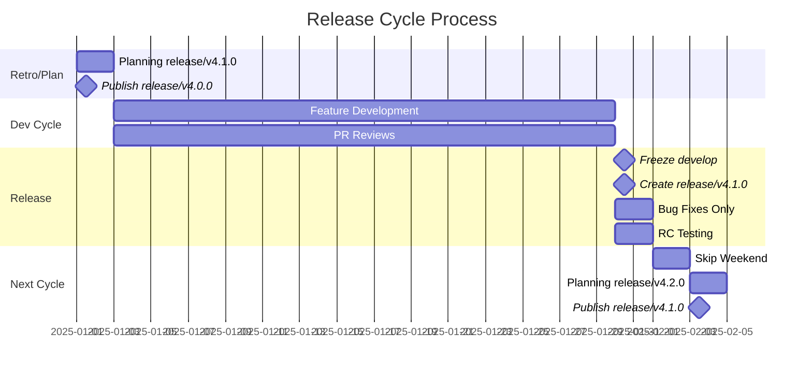

<div align="center">

# AIHawk: the first Jobs Applier AI Agent

AIHawk's core architecture remains **open source**, allowing developers to inspect and extend the codebase. However, due to copyright considerations, we have removed all third‑party provider plugins from this repository.

For a fully integrated experience, including managed provider connections: check out **[laboro.co](https://laboro.co/)** an AI‑driven job board where the agent **automatically applies to jobs** for you.

---

AIHawk has been featured by major media outlets for revolutionizing how job seekers interact with the job market:

[**Business Insider**](https://www.businessinsider.com/aihawk-applies-jobs-for-you-linkedin-risks-inaccuracies-mistakes-2024-11)
[**TechCrunch**](https://techcrunch.com/2024/10/10/a-reporter-used-ai-to-apply-to-2843-jobs/)
[**Semafor**](https://www.semafor.com/article/09/12/2024/linkedins-have-nots-and-have-bots)
[**Dev.by**](https://devby.io/news/ya-razoslal-rezume-na-2843-vakansii-po-17-v-chas-kak-ii-boty-vytesnyaut-ludei-iz-protsessa-naima.amp)
[**Wired**](https://www.wired.it/article/aihawk-come-automatizzare-ricerca-lavoro/)
[**The Verge**](https://www.theverge.com/2024/10/10/24266898/ai-is-enabling-job-seekers-to-think-like-spammers)
[**Vanity Fair**](https://www.vanityfair.it/article/intelligenza-artificiale-candidature-di-lavoro)
[**404 Media**](https://www.404media.co/i-applied-to-2-843-roles-the-rise-of-ai-powered-job-application-bots/)

Repository: feder-cr/jobs_applier_ai_agent_aihawk
Files analyzed: 58

Estimated tokens: 55.1k

Directory structure:
└── feder-cr-jobs_applier_ai_agent_aihawk/
├── README.md
├── config.py
├── CONTRIBUTING.md
├── LICENSE
├── main.py
├── requirements.txt
├── assets/
│ └── resume_schema.yaml
├── data_folder/
│ ├── plain_text_resume.yaml
│ ├── secrets.yaml
│ └── work_preferences.yaml
├── data_folder_example/
│ ├── plain_text_resume.yaml
│ ├── resume_liam_murphy.txt
│ ├── secrets.yaml
│ └── work_preferences.yaml
├── src/
│ ├── **init**.py
│ ├── job.py
│ ├── job_application_saver.py
│ ├── jobContext.py
│ ├── logging.py
│ ├── libs/
│ │ ├── llm_manager.py
│ │ └── resume_and_cover_builder/
│ │ ├── **init**.py
│ │ ├── config.py
│ │ ├── module_loader.py
│ │ ├── resume_facade.py
│ │ ├── resume_generator.py
│ │ ├── style_manager.py
│ │ ├── template_base.py
│ │ ├── utils.py
│ │ ├── cover_letter_prompt/
│ │ │ ├── **init**.py
│ │ │ └── strings_feder-cr.py
│ │ ├── llm/
│ │ │ ├── llm_generate_cover_letter_from_job.py
│ │ │ ├── llm_generate_resume.py
│ │ │ ├── llm_generate_resume_from_job.py
│ │ │ └── llm_job_parser.py
│ │ ├── resume_job_description_prompt/
│ │ │ ├── **init**.py
│ │ │ └── strings_feder-cr.py
│ │ ├── resume_prompt/
│ │ │ ├── **init**.py
│ │ │ └── strings_feder-cr.py
│ │ └── resume_style/
│ │ ├── **init**.py
│ │ ├── style_cloyola.css
│ │ ├── style_josylad_blue.css
│ │ ├── style_josylad_grey.css
│ │ ├── style_krishnavalliappan.css
│ │ └── style_samodum_bold.css
│ ├── resume_schemas/
│ │ ├── job_application_profile.py
│ │ └── resume.py
│ └── utils/
│ ├── **init**.py
│ ├── chrome_utils.py
│ └── constants.py
└── .github/
├── CODE_OF_CONDUCT.md
├── CONTRIBUTING.md
├── FUNDING.yml
├── ISSUE_TEMPLATE/
│ ├── bug-issue.yml
│ ├── config.yml
│ ├── documentation-issue.yml
│ └── enhancement-issue.yml
└── workflows/
├── ci.yml
└── stale.yml

================================================
FILE: README.md
================================================

<div align="center">

# AIHawk: the first Jobs Applier AI Agent

AIHawk's core architecture remains **open source**, allowing developers to inspect and extend the codebase. However, due to copyright considerations, we have removed all third‑party provider plugins from this repository.

For a fully integrated experience, including managed provider connections: check out **[laboro.co](https://laboro.co/)** an AI‑driven job board where the agent **automatically applies to jobs** for you.

---

AIHawk has been featured by major media outlets for revolutionizing how job seekers interact with the job market:

[**Business Insider**](https://www.businessinsider.com/aihawk-applies-jobs-for-you-linkedin-risks-inaccuracies-mistakes-2024-11)
[**TechCrunch**](https://techcrunch.com/2024/10/10/a-reporter-used-ai-to-apply-to-2843-jobs/)
[**Semafor**](https://www.semafor.com/article/09/12/2024/linkedins-have-nots-and-have-bots)
[**Dev.by**](https://devby.io/news/ya-razoslal-rezume-na-2843-vakansii-po-17-v-chas-kak-ii-boty-vytesnyaut-ludei-iz-protsessa-naima.amp)
[**Wired**](https://www.wired.it/article/aihawk-come-automatizzare-ricerca-lavoro/)
[**The Verge**](https://www.theverge.com/2024/10/10/24266898/ai-is-enabling-job-seekers-to-think-like-spammers)
[**Vanity Fair**](https://www.vanityfair.it/article/intelligenza-artificiale-candidature-di-lavoro)
[**404 Media**](https://www.404media.co/i-applied-to-2-843-roles-the-rise-of-ai-powered-job-application-bots/)

================================================
FILE: config.py
================================================

# In this file, you can set the configurations of the app.

from src.utils.constants import DEBUG, ERROR, LLM_MODEL, OPENAI

#config related to logging must have prefix LOG\_
LOG_LEVEL = 'ERROR'
LOG_SELENIUM_LEVEL = ERROR
LOG_TO_FILE = False
LOG_TO_CONSOLE = False

MINIMUM_WAIT_TIME_IN_SECONDS = 60

JOB_APPLICATIONS_DIR = "job_applications"
JOB_SUITABILITY_SCORE = 7

JOB_MAX_APPLICATIONS = 5
JOB_MIN_APPLICATIONS = 1

LLM_MODEL_TYPE = 'openai'
LLM_MODEL = 'gpt-4o-mini'

# Only required for OLLAMA models

LLM_API_URL = ''

================================================
FILE: CONTRIBUTING.md
================================================

# Contributing to Auto_Jobs_Applier_AIHawk

## Table of Contents

- [Issue Labels](#issue-labels)
- [Bug Reports](#bug-reports)
- [Feature Requests](#feature-requests)
- [Branch Rules](#branch-rules)
- [Version Control](#version-control)
- [Release Process](#release-process)
- [Roles](#roles)
- [Pull Request Process](#pull-request-process)
- [Code Style Guidelines](#code-style-guidelines)
- [Development Setup](#development-setup)
- [Testing](#testing)
- [Communication](#communication)
- [Development Diagrams](./docs/development_diagrams.md)

Thank you for your interest in contributing to Auto_Jobs_Applier_AIHawk. This document provides guidelines for contributing to the project.

## Issue Labels

The project uses the following labels:

- **bug**: Something isn't working correctly
- **enhancement**: New feature requests
- **good first issue**: Good for newcomers
- **help wanted**: Extra attention needed
- **documentation**: Documentation improvements

## Bug Reports

When submitting a bug report, please include:

- A clear, descriptive title prefixed with [BUG]
- Steps to reproduce the issue
- Expected behavior
- Actual behavior
- Any error messages or screenshots
- Your environment details (OS, Python version, etc.)

## Feature Requests

For feature requests, please:

- Prefix the title with [FEATURE]
- Include a feature summary
- Provide detailed feature description
- Explain your motivation for the feature
- List any alternatives you've considered

## Branch Rules

- `main` - Production-ready code, protected branch
- `develop` - Integration branch for features
- `feature/*` - New features
- `release/*` - Release preparation
- `bugfix/*` - Bug fixes for development
- `hotfix/*` - Emergency production fixes

## Version Control

- Semantic versioning: `vMAJOR.MINOR.PATCH`
- Release tags on `main` branch only
- Package versions match git tags

## Release Process

week one for `release/v4.1.0`

- Planning meeting for `release/v4.1.0` with release scope and milestone objectives set by the maintainers. Release and maintainer meeting agendas and schedules are posted on the project repository [wiki](https://github.com/AIHawk/AIHawk/wiki) and shared in the `#releases` channel on Discord.
- `release/v4.0.0` release candidate ready for release
- `release/v4.0.0` merge into `develop`, `main`
- tag `main` as `release/v4.0.0`
- `release/v4.0.0` published to AIHawk/releases and PyPI as a package with release documentation
- delete `release/v4.0.0` branch

release/v4.1.0 release weeks

- Contributers work on issues and PRs, prioritizing next milestone
- Maintainers review PRs from `feature/*`, `bugfix/*` branches and issues, merging into `develop`
- Maintainers review PRs from `hotfix/*` branches and issues, merged into `main` and `develop`, `main` tagged and merged into `4.0.1` package and `release/v4.0.1` and `release/v4.1.0`, documentation is updated

last week, release candidate

- `develop` is frozen, only bug fixes
- create release branch `release/v4.1.0` from `develop`
- only bug fixes are merged into `release/v4.1.0`
- additional testing and release candidate review

week one is repeated for `release/v4.2.0`



## Roles

### Organization Owner

- Has full access to all repositories
- Controls organization-wide settings and permissions
- Can set base permissions for all members
- Manages repository settings and collaborator access

### Release Manager

- Creates and manages release branch from develop
- Coordinates release cycles and versioning
- Merges release into main

### Maintainer

- Reviews and approves develop, feature PRs
- Triage issues, bugs, PRs
- Manages feature, bugfix PRs merge into develop
- Leads feature development, bug prioritization
- Manages README, CONTRIBUTING, and other documentation

### Moderator

- Moderates Telegram, Discord channels
- Manages project wiki
- Contributes to README, CONTRIBUTING, and other documentation

### Contributor

- Creates feature branches from develop
- Implements new features, bug fixes, and other changes
- creates PRs on features
- Collaborates with other developers on features

## Pull Request Process

1. Fork the repository
2. Create a new branch for your feature or bug
3. Write clear commit messages
4. Update documentation as needed
5. Add tests for new functionality
6. Ensure tests pass
7. Submit a pull request with a clear description

## Merging Pull Requests

- All PRs are reviewed by maintainers
- At least 2 Maintainers approve PRs for merge
- PRs are merged into `develop`
- PRs are tested and verified to work as expected

## Code Style Guidelines

- Follow PEP 8 standards for Python code
- Include docstrings for new functions and classes
- Add comments for complex logic
- Maintain consistent naming conventions
- Security best practices
- Any performance considerations

## Development Setup

1. Clone the repository
2. Install dependencies from requirements.txt
3. Set up necessary API keys and configurations

## Testing

Before submitting a PR:

- Test your changes thoroughly
- Ensure existing tests pass
- Add new tests for new functionality
- Verify functionality with different configurations

## Communication

- Be respectful and constructive in discussions
- Use clear and concise language
- Reference relevant issues in commits and PRs
- Ask for help when needed

The project maintainers reserve the right to reject any contribution that doesn't meet these guidelines or align with the project's goals.

================================================
FILE: LICENSE
================================================
GNU AFFERO GENERAL PUBLIC LICENSE
Version 3, 19 November 2007

Copyright (C) 2024 AI Hawk FOSS <https://github.com/AIHawk-FOSS/Auto_Jobs_Applier_AI_Agent/graphs/contributors> </br>
Everyone is permitted to copy and distribute verbatim copies
of this license document, but changing it is not allowed.

                            Preamble

The GNU Affero General Public License is a free, copyleft license for
software and other kinds of works, specifically designed to ensure
cooperation with the community in the case of network server software.

The licenses for most software and other practical works are designed
to take away your freedom to share and change the works. By contrast,
our General Public Licenses are intended to guarantee your freedom to
share and change all versions of a program--to make sure it remains free
software for all its users.

When we speak of free software, we are referring to freedom, not
price. Our General Public Licenses are designed to make sure that you
have the freedom to distribute copies of free software (and charge for
them if you wish), that you receive source code or can get it if you
want it, that you can change the software or use pieces of it in new
free programs, and that you know you can do these things.

Developers that use our General Public Licenses protect your rights
with two steps: (1) assert copyright on the software, and (2) offer
you this License which gives you legal permission to copy, distribute
and/or modify the software.

A secondary benefit of defending all users' freedom is that
improvements made in alternate versions of the program, if they
receive widespread use, become available for other developers to
incorporate. Many developers of free software are heartened and
encouraged by the resulting cooperation. However, in the case of
software used on network servers, this result may fail to come about.
The GNU General Public License permits making a modified version and
letting the public access it on a server without ever releasing its
source code to the public.

The GNU Affero General Public License is designed specifically to
ensure that, in such cases, the modified source code becomes available
to the community. It requires the operator of a network server to
provide the source code of the modified version running there to the
users of that server. Therefore, public use of a modified version, on
a publicly accessible server, gives the public access to the source
code of the modified version.

An older license, called the Affero General Public License and
published by Affero, was designed to accomplish similar goals. This is
a different license, not a version of the Affero GPL, but Affero has
released a new version of the Affero GPL which permits relicensing under
this license.

The precise terms and conditions for copying, distribution and
modification follow.

                       TERMS AND CONDITIONS

1. Definitions.

"This License" refers to version 3 of the GNU Affero General Public License.

"Copyright" also means copyright-like laws that apply to other kinds of
works, such as semiconductor masks.

"The Program" refers to any copyrightable work licensed under this
License. Each licensee is addressed as "you". "Licensees" and
"recipients" may be individuals or organizations.

To "modify" a work means to copy from or adapt all or part of the work
in a fashion requiring copyright permission, other than the making of an
exact copy. The resulting work is called a "modified version" of the
earlier work or a work "based on" the earlier work.

A "covered work" means either the unmodified Program or a work based
on the Program.

To "propagate" a work means to do anything with it that, without
permission, would make you directly or secondarily liable for
infringement under applicable copyright law, except executing it on a
computer or modifying a private copy. Propagation includes copying,
distribution (with or without modification), making available to the
public, and in some countries other activities as well.

To "convey" a work means any kind of propagation that enables other
parties to make or receive copies. Mere interaction with a user through
a computer network, with no transfer of a copy, is not conveying.

An interactive user interface displays "Appropriate Legal Notices"
to the extent that it includes a convenient and prominently visible
feature that (1) displays an appropriate copyright notice, and (2)
tells the user that there is no warranty for the work (except to the
extent that warranties are provided), that licensees may convey the
work under this License, and how to view a copy of this License. If
the interface presents a list of user commands or options, such as a
menu, a prominent item in the list meets this criterion.

1. Source Code.

The "source code" for a work means the preferred form of the work
for making modifications to it. "Object code" means any non-source
form of a work.

A "Standard Interface" means an interface that either is an official
standard defined by a recognized standards body, or, in the case of
interfaces specified for a particular programming language, one that
is widely used among developers working in that language.

The "System Libraries" of an executable work include anything, other
than the work as a whole, that (a) is included in the normal form of
packaging a Major Component, but which is not part of that Major
Component, and (b) serves only to enable use of the work with that
Major Component, or to implement a Standard Interface for which an
implementation is available to the public in source code form. A
"Major Component", in this context, means a major essential component
(kernel, window system, and so on) of the specific operating system
(if any) on which the executable work runs, or a compiler used to
produce the work, or an object code interpreter used to run it.

The "Corresponding Source" for a work in object code form means all
the source code needed to generate, install, and (for an executable
work) run the object code and to modify the work, including scripts to
control those activities. However, it does not include the work's
System Libraries, or general-purpose tools or generally available free
programs which are used unmodified in performing those activities but
which are not part of the work. For example, Corresponding Source
includes interface definition files associated with source files for
the work, and the source code for shared libraries and dynamically
linked subprograms that the work is specifically designed to require,
such as by intimate data communication or control flow between those
subprograms and other parts of the work.

The Corresponding Source need not include anything that users
can regenerate automatically from other parts of the Corresponding
Source.

The Corresponding Source for a work in source code form is that
same work.

2. Basic Permissions.

All rights granted under this License are granted for the term of
copyright on the Program, and are irrevocable provided the stated
conditions are met. This License explicitly affirms your unlimited
permission to run the unmodified Program. The output from running a
covered work is covered by this License only if the output, given its
content, constitutes a covered work. This License acknowledges your
rights of fair use or other equivalent, as provided by copyright law.

You may make, run and propagate covered works that you do not
convey, without conditions so long as your license otherwise remains
in force. You may convey covered works to others for the sole purpose
of having them make modifications exclusively for you, or provide you
with facilities for running those works, provided that you comply with
the terms of this License in conveying all material for which you do
not control copyright. Those thus making or running the covered works
for you must do so exclusively on your behalf, under your direction
and control, on terms that prohibit them from making any copies of
your copyrighted material outside their relationship with you.

Conveying under any other circumstances is permitted solely under
the conditions stated below. Sublicensing is not allowed; section 10
makes it unnecessary.

3. Protecting Users' Legal Rights From Anti-Circumvention Law.

No covered work shall be deemed part of an effective technological
measure under any applicable law fulfilling obligations under article
11 of the WIPO copyright treaty adopted on 20 December 1996, or
similar laws prohibiting or restricting circumvention of such
measures.

When you convey a covered work, you waive any legal power to forbid
circumvention of technological measures to the extent such circumvention
is effected by exercising rights under this License with respect to
the covered work, and you disclaim any intention to limit operation or
modification of the work as a means of enforcing, against the work's
users, your or third parties' legal rights to forbid circumvention of
technological measures.

4. Conveying Verbatim Copies.

You may convey verbatim copies of the Program's source code as you
receive it, in any medium, provided that you conspicuously and
appropriately publish on each copy an appropriate copyright notice;
keep intact all notices stating that this License and any
non-permissive terms added in accord with section 7 apply to the code;
keep intact all notices of the absence of any warranty; and give all
recipients a copy of this License along with the Program.

You may charge any price or no price for each copy that you convey,
and you may offer support or warranty protection for a fee.

5. Conveying Modified Source Versions.

You may convey a work based on the Program, or the modifications to
produce it from the Program, in the form of source code under the
terms of section 4, provided that you also meet all of these conditions:

    a) The work must carry prominent notices stating that you modified
    it, and giving a relevant date.

    b) The work must carry prominent notices stating that it is
    released under this License and any conditions added under section
    7.  This requirement modifies the requirement in section 4 to
    "keep intact all notices".

    c) You must license the entire work, as a whole, under this
    License to anyone who comes into possession of a copy.  This
    License will therefore apply, along with any applicable section 7
    additional terms, to the whole of the work, and all its parts,
    regardless of how they are packaged.  This License gives no
    permission to license the work in any other way, but it does not
    invalidate such permission if you have separately received it.

    d) If the work has interactive user interfaces, each must display
    Appropriate Legal Notices; however, if the Program has interactive
    interfaces that do not display Appropriate Legal Notices, your
    work need not make them do so.

A compilation of a covered work with other separate and independent
works, which are not by their nature extensions of the covered work,
and which are not combined with it such as to form a larger program,
in or on a volume of a storage or distribution medium, is called an
"aggregate" if the compilation and its resulting copyright are not
used to limit the access or legal rights of the compilation's users
beyond what the individual works permit. Inclusion of a covered work
in an aggregate does not cause this License to apply to the other
parts of the aggregate.

6. Conveying Non-Source Forms.

You may convey a covered work in object code form under the terms
of sections 4 and 5, provided that you also convey the
machine-readable Corresponding Source under the terms of this License,
in one of these ways:

    a) Convey the object code in, or embodied in, a physical product
    (including a physical distribution medium), accompanied by the
    Corresponding Source fixed on a durable physical medium
    customarily used for software interchange.

    b) Convey the object code in, or embodied in, a physical product
    (including a physical distribution medium), accompanied by a
    written offer, valid for at least three years and valid for as
    long as you offer spare parts or customer support for that product
    model, to give anyone who possesses the object code either (1) a
    copy of the Corresponding Source for all the software in the
    product that is covered by this License, on a durable physical
    medium customarily used for software interchange, for a price no
    more than your reasonable cost of physically performing this
    conveying of source, or (2) access to copy the
    Corresponding Source from a network server at no charge.

    c) Convey individual copies of the object code with a copy of the
    written offer to provide the Corresponding Source.  This
    alternative is allowed only occasionally and noncommercially, and
    only if you received the object code with such an offer, in accord
    with subsection 6b.

    d) Convey the object code by offering access from a designated
    place (gratis or for a charge), and offer equivalent access to the
    Corresponding Source in the same way through the same place at no
    further charge.  You need not require recipients to copy the
    Corresponding Source along with the object code.  If the place to
    copy the object code is a network server, the Corresponding Source
    may be on a different server (operated by you or a third party)
    that supports equivalent copying facilities, provided you maintain
    clear directions next to the object code saying where to find the
    Corresponding Source.  Regardless of what server hosts the
    Corresponding Source, you remain obligated to ensure that it is
    available for as long as needed to satisfy these requirements.

    e) Convey the object code using peer-to-peer transmission, provided
    you inform other peers where the object code and Corresponding
    Source of the work are being offered to the general public at no
    charge under subsection 6d.

A separable portion of the object code, whose source code is excluded
from the Corresponding Source as a System Library, need not be
included in conveying the object code work.

A "User Product" is either (1) a "consumer product", which means any
tangible personal property which is normally used for personal, family,
or household purposes, or (2) anything designed or sold for incorporation
into a dwelling. In determining whether a product is a consumer product,
doubtful cases shall be resolved in favor of coverage. For a particular
product received by a particular user, "normally used" refers to a
typical or common use of that class of product, regardless of the status
of the particular user or of the way in which the particular user
actually uses, or expects or is expected to use, the product. A product
is a consumer product regardless of whether the product has substantial
commercial, industrial or non-consumer uses, unless such uses represent
the only significant mode of use of the product.

"Installation Information" for a User Product means any methods,
procedures, authorization keys, or other information required to install
and execute modified versions of a covered work in that User Product from
a modified version of its Corresponding Source. The information must
suffice to ensure that the continued functioning of the modified object
code is in no case prevented or interfered with solely because
modification has been made.

If you convey an object code work under this section in, or with, or
specifically for use in, a User Product, and the conveying occurs as
part of a transaction in which the right of possession and use of the
User Product is transferred to the recipient in perpetuity or for a
fixed term (regardless of how the transaction is characterized), the
Corresponding Source conveyed under this section must be accompanied
by the Installation Information. But this requirement does not apply
if neither you nor any third party retains the ability to install
modified object code on the User Product (for example, the work has
been installed in ROM).

The requirement to provide Installation Information does not include a
requirement to continue to provide support service, warranty, or updates
for a work that has been modified or installed by the recipient, or for
the User Product in which it has been modified or installed. Access to a
network may be denied when the modification itself materially and
adversely affects the operation of the network or violates the rules and
protocols for communication across the network.

Corresponding Source conveyed, and Installation Information provided,
in accord with this section must be in a format that is publicly
documented (and with an implementation available to the public in
source code form), and must require no special password or key for
unpacking, reading or copying.

7. Additional Terms.

"Additional permissions" are terms that supplement the terms of this
License by making exceptions from one or more of its conditions.
Additional permissions that are applicable to the entire Program shall
be treated as though they were included in this License, to the extent
that they are valid under applicable law. If additional permissions
apply only to part of the Program, that part may be used separately
under those permissions, but the entire Program remains governed by
this License without regard to the additional permissions.

When you convey a copy of a covered work, you may at your option
remove any additional permissions from that copy, or from any part of
it. (Additional permissions may be written to require their own
removal in certain cases when you modify the work.) You may place
additional permissions on material, added by you to a covered work,
for which you have or can give appropriate copyright permission.

Notwithstanding any other provision of this License, for material you
add to a covered work, you may (if authorized by the copyright holders of
that material) supplement the terms of this License with terms:

    a) Disclaiming warranty or limiting liability differently from the
    terms of sections 15 and 16 of this License; or

    b) Requiring preservation of specified reasonable legal notices or
    author attributions in that material or in the Appropriate Legal
    Notices displayed by works containing it; or

    c) Prohibiting misrepresentation of the origin of that material, or
    requiring that modified versions of such material be marked in
    reasonable ways as different from the original version; or

    d) Limiting the use for publicity purposes of names of licensors or
    authors of the material; or

    e) Declining to grant rights under trademark law for use of some
    trade names, trademarks, or service marks; or

    f) Requiring indemnification of licensors and authors of that
    material by anyone who conveys the material (or modified versions of
    it) with contractual assumptions of liability to the recipient, for
    any liability that these contractual assumptions directly impose on
    those licensors and authors.

All other non-permissive additional terms are considered "further
restrictions" within the meaning of section 10. If the Program as you
received it, or any part of it, contains a notice stating that it is
governed by this License along with a term that is a further
restriction, you may remove that term. If a license document contains
a further restriction but permits relicensing or conveying under this
License, you may add to a covered work material governed by the terms
of that license document, provided that the further restriction does
not survive such relicensing or conveying.

If you add terms to a covered work in accord with this section, you
must place, in the relevant source files, a statement of the
additional terms that apply to those files, or a notice indicating
where to find the applicable terms.

Additional terms, permissive or non-permissive, may be stated in the
form of a separately written license, or stated as exceptions;
the above requirements apply either way.

8. Termination.

You may not propagate or modify a covered work except as expressly
provided under this License. Any attempt otherwise to propagate or
modify it is void, and will automatically terminate your rights under
this License (including any patent licenses granted under the third
paragraph of section 11).

However, if you cease all violation of this License, then your
license from a particular copyright holder is reinstated (a)
provisionally, unless and until the copyright holder explicitly and
finally terminates your license, and (b) permanently, if the copyright
holder fails to notify you of the violation by some reasonable means
prior to 60 days after the cessation.

Moreover, your license from a particular copyright holder is
reinstated permanently if the copyright holder notifies you of the
violation by some reasonable means, this is the first time you have
received notice of violation of this License (for any work) from that
copyright holder, and you cure the violation prior to 30 days after
your receipt of the notice.

Termination of your rights under this section does not terminate the
licenses of parties who have received copies or rights from you under
this License. If your rights have been terminated and not permanently
reinstated, you do not qualify to receive new licenses for the same
material under section 10.

9. Acceptance Not Required for Having Copies.

You are not required to accept this License in order to receive or
run a copy of the Program. Ancillary propagation of a covered work
occurring solely as a consequence of using peer-to-peer transmission
to receive a copy likewise does not require acceptance. However,
nothing other than this License grants you permission to propagate or
modify any covered work. These actions infringe copyright if you do
not accept this License. Therefore, by modifying or propagating a
covered work, you indicate your acceptance of this License to do so.

10. Automatic Licensing of Downstream Recipients.

Each time you convey a covered work, the recipient automatically
receives a license from the original licensors, to run, modify and
propagate that work, subject to this License. You are not responsible
for enforcing compliance by third parties with this License.

An "entity transaction" is a transaction transferring control of an
organization, or substantially all assets of one, or subdividing an
organization, or merging organizations. If propagation of a covered
work results from an entity transaction, each party to that
transaction who receives a copy of the work also receives whatever
licenses to the work the party's predecessor in interest had or could
give under the previous paragraph, plus a right to possession of the
Corresponding Source of the work from the predecessor in interest, if
the predecessor has it or can get it with reasonable efforts.

You may not impose any further restrictions on the exercise of the
rights granted or affirmed under this License. For example, you may
not impose a license fee, royalty, or other charge for exercise of
rights granted under this License, and you may not initiate litigation
(including a cross-claim or counterclaim in a lawsuit) alleging that
any patent claim is infringed by making, using, selling, offering for
sale, or importing the Program or any portion of it.

11. Patents.

A "contributor" is a copyright holder who authorizes use under this
License of the Program or a work on which the Program is based. The
work thus licensed is called the contributor's "contributor version".

A contributor's "essential patent claims" are all patent claims
owned or controlled by the contributor, whether already acquired or
hereafter acquired, that would be infringed by some manner, permitted
by this License, of making, using, or selling its contributor version,
but do not include claims that would be infringed only as a
consequence of further modification of the contributor version. For
purposes of this definition, "control" includes the right to grant
patent sublicenses in a manner consistent with the requirements of
this License.

Each contributor grants you a non-exclusive, worldwide, royalty-free
patent license under the contributor's essential patent claims, to
make, use, sell, offer for sale, import and otherwise run, modify and
propagate the contents of its contributor version.

In the following three paragraphs, a "patent license" is any express
agreement or commitment, however denominated, not to enforce a patent
(such as an express permission to practice a patent or covenant not to
sue for patent infringement). To "grant" such a patent license to a
party means to make such an agreement or commitment not to enforce a
patent against the party.

If you convey a covered work, knowingly relying on a patent license,
and the Corresponding Source of the work is not available for anyone
to copy, free of charge and under the terms of this License, through a
publicly available network server or other readily accessible means,
then you must either (1) cause the Corresponding Source to be so
available, or (2) arrange to deprive yourself of the benefit of the
patent license for this particular work, or (3) arrange, in a manner
consistent with the requirements of this License, to extend the patent
license to downstream recipients. "Knowingly relying" means you have
actual knowledge that, but for the patent license, your conveying the
covered work in a country, or your recipient's use of the covered work
in a country, would infringe one or more identifiable patents in that
country that you have reason to believe are valid.

If, pursuant to or in connection with a single transaction or
arrangement, you convey, or propagate by procuring conveyance of, a
covered work, and grant a patent license to some of the parties
receiving the covered work authorizing them to use, propagate, modify
or convey a specific copy of the covered work, then the patent license
you grant is automatically extended to all recipients of the covered
work and works based on it.

A patent license is "discriminatory" if it does not include within
the scope of its coverage, prohibits the exercise of, or is
conditioned on the non-exercise of one or more of the rights that are
specifically granted under this License. You may not convey a covered
work if you are a party to an arrangement with a third party that is
in the business of distributing software, under which you make payment
to the third party based on the extent of your activity of conveying
the work, and under which the third party grants, to any of the
parties who would receive the covered work from you, a discriminatory
patent license (a) in connection with copies of the covered work
conveyed by you (or copies made from those copies), or (b) primarily
for and in connection with specific products or compilations that
contain the covered work, unless you entered into that arrangement,
or that patent license was granted, prior to 28 March 2007.

Nothing in this License shall be construed as excluding or limiting
any implied license or other defenses to infringement that may
otherwise be available to you under applicable patent law.

12. No Surrender of Others' Freedom.

If conditions are imposed on you (whether by court order, agreement or
otherwise) that contradict the conditions of this License, they do not
excuse you from the conditions of this License. If you cannot convey a
covered work so as to satisfy simultaneously your obligations under this
License and any other pertinent obligations, then as a consequence you may
not convey it at all. For example, if you agree to terms that obligate you
to collect a royalty for further conveying from those to whom you convey
the Program, the only way you could satisfy both those terms and this
License would be to refrain entirely from conveying the Program.

13. Remote Network Interaction; Use with the GNU General Public License.

Notwithstanding any other provision of this License, if you modify the
Program, your modified version must prominently offer all users
interacting with it remotely through a computer network (if your version
supports such interaction) an opportunity to receive the Corresponding
Source of your version by providing access to the Corresponding Source
from a network server at no charge, through some standard or customary
means of facilitating copying of software. This Corresponding Source
shall include the Corresponding Source for any work covered by version 3
of the GNU General Public License that is incorporated pursuant to the
following paragraph.

Notwithstanding any other provision of this License, you have
permission to link or combine any covered work with a work licensed
under version 3 of the GNU General Public License into a single
combined work, and to convey the resulting work. The terms of this
License will continue to apply to the part which is the covered work,
but the work with which it is combined will remain governed by version
3 of the GNU General Public License.

14. Revised Versions of this License.

The Free Software Foundation may publish revised and/or new versions of
the GNU Affero General Public License from time to time. Such new versions
will be similar in spirit to the present version, but may differ in detail to
address new problems or concerns.

Each version is given a distinguishing version number. If the
Program specifies that a certain numbered version of the GNU Affero General
Public License "or any later version" applies to it, you have the
option of following the terms and conditions either of that numbered
version or of any later version published by the Free Software
Foundation. If the Program does not specify a version number of the
GNU Affero General Public License, you may choose any version ever published
by the Free Software Foundation.

If the Program specifies that a proxy can decide which future
versions of the GNU Affero General Public License can be used, that proxy's
public statement of acceptance of a version permanently authorizes you
to choose that version for the Program.

Later license versions may give you additional or different
permissions. However, no additional obligations are imposed on any
author or copyright holder as a result of your choosing to follow a
later version.

15. Disclaimer of Warranty.

THERE IS NO WARRANTY FOR THE PROGRAM, TO THE EXTENT PERMITTED BY
APPLICABLE LAW. EXCEPT WHEN OTHERWISE STATED IN WRITING THE COPYRIGHT
HOLDERS AND/OR OTHER PARTIES PROVIDE THE PROGRAM "AS IS" WITHOUT WARRANTY
OF ANY KIND, EITHER EXPRESSED OR IMPLIED, INCLUDING, BUT NOT LIMITED TO,
THE IMPLIED WARRANTIES OF MERCHANTABILITY AND FITNESS FOR A PARTICULAR
PURPOSE. THE ENTIRE RISK AS TO THE QUALITY AND PERFORMANCE OF THE PROGRAM
IS WITH YOU. SHOULD THE PROGRAM PROVE DEFECTIVE, YOU ASSUME THE COST OF
ALL NECESSARY SERVICING, REPAIR OR CORRECTION.

16. Limitation of Liability.

IN NO EVENT UNLESS REQUIRED BY APPLICABLE LAW OR AGREED TO IN WRITING
WILL ANY COPYRIGHT HOLDER, OR ANY OTHER PARTY WHO MODIFIES AND/OR CONVEYS
THE PROGRAM AS PERMITTED ABOVE, BE LIABLE TO YOU FOR DAMAGES, INCLUDING ANY
GENERAL, SPECIAL, INCIDENTAL OR CONSEQUENTIAL DAMAGES ARISING OUT OF THE
USE OR INABILITY TO USE THE PROGRAM (INCLUDING BUT NOT LIMITED TO LOSS OF
DATA OR DATA BEING RENDERED INACCURATE OR LOSSES SUSTAINED BY YOU OR THIRD
PARTIES OR A FAILURE OF THE PROGRAM TO OPERATE WITH ANY OTHER PROGRAMS),
EVEN IF SUCH HOLDER OR OTHER PARTY HAS BEEN ADVISED OF THE POSSIBILITY OF
SUCH DAMAGES.

17. Interpretation of Sections 15 and 16.

If the disclaimer of warranty and limitation of liability provided
above cannot be given local legal effect according to their terms,
reviewing courts shall apply local law that most closely approximates
an absolute waiver of all civil liability in connection with the
Program, unless a warranty or assumption of liability accompanies a
copy of the Program in return for a fee.

                     END OF TERMS AND CONDITIONS

            How to Apply These Terms to Your New Programs

If you develop a new program, and you want it to be of the greatest
possible use to the public, the best way to achieve this is to make it
free software which everyone can redistribute and change under these terms.

To do so, attach the following notices to the program. It is safest
to attach them to the start of each source file to most effectively
state the exclusion of warranty; and each file should have at least
the "copyright" line and a pointer to where the full notice is found.

    <one line to give the program's name and a brief idea of what it does.>
    Copyright (C) <year>  <name of author>

    This program is free software: you can redistribute it and/or modify
    it under the terms of the GNU Affero General Public License as published
    by the Free Software Foundation, either version 3 of the License, or
    (at your option) any later version.

    This program is distributed in the hope that it will be useful,
    but WITHOUT ANY WARRANTY; without even the implied warranty of
    MERCHANTABILITY or FITNESS FOR A PARTICULAR PURPOSE.  See the
    GNU Affero General Public License for more details.

    You should have received a copy of the GNU Affero General Public License
    along with this program.  If not, see <https://www.gnu.org/licenses/>.

Also add information on how to contact you by electronic and paper mail.

If your software can interact with users remotely through a computer
network, you should also make sure that it provides a way for users to
get its source. For example, if your program is a web application, its
interface could display a "Source" link that leads users to an archive
of the code. There are many ways you could offer source, and different
solutions will be better for different programs; see section 13 for the
specific requirements.

You should also get your employer (if you work as a programmer) or school,
if any, to sign a "copyright disclaimer" for the program, if necessary.
For more information on this, and how to apply and follow the GNU AGPL, see
<https://www.gnu.org/licenses/>.

================================================
FILE: main.py
================================================
import base64
import sys
from pathlib import Path
import traceback
from typing import List, Optional, Tuple, Dict

import click
import inquirer
import yaml
from selenium import webdriver
from selenium.common.exceptions import WebDriverException
from selenium.webdriver.chrome.service import Service as ChromeService
from webdriver_manager.chrome import ChromeDriverManager
import re
from src.libs.resume_and_cover_builder import ResumeFacade, ResumeGenerator, StyleManager
from src.resume_schemas.job_application_profile import JobApplicationProfile
from src.resume_schemas.resume import Resume
from src.logging import logger
from src.utils.chrome_utils import init_browser
from src.utils.constants import (
PLAIN_TEXT_RESUME_YAML,
SECRETS_YAML,
WORK_PREFERENCES_YAML,
)

# from ai_hawk.bot_facade import AIHawkBotFacade

# from ai_hawk.job_manager import AIHawkJobManager

# from ai_hawk.llm.llm_manager import GPTAnswerer

class ConfigError(Exception):
"""Custom exception for configuration-related errors."""
pass

class ConfigValidator:
"""Validates configuration and secrets YAML files."""

    EMAIL_REGEX = re.compile(r"^[a-zA-Z0-9._%+-]+@[a-zA-Z0-9.-]+\.[a-zA-Z]{2,}$")
    REQUIRED_CONFIG_KEYS = {
        "remote": bool,
        "experience_level": dict,
        "job_types": dict,
        "date": dict,
        "positions": list,
        "locations": list,
        "location_blacklist": list,
        "distance": int,
        "company_blacklist": list,
        "title_blacklist": list,
    }
    EXPERIENCE_LEVELS = [
        "internship",
        "entry",
        "associate",
        "mid_senior_level",
        "director",
        "executive",
    ]
    JOB_TYPES = [
        "full_time",
        "contract",
        "part_time",
        "temporary",
        "internship",
        "other",
        "volunteer",
    ]
    DATE_FILTERS = ["all_time", "month", "week", "24_hours"]
    APPROVED_DISTANCES = {0, 5, 10, 25, 50, 100}

    @staticmethod
    def validate_email(email: str) -> bool:
        """Validate the format of an email address."""
        return bool(ConfigValidator.EMAIL_REGEX.match(email))

    @staticmethod
    def load_yaml(yaml_path: Path) -> dict:
        """Load and parse a YAML file."""
        try:
            with open(yaml_path, "r") as stream:
                return yaml.safe_load(stream)
        except yaml.YAMLError as exc:
            raise ConfigError(f"Error reading YAML file {yaml_path}: {exc}")
        except FileNotFoundError:
            raise ConfigError(f"YAML file not found: {yaml_path}")

    @classmethod
    def validate_config(cls, config_yaml_path: Path) -> dict:
        """Validate the main configuration YAML file."""
        parameters = cls.load_yaml(config_yaml_path)
        # Check for required keys and their types
        for key, expected_type in cls.REQUIRED_CONFIG_KEYS.items():
            if key not in parameters:
                if key in ["company_blacklist", "title_blacklist", "location_blacklist"]:
                    parameters[key] = []
                else:
                    raise ConfigError(f"Missing required key '{key}' in {config_yaml_path}")
            elif not isinstance(parameters[key], expected_type):
                if key in ["company_blacklist", "title_blacklist", "location_blacklist"] and parameters[key] is None:
                    parameters[key] = []
                else:
                    raise ConfigError(
                        f"Invalid type for key '{key}' in {config_yaml_path}. Expected {expected_type.__name__}."
                    )
        cls._validate_experience_levels(parameters["experience_level"], config_yaml_path)
        cls._validate_job_types(parameters["job_types"], config_yaml_path)
        cls._validate_date_filters(parameters["date"], config_yaml_path)
        cls._validate_list_of_strings(parameters, ["positions", "locations"], config_yaml_path)
        cls._validate_distance(parameters["distance"], config_yaml_path)
        cls._validate_blacklists(parameters, config_yaml_path)
        return parameters

    @classmethod
    def _validate_experience_levels(cls, experience_levels: dict, config_path: Path):
        """Ensure experience levels are booleans."""
        for level in cls.EXPERIENCE_LEVELS:
            if not isinstance(experience_levels.get(level), bool):
                raise ConfigError(
                    f"Experience level '{level}' must be a boolean in {config_path}"
                )

    @classmethod
    def _validate_job_types(cls, job_types: dict, config_path: Path):
        """Ensure job types are booleans."""
        for job_type in cls.JOB_TYPES:
            if not isinstance(job_types.get(job_type), bool):
                raise ConfigError(
                    f"Job type '{job_type}' must be a boolean in {config_path}"
                )

    @classmethod
    def _validate_date_filters(cls, date_filters: dict, config_path: Path):
        """Ensure date filters are booleans."""
        for date_filter in cls.DATE_FILTERS:
            if not isinstance(date_filters.get(date_filter), bool):
                raise ConfigError(
                    f"Date filter '{date_filter}' must be a boolean in {config_path}"
                )

    @classmethod
    def _validate_list_of_strings(cls, parameters: dict, keys: list, config_path: Path):
        """Ensure specified keys are lists of strings."""
        for key in keys:
            if not all(isinstance(item, str) for item in parameters[key]):
                raise ConfigError(
                    f"'{key}' must be a list of strings in {config_path}"
                )

    @classmethod
    def _validate_distance(cls, distance: int, config_path: Path):
        """Validate the distance value."""
        if distance not in cls.APPROVED_DISTANCES:
            raise ConfigError(
                f"Invalid distance value '{distance}' in {config_path}. Must be one of: {cls.APPROVED_DISTANCES}"
            )

    @classmethod
    def _validate_blacklists(cls, parameters: dict, config_path: Path):
        """Ensure blacklists are lists."""
        for blacklist in ["company_blacklist", "title_blacklist", "location_blacklist"]:
            if not isinstance(parameters.get(blacklist), list):
                raise ConfigError(
                    f"'{blacklist}' must be a list in {config_path}"
                )
            if parameters[blacklist] is None:
                parameters[blacklist] = []

    @staticmethod
    def validate_secrets(secrets_yaml_path: Path) -> str:
        """Validate the secrets YAML file and retrieve the LLM API key."""
        secrets = ConfigValidator.load_yaml(secrets_yaml_path)
        mandatory_secrets = ["llm_api_key"]

        for secret in mandatory_secrets:
            if secret not in secrets:
                raise ConfigError(f"Missing secret '{secret}' in {secrets_yaml_path}")

            if not secrets[secret]:
                raise ConfigError(f"Secret '{secret}' cannot be empty in {secrets_yaml_path}")

        return secrets["llm_api_key"]

class FileManager:
"""Handles file system operations and validations."""

    REQUIRED_FILES = [SECRETS_YAML, WORK_PREFERENCES_YAML, PLAIN_TEXT_RESUME_YAML]

    @staticmethod
    def validate_data_folder(app_data_folder: Path) -> Tuple[Path, Path, Path, Path]:
        """Validate the existence of the data folder and required files."""
        if not app_data_folder.is_dir():
            raise FileNotFoundError(f"Data folder not found: {app_data_folder}")

        missing_files = [file for file in FileManager.REQUIRED_FILES if not (app_data_folder / file).exists()]
        if missing_files:
            raise FileNotFoundError(f"Missing files in data folder: {', '.join(missing_files)}")

        output_folder = app_data_folder / "output"
        output_folder.mkdir(exist_ok=True)

        return (
            app_data_folder / SECRETS_YAML,
            app_data_folder / WORK_PREFERENCES_YAML,
            app_data_folder / PLAIN_TEXT_RESUME_YAML,
            output_folder,
        )

    @staticmethod
    def get_uploads(plain_text_resume_file: Path) -> Dict[str, Path]:
        """Convert resume file paths to a dictionary."""
        if not plain_text_resume_file.exists():
            raise FileNotFoundError(f"Plain text resume file not found: {plain_text_resume_file}")

        uploads = {"plainTextResume": plain_text_resume_file}

        return uploads

def create_cover_letter(parameters: dict, llm_api_key: str):
"""
Logic to create a CV.
"""
try:
logger.info("Generating a CV based on provided parameters.")

        # Carica il resume in testo semplice
        with open(parameters["uploads"]["plainTextResume"], "r", encoding="utf-8") as file:
            plain_text_resume = file.read()

        style_manager = StyleManager()
        available_styles = style_manager.get_styles()

        if not available_styles:
            logger.warning("No styles available. Proceeding without style selection.")
        else:
            # Present style choices to the user
            choices = style_manager.format_choices(available_styles)
            questions = [
                inquirer.List(
                    "style",
                    message="Select a style for the resume:",
                    choices=choices,
                )
            ]
            style_answer = inquirer.prompt(questions)
            if style_answer and "style" in style_answer:
                selected_choice = style_answer["style"]
                for style_name, (file_name, author_link) in available_styles.items():
                    if selected_choice.startswith(style_name):
                        style_manager.set_selected_style(style_name)
                        logger.info(f"Selected style: {style_name}")
                        break
            else:
                logger.warning("No style selected. Proceeding with default style.")
        questions = [
    inquirer.Text('job_url', message="Please enter the URL of the job description:")
        ]
        answers = inquirer.prompt(questions)
        job_url = answers.get('job_url')
        resume_generator = ResumeGenerator()
        resume_object = Resume(plain_text_resume)
        driver = init_browser()
        resume_generator.set_resume_object(resume_object)
        resume_facade = ResumeFacade(
            api_key=llm_api_key,
            style_manager=style_manager,
            resume_generator=resume_generator,
            resume_object=resume_object,
            output_path=Path("data_folder/output"),
        )
        resume_facade.set_driver(driver)
        resume_facade.link_to_job(job_url)
        result_base64, suggested_name = resume_facade.create_cover_letter()

        # Decodifica Base64 in dati binari
        try:
            pdf_data = base64.b64decode(result_base64)
        except base64.binascii.Error as e:
            logger.error("Error decoding Base64: %s", e)
            raise

        # Definisci il percorso della cartella di output utilizzando `suggested_name`
        output_dir = Path(parameters["outputFileDirectory"]) / suggested_name

        # Crea la cartella se non esiste
        try:
            output_dir.mkdir(parents=True, exist_ok=True)
            logger.info(f"Cartella di output creata o già esistente: {output_dir}")
        except IOError as e:
            logger.error("Error creating output directory: %s", e)
            raise

        output_path = output_dir / "cover_letter_tailored.pdf"
        try:
            with open(output_path, "wb") as file:
                file.write(pdf_data)
            logger.info(f"CV salvato in: {output_path}")
        except IOError as e:
            logger.error("Error writing file: %s", e)
            raise
    except Exception as e:
        logger.exception(f"An error occurred while creating the CV: {e}")
        raise

def create_resume_pdf_job_tailored(parameters: dict, llm_api_key: str):
"""
Logic to create a CV.
"""
try:
logger.info("Generating a CV based on provided parameters.")

        # Carica il resume in testo semplice
        with open(parameters["uploads"]["plainTextResume"], "r", encoding="utf-8") as file:
            plain_text_resume = file.read()

        style_manager = StyleManager()
        available_styles = style_manager.get_styles()

        if not available_styles:
            logger.warning("No styles available. Proceeding without style selection.")
        else:
            # Present style choices to the user
            choices = style_manager.format_choices(available_styles)
            questions = [
                inquirer.List(
                    "style",
                    message="Select a style for the resume:",
                    choices=choices,
                )
            ]
            style_answer = inquirer.prompt(questions)
            if style_answer and "style" in style_answer:
                selected_choice = style_answer["style"]
                for style_name, (file_name, author_link) in available_styles.items():
                    if selected_choice.startswith(style_name):
                        style_manager.set_selected_style(style_name)
                        logger.info(f"Selected style: {style_name}")
                        break
            else:
                logger.warning("No style selected. Proceeding with default style.")
        questions = [inquirer.Text('job_url', message="Please enter the URL of the job description:")]
        answers = inquirer.prompt(questions)
        job_url = answers.get('job_url')
        resume_generator = ResumeGenerator()
        resume_object = Resume(plain_text_resume)
        driver = init_browser()
        resume_generator.set_resume_object(resume_object)
        resume_facade = ResumeFacade(
            api_key=llm_api_key,
            style_manager=style_manager,
            resume_generator=resume_generator,
            resume_object=resume_object,
            output_path=Path("data_folder/output"),
        )
        resume_facade.set_driver(driver)
        resume_facade.link_to_job(job_url)
        result_base64, suggested_name = resume_facade.create_resume_pdf_job_tailored()

        # Decodifica Base64 in dati binari
        try:
            pdf_data = base64.b64decode(result_base64)
        except base64.binascii.Error as e:
            logger.error("Error decoding Base64: %s", e)
            raise

        # Definisci il percorso della cartella di output utilizzando `suggested_name`
        output_dir = Path(parameters["outputFileDirectory"]) / suggested_name

        # Crea la cartella se non esiste
        try:
            output_dir.mkdir(parents=True, exist_ok=True)
            logger.info(f"Cartella di output creata o già esistente: {output_dir}")
        except IOError as e:
            logger.error("Error creating output directory: %s", e)
            raise

        output_path = output_dir / "resume_tailored.pdf"
        try:
            with open(output_path, "wb") as file:
                file.write(pdf_data)
            logger.info(f"CV salvato in: {output_path}")
        except IOError as e:
            logger.error("Error writing file: %s", e)
            raise
    except Exception as e:
        logger.exception(f"An error occurred while creating the CV: {e}")
        raise

def create_resume_pdf(parameters: dict, llm_api_key: str):
"""
Logic to create a CV.
"""
try:
logger.info("Generating a CV based on provided parameters.")

        # Load the plain text resume
        with open(parameters["uploads"]["plainTextResume"], "r", encoding="utf-8") as file:
            plain_text_resume = file.read()

        # Initialize StyleManager
        style_manager = StyleManager()
        available_styles = style_manager.get_styles()

        if not available_styles:
            logger.warning("No styles available. Proceeding without style selection.")
        else:
            # Present style choices to the user
            choices = style_manager.format_choices(available_styles)
            questions = [
                inquirer.List(
                    "style",
                    message="Select a style for the resume:",
                    choices=choices,
                )
            ]
            style_answer = inquirer.prompt(questions)
            if style_answer and "style" in style_answer:
                selected_choice = style_answer["style"]
                for style_name, (file_name, author_link) in available_styles.items():
                    if selected_choice.startswith(style_name):
                        style_manager.set_selected_style(style_name)
                        logger.info(f"Selected style: {style_name}")
                        break
            else:
                logger.warning("No style selected. Proceeding with default style.")

        # Initialize the Resume Generator
        resume_generator = ResumeGenerator()
        resume_object = Resume(plain_text_resume)
        driver = init_browser()
        resume_generator.set_resume_object(resume_object)

        # Create the ResumeFacade
        resume_facade = ResumeFacade(
            api_key=llm_api_key,
            style_manager=style_manager,
            resume_generator=resume_generator,
            resume_object=resume_object,
            output_path=Path("data_folder/output"),
        )
        resume_facade.set_driver(driver)
        result_base64 = resume_facade.create_resume_pdf()

        # Decode Base64 to binary data
        try:
            pdf_data = base64.b64decode(result_base64)
        except base64.binascii.Error as e:
            logger.error("Error decoding Base64: %s", e)
            raise

        # Define the output directory using `suggested_name`
        output_dir = Path(parameters["outputFileDirectory"])

        # Write the PDF file
        output_path = output_dir / "resume_base.pdf"
        try:
            with open(output_path, "wb") as file:
                file.write(pdf_data)
            logger.info(f"Resume saved at: {output_path}")
        except IOError as e:
            logger.error("Error writing file: %s", e)
            raise
    except Exception as e:
        logger.exception(f"An error occurred while creating the CV: {e}")
        raise


def handle_inquiries(selected_actions: List[str], parameters: dict, llm_api_key: str):
"""
Decide which function to call based on the selected user actions.

    :param selected_actions: List of actions selected by the user.
    :param parameters: Configuration parameters dictionary.
    :param llm_api_key: API key for the language model.
    """
    try:
        if selected_actions:
            if "Generate Resume" == selected_actions:
                logger.info("Crafting a standout professional resume...")
                create_resume_pdf(parameters, llm_api_key)

            if "Generate Resume Tailored for Job Description" == selected_actions:
                logger.info("Customizing your resume to enhance your job application...")
                create_resume_pdf_job_tailored(parameters, llm_api_key)

            if "Generate Tailored Cover Letter for Job Description" == selected_actions:
                logger.info("Designing a personalized cover letter to enhance your job application...")
                create_cover_letter(parameters, llm_api_key)

        else:
            logger.warning("No actions selected. Nothing to execute.")
    except Exception as e:
        logger.exception(f"An error occurred while handling inquiries: {e}")
        raise

def prompt_user_action() -> str:
"""
Use inquirer to ask the user which action they want to perform.

    :return: Selected action.
    """
    try:
        questions = [
            inquirer.List(
                'action',
                message="Select the action you want to perform:",
                choices=[
                    "Generate Resume",
                    "Generate Resume Tailored for Job Description",
                    "Generate Tailored Cover Letter for Job Description",
                ],
            ),
        ]
        answer = inquirer.prompt(questions)
        if answer is None:
            print("No answer provided. The user may have interrupted.")
            return ""
        return answer.get('action', "")
    except Exception as e:
        print(f"An error occurred: {e}")
        return ""

def main():
"""Main entry point for the AIHawk Job Application Bot."""
try: # Define and validate the data folder
data_folder = Path("data_folder")
secrets_file, config_file, plain_text_resume_file, output_folder = FileManager.validate_data_folder(data_folder)

        # Validate configuration and secrets
        config = ConfigValidator.validate_config(config_file)
        llm_api_key = ConfigValidator.validate_secrets(secrets_file)

        # Prepare parameters
        config["uploads"] = FileManager.get_uploads(plain_text_resume_file)
        config["outputFileDirectory"] = output_folder

        # Interactive prompt for user to select actions
        selected_actions = prompt_user_action()

        # Handle selected actions and execute them
        handle_inquiries(selected_actions, config, llm_api_key)

    except ConfigError as ce:
        logger.error(f"Configuration error: {ce}")
        logger.error(
            "Refer to the configuration guide for troubleshooting: "
            "https://github.com/feder-cr/Auto_Jobs_Applier_AIHawk?tab=readme-ov-file#configuration"
        )
    except FileNotFoundError as fnf:
        logger.error(f"File not found: {fnf}")
        logger.error("Ensure all required files are present in the data folder.")
    except RuntimeError as re:
        logger.error(f"Runtime error: {re}")
        logger.debug(traceback.format_exc())
    except Exception as e:
        logger.exception(f"An unexpected error occurred: {e}")

if **name** == "**main**":
main()

================================================
FILE: requirements.txt
================================================
click
git+https://github.com/feder-cr/lib_resume_builder_AIHawk.git
httpx~=0.27.2
inputimeout==1.0.4
jsonschema==4.23.0
jsonschema-specifications==2023.12.1
langchain==0.2.11
langchain-anthropic
langchain-huggingface
langchain-community==0.2.10
langchain-core==0.2.36
langchain-google-genai==1.0.10
langchain-ollama==0.1.3
langchain-openai==0.1.17
langchain-text-splitters==0.2.2
langsmith==0.1.93
Levenshtein==0.25.1
loguru==0.7.2
openai==1.37.1
pdfminer.six==20221105
pytest>=8.3.3
python-dotenv~=1.0.1
PyYAML~=6.0.2
regex==2024.7.24
reportlab==4.2.2
selenium==4.9.1
webdriver-manager==4.0.2
pytest
pytest-mock
pytest-cov
undetected-chromedriver==3.5.5

================================================
FILE: assets/resume_schema.yaml
================================================

# YAML Schema for plain_text_resume.yaml

personal_information:
type: object
properties:
name: {type: string}
surname: {type: string}
date_of_birth: {type: string, format: date}
country: {type: string}
zip_code: {type: string, pattern: "^[0-9]{5,10}$"}
city: {type: string}
address: {type: string}
phone_prefix: {type: string, format: phone_prefix}
phone: {type: string, format: phone}
email: {type: string, format: email}
github: {type: string, format: uri}
linkedin: {type: string, format: uri}
required: [name, surname, date_of_birth, country, city, address, zip_code, phone_prefix, phone, email]

education_details:
type: array
items:
type: object
properties:
degree: {type: string}
university: {type: string}
gpa: {type: string}
graduation_year: {type: string}
field_of_study: {type: string}
exam:
type: object
additionalProperties: {type: string}
required: [degree, university, gpa, graduation_year, field_of_study]

experience_details:
type: array
items:
type: object
properties:
position: {type: string}
company: {type: string}
employment_period: {type: string}
location: {type: string}
industry: {type: string}
key_responsibilities:
type: object
additionalProperties: {type: string}
skills_acquired:
type: array
items: {type: string}
required: [position, company, employment_period, location, industry, key_responsibilities, skills_acquired]

projects:
type: array
items:
type: object
properties:
name: {type: string}
description: {type: string}
link: {type: string, format: uri}
required: [name, description]

achievements:
type: array
items:
type: object
properties:
name: {type: string}
description: {type: string}
required: [name, description]

certifications:
type: array
items: {type: string}

languages:
type: array
items:
type: object
properties:
language: {type: string}
proficiency: {type: string, enum: [Native, Fluent, Intermediate, Beginner]}
required: [language, proficiency]

interests:
type: array
items: {type: string}

availability:
type: object
properties:
notice_period: {type: string}
required: [notice_period]

salary_expectations:
type: object
properties:
salary_range_usd: {type: string}
required: [salary_range_usd]

self_identification:
type: object
properties:
gender: {type: string}
pronouns: {type: string}
veteran: {type: string, enum: [Yes, No]}
disability: {type: string, enum: [Yes, No]}
ethnicity: {type: string}
required: [gender, pronouns, veteran, disability, ethnicity]

legal_authorization:
type: object
properties:
eu_work_authorization: {type: string, enum: [Yes, No]}
us_work_authorization: {type: string, enum: [Yes, No]}
requires_us_visa: {type: string, enum: [Yes, No]}
requires_us_sponsorship: {type: string, enum: [Yes, No]}
requires_eu_visa: {type: string, enum: [Yes, No]}
legally_allowed_to_work_in_eu: {type: string, enum: [Yes, No]}
legally_allowed_to_work_in_us: {type: string, enum: [Yes, No]}
requires_eu_sponsorship: {type: string, enum: [Yes, No]}
required: [eu_work_authorization, us_work_authorization, requires_us_visa, requires_us_sponsorship, requires_eu_visa, legally_allowed_to_work_in_eu, legally_allowed_to_work_in_us, requires_eu_sponsorship]

work_preferences:
type: object
properties:
remote_work: {type: string, enum: [Yes, No]}
in_person_work: {type: string, enum: [Yes, No]}
open_to_relocation: {type: string, enum: [Yes, No]}
willing_to_complete_assessments: {type: string, enum: [Yes, No]}
willing_to_undergo_drug_tests: {type: string, enum: [Yes, No]}
willing_to_undergo_background_checks: {type: string, enum: [Yes, No]}
required: [remote_work, in_person_work, open_to_relocation, willing_to_complete_assessments, willing_to_undergo_drug_tests, willing_to_undergo_background_checks]

================================================
FILE: data_folder/plain_text_resume.yaml
================================================
personal_information:
name: "[Your Name]"
surname: "[Your Surname]"
date_of_birth: "[Your Date of Birth]"
country: "[Your Country]"
city: "[Your City]"
address: "[Your Address]"
zip_code: "[Your zip code]"
phone_prefix: "[Your Phone Prefix]"
phone: "[Your Phone Number]"
email: "[Your Email Address]"
github: "[Your GitHub Profile URL]"
linkedin: "[Your LinkedIn Profile URL]"

education_details:

- education_level: "[Your Education Level]"
  institution: "[Your Institution]"
  field_of_study: "[Your Field of Study]"
  final_evaluation_grade: "[Your Final Evaluation Grade]"
  start_date: "[Start Date]"
  year_of_completion: "[Year of Completion]"
  exam:
  exam_name_1: "[Grade]"
  exam_name_2: "[Grade]"
  exam_name_3: "[Grade]"
  exam_name_4: "[Grade]"
  exam_name_5: "[Grade]"
  exam_name_6: "[Grade]"

experience_details:

- position: "[Your Position]"
  company: "[Company Name]"
  employment_period: "[Employment Period]"
  location: "[Location]"
  industry: "[Industry]"
  key_responsibilities:

  - responsibility_1: "[Responsibility Description]"
  - responsibility_2: "[Responsibility Description]"
  - responsibility_3: "[Responsibility Description]"
    skills_acquired:
  - "[Skill]"
  - "[Skill]"
  - "[Skill]"

- position: "[Your Position]"
  company: "[Company Name]"
  employment_period: "[Employment Period]"
  location: "[Location]"
  industry: "[Industry]"
  key_responsibilities:
  - responsibility_1: "[Responsibility Description]"
  - responsibility_2: "[Responsibility Description]"
  - responsibility_3: "[Responsibility Description]"
    skills_acquired:
  - "[Skill]"
  - "[Skill]"
  - "[Skill]"

projects:

- name: "[Project Name]"
  description: "[Project Description]"
  link: "[Project Link]"

- name: "[Project Name]"
  description: "[Project Description]"
  link: "[Project Link]"

achievements:

- name: "[Achievement Name]"
  description: "[Achievement Description]"
- name: "[Achievement Name]"
  description: "[Achievement Description]"

certifications:

- name: "[Certification Name]"
  description: "[Certification Description]"
- name: "[Certification Name]"
  description: "[Certification Description]"

languages:

- language: "[Language]"
  proficiency: "[Proficiency Level]"
- language: "[Language]"
  proficiency: "[Proficiency Level]"

interests:

- "[Interest]"
- "[Interest]"
- "[Interest]"

availability:
notice_period: "[Notice Period]"

salary_expectations:
salary_range_usd: "[Salary Range]"

self_identification:
gender: "[Gender]"
pronouns: "[Pronouns]"
veteran: "[Yes/No]"
disability: "[Yes/No]"
ethnicity: "[Ethnicity]"

legal_authorization:
eu_work_authorization: "[Yes/No]"
us_work_authorization: "[Yes/No]"
requires_us_visa: "[Yes/No]"
requires_us_sponsorship: "[Yes/No]"
requires_eu_visa: "[Yes/No]"
legally_allowed_to_work_in_eu: "[Yes/No]"
legally_allowed_to_work_in_us: "[Yes/No]"
requires_eu_sponsorship: "[Yes/No]"
canada_work_authorization: "[Yes/No]"
requires_canada_visa: "[Yes/No]"
legally_allowed_to_work_in_canada: "[Yes/No]"
requires_canada_sponsorship: "[Yes/No]"
uk_work_authorization: "[Yes/No]"
requires_uk_visa: "[Yes/No]"
legally_allowed_to_work_in_uk: "[Yes/No]"
requires_uk_sponsorship: "[Yes/No]"

work_preferences:
remote_work: "[Yes/No]"
in_person_work: "[Yes/No]"
open_to_relocation: "[Yes/No]"
willing_to_complete_assessments: "[Yes/No]"
willing_to_undergo_drug_tests: "[Yes/No]"
willing_to_undergo_background_checks: "[Yes/No]"

================================================
FILE: data_folder/secrets.yaml
================================================
llm_api_key: 'sk-11KRr4uuTwpRGfeRTfj1T9BlbkFJjP8QTrswHU1yGruru2FR'

================================================
FILE: data_folder/work_preferences.yaml
================================================
remote: true
hybrid: true
onsite: true

experience_level:
internship: false
entry: true
associate: true
mid_senior_level: true
director: false
executive: false

job_types:
full_time: true
contract: false
part_time: false
temporary: true
internship: false
other: false
volunteer: true

date:
all_time: false
month: false
week: false
24_hours: true

positions:

- Software engineer

locations:

- Germany

apply_once_at_company: true

distance: 100

company_blacklist:

- wayfair
- Crossover

title_blacklist:

- word1
- word2

location_blacklist:

- Brazil

================================================
FILE: data_folder_example/plain_text_resume.yaml
================================================
personal_information:
name: "solid"
surname: "snake"
date_of_birth: "12/01/1861"
country: "Ireland"
city: "Dublin"
zip_code: "520123"
address: "12 Fox road"
phone_prefix: "+1"
phone: "7819117091"
email: "hi@gmail.com"
github: "https://github.com/lol"
linkedin: "https://www.linkedin.com/in/thezucc/"

education_details:

- education_level: "Master's Degree"
  institution: "Bob academy"
  field_of_study: "Bobs Engineering"
  final_evaluation_grade: "4.0"
  year_of_completion: "2023"
  start_date: "2022"
  additional_info:
  exam:
  Algorithms: "A"
  Linear Algebra: "A"
  Database Systems: "A"
  Operating Systems: "A-"
  Web Development: "A"

experience_details:

- position: "X"
  company: "Y."
  employment_period: "06/2019 - Present"
  location: "San Francisco, CA"
  industry: "Technology"
  key_responsibilities:
  - responsibility: "Developed web applications using React and Node.js"
  - responsibility: "Collaborated with cross-functional teams to design and implement new features"
  - responsibility: "Troubleshot and resolved complex software issues"
    skills_acquired:
  - "React"
  - "Node.js"
  - "Software Troubleshooting"
- position: "Software Developer"
  company: "Innovatech"
  employment_period: "06/2015 - 12/2017"
  location: "Milan, Italy"
  industry: "Technology"
  key_responsibilities:
  - responsibility: "Developed and maintained web applications using modern technologies"
  - responsibility: "Collaborated with UX/UI designers to enhance user experience"
  - responsibility: "Implemented automated testing procedures to ensure code quality"
    skills_acquired:
  - "Web development"
  - "User experience design"
  - "Automated testing"
- position: "Junior Developer"
  company: "StartUp Hub"
  employment_period: "01/2014 - 05/2015"
  location: "Florence, Italy"
  industry: "Startups"
  key_responsibilities: - responsibility: "Assisted in the development of mobile applications and web platforms" - responsibility: "Participated in code reviews and contributed to software design discussions" - responsibility: "Resolved bugs and implemented feature enhancements"
  skills_acquired: - "Mobile app development" - "Code reviews" - "Bug fixing"
  projects:
- name: "X"
  description: "Y blah blah blah "
  link: "https://github.com/haveagoodday"

achievements:

- name: "Employee of the Month"
  description: "Recognized for exceptional performance and contributions to the team."
- name: "Hackathon Winner"
  description: "Won first place in a national hackathon competition."

certifications:

- name: "Certified Scrum Master"
  description: "Recognized certification for proficiency in Agile methodologies and Scrum framework."
- name: "AWS Certified Solutions Architect"
  description: "Certification demonstrating expertise in designing, deploying, and managing applications on AWS."

languages:

- language: "English"
  proficiency: "Fluent"
- language: "Spanish"
  proficiency: "Intermediate"

interests:

- "Machine Learning"
- "Cybersecurity"
- "Open Source Projects"
- "Digital Marketing"
- "Entrepreneurship"

availability:
notice_period: "2 weeks"

salary_expectations:
salary_range_usd: "90000 - 110000"

self_identification:
gender: "Female"
pronouns: "She/Her"
veteran: "No"
disability: "No"
ethnicity: "Asian"

legal_authorization:
eu_work_authorization: "Yes"
us_work_authorization: "Yes"
requires_us_visa: "No"
requires_us_sponsorship: "Yes"
requires_eu_visa: "No"
legally_allowed_to_work_in_eu: "Yes"
legally_allowed_to_work_in_us: "Yes"
requires_eu_sponsorship: "No"
canada_work_authorization: "Yes"
requires_canada_visa: "No"
legally_allowed_to_work_in_canada: "Yes"
requires_canada_sponsorship: "No"
uk_work_authorization: "Yes"
requires_uk_visa: "No"
legally_allowed_to_work_in_uk: "Yes"
requires_uk_sponsorship: "No"

work_preferences:
remote_work: "Yes"
in_person_work: "Yes"
open_to_relocation: "Yes"
willing_to_complete_assessments: "Yes"
willing_to_undergo_drug_tests: "Yes"
willing_to_undergo_background_checks: "Yes"

================================================
FILE: data_folder_example/resume_liam_murphy.txt
================================================
Liam Murphy
Galway, Ireland
Email: liam.murphy@gmail.com | AIHawk: liam-murphy
GitHub: liam-murphy | Phone: +353 871234567

Education
Bachelor's Degree in Computer Science
National University of Ireland, Galway (GPA: 4/4)
Graduation Year: 2020

Experience
Co-Founder & Software Engineer
CryptoWave Solutions (03/2021 - Present)
Location: Ireland | Industry: Blockchain Technology

Co-founded and led a startup specializing in app and software development with a focus on blockchain technology
Provided blockchain consultations for 10+ companies, enhancing their software capabilities with secure, decentralized solutions
Developed blockchain applications, integrated cutting-edge technology to meet client needs and drive industry innovation
Research Intern
National University of Ireland, Galway (11/2022 - 03/2023)
Location: Galway, Ireland | Industry: IoT Security Research

Conducted in-depth research on IoT security, focusing on binary instrumentation and runtime monitoring
Performed in-depth study of the MQTT protocol and Falco
Developed multiple software components including MQTT packet analysis library, Falco adapter, and RML monitor in Prolog
Authored thesis "Binary Instrumentation for Runtime Monitoring of Internet of Things Systems Using Falco"
Software Engineer
University Hospital Galway (05/2022 - 11/2022)
Location: Galway, Ireland | Industry: Healthcare IT

Integrated and enforced robust security protocols
Developed and maintained a critical software tool for password validation used by over 1,600 employees
Played an integral role in the hospital's cybersecurity team
Projects
JobBot
AI-driven tool to automate and personalize job applications on AIHawk, gained over 3000 stars on GitHub, improving efficiency and reducing application time
Link: JobBot

mqtt-packet-parser
Developed a Node.js module for parsing MQTT packets, improved parsing efficiency by 40%
Link: mqtt-packet-parser

Achievements
Winner of an Irish public competition - Won first place in a public competition with a perfect score of 70/70, securing a Software Developer position at University Hospital Galway
Galway Merit Scholarship - Awarded annually from 2018 to 2020 in recognition of academic excellence and contribution
GitHub Recognition - Gained over 3000 stars on GitHub with JobBot project
Certifications
C1

Languages
English - Native
Spanish - Professional
Interests
Full-Stack Development, Software Architecture, IoT system design and development, Artificial Intelligence, Cloud Technologies

================================================
FILE: data_folder_example/secrets.yaml
================================================
llm_api_key: 'sk-11KRr4uuTwpRGfeRTfj1T9BlbkFJjP8QTrswHU1yGruru2FR'

================================================
FILE: data_folder_example/work_preferences.yaml
================================================
remote: true
hybrid: true
onsite: true

experience_level:
internship: false
entry: true
associate: true
mid_senior_level: true
director: false
executive: false

job_types:
full_time: true
contract: false
part_time: false
temporary: true
internship: false
other: false
volunteer: true

date:
all_time: false
month: false
week: false
24_hours: true

positions:

- Software engineer

locations:

- Germany

apply_once_at_company: true

distance: 100

company_blacklist:

- wayfair
- Crossover

title_blacklist:

- word1
- word2

location_blacklist:

- Brazil

================================================
FILE: src/**init**.py
================================================

================================================
FILE: src/job.py
================================================
from dataclasses import dataclass
from src.logging import logger

@dataclass
class Job:
role: str = ""
company: str = ""
location: str = ""
link: str = ""
apply_method: str = ""
description: str = ""
summarize_job_description: str = ""
recruiter_link: str = ""
resume_path: str = ""
cover_letter_path: str = ""

    def formatted_job_information(self):
        """
        Formats the job information as a markdown string.
        """
        logger.debug(f"Formatting job information for job: {self.role} at {self.company}")
        job_information = f"""
        # Job Description
        ## Job Information
        - Position: {self.role}
        - At: {self.company}
        - Location: {self.location}
        - Recruiter Profile: {self.recruiter_link or 'Not available'}

        ## Description
        {self.description or 'No description provided.'}
        """
        formatted_information = job_information.strip()
        logger.debug(f"Formatted job information: {formatted_information}")
        return formatted_information

================================================
FILE: src/job_application_saver.py
================================================
from src.logging import logger
import os
import json
import shutil

from dataclasses import asdict

from config import JOB_APPLICATIONS_DIR
from job import Job
from job_application import JobApplication

# Base directory where all applications will be saved

BASE_DIR = JOB_APPLICATIONS_DIR

class ApplicationSaver:

    def __init__(self, job_application: JobApplication):
        self.job_application = job_application
        self.job_application_files_path = None

    # Function to create a directory for each job application
    def create_application_directory(self):
        job = self.job_application.job

        # Create a unique directory name using the application ID and company name
        dir_name = f"{job.id} - {job.company} {job.title}"
        dir_path = os.path.join(BASE_DIR, dir_name)

        # Create the directory if it doesn't exist
        os.makedirs(dir_path, exist_ok=True)
        self.job_application_files_path = dir_path
        return dir_path

    # Function to save the job application details as a JSON file
    def save_application_details(self):

        if self.job_application_files_path is None:
            raise ValueError(
                "Job application file path is not set. Please create the application directory first."
            )

        json_file_path = os.path.join(
            self.job_application_files_path, "job_application.json"
        )
        with open(json_file_path, "w") as json_file:
            json.dump(self.job_application.application, json_file, indent=4)

    # Function to save files like Resume and CV
    def save_file(self, dir_path, file_path, new_filename):
        if dir_path is None:
            raise ValueError("dir path cannot be None")

        # Copy the file to the application directory with a new name
        destination = os.path.join(dir_path, new_filename)
        shutil.copy(file_path, destination)

    # Function to save job description as a text file
    def save_job_description(self):
        if self.job_application_files_path is None:
            raise ValueError(
                "Job application file path is not set. Please create the application directory first."
            )

        job: Job = self.job_application.job

        json_file_path = os.path.join(
            self.job_application_files_path, "job_description.json"
        )
        with open(json_file_path, "w") as json_file:
            json.dump(asdict(job), json_file, indent=4)

    @staticmethod
    def save(job_application: JobApplication):
        saver = ApplicationSaver(job_application)
        saver.create_application_directory()
        saver.save_application_details()
        saver.save_job_description()
        # todo: tempory fix, to rely on resume and cv path from job object instead of job application object
        if job_application.resume_path:
            saver.save_file(
                saver.job_application_files_path,
                job_application.job.resume_path,
                "resume.pdf",
            )
        logger.debug(f"Saving cover letter to path: {job_application.cover_letter_path}")
        if job_application.cover_letter_path:
            saver.save_file(
                saver.job_application_files_path,
                job_application.job.cover_letter_path,
                "cover_letter.pdf"
            )

================================================
FILE: src/jobContext.py
================================================
from src.job import Job
from src.job_application import JobApplication

from dataclasses import dataclass

@dataclass
class JobContext:
job: Job = None
job_application: JobApplication = None

================================================
FILE: src/logging.py
================================================
import logging.handlers
import os
import sys
import logging
from loguru import logger
from selenium.webdriver.remote.remote_connection import LOGGER as selenium_logger

from config import LOG_LEVEL, LOG_SELENIUM_LEVEL, LOG_TO_CONSOLE, LOG_TO_FILE

def remove_default_loggers():
"""Remove default loggers from root logger."""
root_logger = logging.getLogger()
if root_logger.hasHandlers():
root_logger.handlers.clear()
if os.path.exists("log/app.log"):
os.remove("log/app.log")

def init_loguru_logger():
"""Initialize and configure loguru logger."""

    def get_log_filename():
        return f"log/app.log"

    log_file = get_log_filename()

    os.makedirs(os.path.dirname(log_file), exist_ok=True)

    logger.remove()

    # Add file logger if LOG_TO_FILE is True
    if LOG_TO_FILE:
        logger.add(
            log_file,
            level=LOG_LEVEL,
            rotation="10 MB",
            retention="1 week",
            compression="zip",
            format="<green>{time:YYYY-MM-DD HH:mm:ss.SSS}</green> | <level>{level: <8}</level> | <cyan>{name}</cyan>:<cyan>{function}</cyan>:<cyan>{line}</cyan> - <level>{message}</level>",
            backtrace=True,
            diagnose=True,
        )

    # Add console logger if LOG_TO_CONSOLE is True
    if LOG_TO_CONSOLE:
        logger.add(
            sys.stderr,
            level=LOG_LEVEL,
            format="<green>{time:YYYY-MM-DD HH:mm:ss.SSS}</green> | <level>{level: <8}</level> | <cyan>{name}</cyan>:<cyan>{function}</cyan>:<cyan>{line}</cyan> - <level>{message}</level>",
            backtrace=True,
            diagnose=True,
        )

def init_selenium_logger():
"""Initialize and configure selenium logger to write to selenium.log."""
log_file = "log/selenium.log"
os.makedirs(os.path.dirname(log_file), exist_ok=True)

    selenium_logger.handlers.clear()

    selenium_logger.setLevel(LOG_SELENIUM_LEVEL)

    # Create file handler for selenium logger
    file_handler = logging.handlers.TimedRotatingFileHandler(
        log_file, when="D", interval=1, backupCount=5
    )
    file_handler.setLevel(LOG_SELENIUM_LEVEL)

    # Define a simplified format for selenium logger entries
    formatter = logging.Formatter("%(asctime)s - %(levelname)s - %(message)s")
    file_handler.setFormatter(formatter)

    # Add the file handler to selenium_logger
    selenium_logger.addHandler(file_handler)

remove_default_loggers()
init_loguru_logger()
init_selenium_logger()

================================================
FILE: src/libs/llm_manager.py
================================================
import json
import os
import re
import textwrap
import time
from abc import ABC, abstractmethod
from datetime import datetime
from pathlib import Path
from typing import Dict, List, Union

import httpx
from dotenv import load_dotenv
from langchain_core.messages import BaseMessage
from langchain_core.messages.ai import AIMessage
from langchain_core.output_parsers import StrOutputParser
from langchain_core.prompt_values import StringPromptValue
from langchain_core.prompts import ChatPromptTemplate
from Levenshtein import distance

import ai_hawk.llm.prompts as prompts
from config import JOB_SUITABILITY_SCORE
from src.utils.constants import (
AVAILABILITY,
CERTIFICATIONS,
CLAUDE,
COMPANY,
CONTENT,
COVER_LETTER,
EDUCATION_DETAILS,
EXPERIENCE_DETAILS,
FINISH_REASON,
GEMINI,
HUGGINGFACE,
ID,
INPUT_TOKENS,
INTERESTS,
JOB_APPLICATION_PROFILE,
JOB_DESCRIPTION,
LANGUAGES,
LEGAL_AUTHORIZATION,
LLM_MODEL_TYPE,
LOGPROBS,
MODEL,
MODEL_NAME,
OLLAMA,
OPENAI,
PERPLEXITY,
OPTIONS,
OUTPUT_TOKENS,
PERSONAL_INFORMATION,
PHRASE,
PROJECTS,
PROMPTS,
QUESTION,
REPLIES,
RESPONSE_METADATA,
RESUME,
RESUME_EDUCATIONS,
RESUME_JOBS,
RESUME_PROJECTS,
RESUME_SECTION,
SALARY_EXPECTATIONS,
SELF_IDENTIFICATION,
SYSTEM_FINGERPRINT,
TEXT,
TIME,
TOKEN_USAGE,
TOTAL_COST,
TOTAL_TOKENS,
USAGE_METADATA,
WORK_PREFERENCES,
)
from src.job import Job
from src.logging import logger
import config as cfg

load_dotenv()

class AIModel(ABC):
@abstractmethod
def invoke(self, prompt: str) -> str:
pass

class OpenAIModel(AIModel):
def **init**(self, api_key: str, llm_model: str):
from langchain_openai import ChatOpenAI

        self.model = ChatOpenAI(
            model_name=llm_model, openai_api_key=api_key, temperature=0.4
        )

    def invoke(self, prompt: str) -> BaseMessage:
        logger.debug("Invoking OpenAI API")
        response = self.model.invoke(prompt)
        return response

class ClaudeModel(AIModel):
def **init**(self, api_key: str, llm_model: str):
from langchain_anthropic import ChatAnthropic

        self.model = ChatAnthropic(model=llm_model, api_key=api_key, temperature=0.4)

    def invoke(self, prompt: str) -> BaseMessage:
        response = self.model.invoke(prompt)
        logger.debug("Invoking Claude API")
        return response

class OllamaModel(AIModel):
def **init**(self, llm_model: str, llm_api_url: str):
from langchain_ollama import ChatOllama

        if len(llm_api_url) > 0:
            logger.debug(f"Using Ollama with API URL: {llm_api_url}")
            self.model = ChatOllama(model=llm_model, base_url=llm_api_url)
        else:
            self.model = ChatOllama(model=llm_model)

    def invoke(self, prompt: str) -> BaseMessage:
        response = self.model.invoke(prompt)
        return response

class PerplexityModel(AIModel):
def **init**(self, api_key: str, llm_model: str):
from langchain_community.chat_models import ChatPerplexity
self.model = ChatPerplexity(model=llm_model, api_key=api_key, temperature=0.4)

    def invoke(self, prompt: str) -> BaseMessage:
        response = self.model.invoke(prompt)
        return response

# gemini doesn't seem to work because API doesn't rstitute answers for questions that involve answers that are too short

class GeminiModel(AIModel):
def **init**(self, api_key: str, llm_model: str):
from langchain_google_genai import (
ChatGoogleGenerativeAI,
HarmBlockThreshold,
HarmCategory,
)

        self.model = ChatGoogleGenerativeAI(
            model=llm_model,
            google_api_key=api_key,
            safety_settings={
                HarmCategory.HARM_CATEGORY_UNSPECIFIED: HarmBlockThreshold.BLOCK_NONE,
                HarmCategory.HARM_CATEGORY_DEROGATORY: HarmBlockThreshold.BLOCK_NONE,
                HarmCategory.HARM_CATEGORY_TOXICITY: HarmBlockThreshold.BLOCK_NONE,
                HarmCategory.HARM_CATEGORY_VIOLENCE: HarmBlockThreshold.BLOCK_NONE,
                HarmCategory.HARM_CATEGORY_SEXUAL: HarmBlockThreshold.BLOCK_NONE,
                HarmCategory.HARM_CATEGORY_MEDICAL: HarmBlockThreshold.BLOCK_NONE,
                HarmCategory.HARM_CATEGORY_DANGEROUS: HarmBlockThreshold.BLOCK_NONE,
                HarmCategory.HARM_CATEGORY_HARASSMENT: HarmBlockThreshold.BLOCK_NONE,
                HarmCategory.HARM_CATEGORY_HATE_SPEECH: HarmBlockThreshold.BLOCK_NONE,
                HarmCategory.HARM_CATEGORY_SEXUALLY_EXPLICIT: HarmBlockThreshold.BLOCK_NONE,
                HarmCategory.HARM_CATEGORY_DANGEROUS_CONTENT: HarmBlockThreshold.BLOCK_NONE,
            },
        )

    def invoke(self, prompt: str) -> BaseMessage:
        response = self.model.invoke(prompt)
        return response

class HuggingFaceModel(AIModel):
def **init**(self, api_key: str, llm_model: str):
from langchain_huggingface import ChatHuggingFace, HuggingFaceEndpoint

        self.model = HuggingFaceEndpoint(
            repo_id=llm_model, huggingfacehub_api_token=api_key, temperature=0.4
        )
        self.chatmodel = ChatHuggingFace(llm=self.model)

    def invoke(self, prompt: str) -> BaseMessage:
        response = self.chatmodel.invoke(prompt)
        logger.debug(
            f"Invoking Model from Hugging Face API. Response: {response}, Type: {type(response)}"
        )
        return response

class AIAdapter:
def **init**(self, config: dict, api_key: str):
self.model = self.\_create_model(config, api_key)

    def _create_model(self, config: dict, api_key: str) -> AIModel:
        llm_model_type = cfg.LLM_MODEL_TYPE
        llm_model = cfg.LLM_MODEL

        llm_api_url = cfg.LLM_API_URL

        logger.debug(f"Using {llm_model_type} with {llm_model}")

        if llm_model_type == OPENAI:
            return OpenAIModel(api_key, llm_model)
        elif llm_model_type == CLAUDE:
            return ClaudeModel(api_key, llm_model)
        elif llm_model_type == OLLAMA:
            return OllamaModel(llm_model, llm_api_url)
        elif llm_model_type == GEMINI:
            return GeminiModel(api_key, llm_model)
        elif llm_model_type == HUGGINGFACE:
            return HuggingFaceModel(api_key, llm_model)
        elif llm_model_type == PERPLEXITY:
            return PerplexityModel(api_key, llm_model)
        else:
            raise ValueError(f"Unsupported model type: {llm_model_type}")

    def invoke(self, prompt: str) -> str:
        return self.model.invoke(prompt)

class LLMLogger:
def **init**(self, llm: Union[OpenAIModel, OllamaModel, ClaudeModel, GeminiModel]):
self.llm = llm
logger.debug(f"LLMLogger successfully initialized with LLM: {llm}")

    @staticmethod
    def log_request(prompts, parsed_reply: Dict[str, Dict]):
        logger.debug("Starting log_request method")
        logger.debug(f"Prompts received: {prompts}")
        logger.debug(f"Parsed reply received: {parsed_reply}")

        try:
            calls_log = os.path.join(Path("data_folder/output"), "open_ai_calls.json")
            logger.debug(f"Logging path determined: {calls_log}")
        except Exception as e:
            logger.error(f"Error determining the log path: {str(e)}")
            raise

        if isinstance(prompts, StringPromptValue):
            logger.debug("Prompts are of type StringPromptValue")
            prompts = prompts.text
            logger.debug(f"Prompts converted to text: {prompts}")
        elif isinstance(prompts, Dict):
            logger.debug("Prompts are of type Dict")
            try:
                prompts = {
                    f"prompt_{i + 1}": prompt.content
                    for i, prompt in enumerate(prompts.messages)
                }
                logger.debug(f"Prompts converted to dictionary: {prompts}")
            except Exception as e:
                logger.error(f"Error converting prompts to dictionary: {str(e)}")
                raise
        else:
            logger.debug("Prompts are of unknown type, attempting default conversion")
            try:
                prompts = {
                    f"prompt_{i + 1}": prompt.content
                    for i, prompt in enumerate(prompts.messages)
                }
                logger.debug(
                    f"Prompts converted to dictionary using default method: {prompts}"
                )
            except Exception as e:
                logger.error(f"Error converting prompts using default method: {str(e)}")
                raise

        try:
            current_time = datetime.now().strftime("%Y-%m-%d %H:%M:%S")
            logger.debug(f"Current time obtained: {current_time}")
        except Exception as e:
            logger.error(f"Error obtaining current time: {str(e)}")
            raise

        try:
            token_usage = parsed_reply[USAGE_METADATA]
            output_tokens = token_usage[OUTPUT_TOKENS]
            input_tokens = token_usage[INPUT_TOKENS]
            total_tokens = token_usage[TOTAL_TOKENS]
            logger.debug(
                f"Token usage - Input: {input_tokens}, Output: {output_tokens}, Total: {total_tokens}"
            )
        except KeyError as e:
            logger.error(f"KeyError in parsed_reply structure: {str(e)}")
            raise

        try:
            model_name = parsed_reply[RESPONSE_METADATA][MODEL_NAME]
            logger.debug(f"Model name: {model_name}")
        except KeyError as e:
            logger.error(f"KeyError in response_metadata: {str(e)}")
            raise

        try:
            prompt_price_per_token = 0.00000015
            completion_price_per_token = 0.0000006
            total_cost = (input_tokens * prompt_price_per_token) + (
                output_tokens * completion_price_per_token
            )
            logger.debug(f"Total cost calculated: {total_cost}")
        except Exception as e:
            logger.error(f"Error calculating total cost: {str(e)}")
            raise

        try:
            log_entry = {
                MODEL: model_name,
                TIME: current_time,
                PROMPTS: prompts,
                REPLIES: parsed_reply[CONTENT],
                TOTAL_TOKENS: total_tokens,
                INPUT_TOKENS: input_tokens,
                OUTPUT_TOKENS: output_tokens,
                TOTAL_COST: total_cost,
            }
            logger.debug(f"Log entry created: {log_entry}")
        except KeyError as e:
            logger.error(
                f"Error creating log entry: missing key {str(e)} in parsed_reply"
            )
            raise

        try:
            with open(calls_log, "a", encoding="utf-8") as f:
                json_string = json.dumps(log_entry, ensure_ascii=False, indent=4)
                f.write(json_string + "\n")
                logger.debug(f"Log entry written to file: {calls_log}")
        except Exception as e:
            logger.error(f"Error writing log entry to file: {str(e)}")
            raise

class LoggerChatModel:
def **init**(self, llm: Union[OpenAIModel, OllamaModel, ClaudeModel, GeminiModel]):
self.llm = llm
logger.debug(f"LoggerChatModel successfully initialized with LLM: {llm}")

    def __call__(self, messages: List[Dict[str, str]]) -> str:
        logger.debug(f"Entering __call__ method with messages: {messages}")
        while True:
            try:
                logger.debug("Attempting to call the LLM with messages")

                reply = self.llm.invoke(messages)
                logger.debug(f"LLM response received: {reply}")

                parsed_reply = self.parse_llmresult(reply)
                logger.debug(f"Parsed LLM reply: {parsed_reply}")

                LLMLogger.log_request(prompts=messages, parsed_reply=parsed_reply)
                logger.debug("Request successfully logged")

                return reply

            except httpx.HTTPStatusError as e:
                logger.error(f"HTTPStatusError encountered: {str(e)}")
                if e.response.status_code == 429:
                    retry_after = e.response.headers.get("retry-after")
                    retry_after_ms = e.response.headers.get("retry-after-ms")

                    if retry_after:
                        wait_time = int(retry_after)
                        logger.warning(
                            f"Rate limit exceeded. Waiting for {wait_time} seconds before retrying (extracted from 'retry-after' header)..."
                        )
                        time.sleep(wait_time)
                    elif retry_after_ms:
                        wait_time = int(retry_after_ms) / 1000.0
                        logger.warning(
                            f"Rate limit exceeded. Waiting for {wait_time} seconds before retrying (extracted from 'retry-after-ms' header)..."
                        )
                        time.sleep(wait_time)
                    else:
                        wait_time = 30
                        logger.warning(
                            f"'retry-after' header not found. Waiting for {wait_time} seconds before retrying (default)..."
                        )
                        time.sleep(wait_time)
                else:
                    logger.error(
                        f"HTTP error occurred with status code: {e.response.status_code}, waiting 30 seconds before retrying"
                    )
                    time.sleep(30)

            except Exception as e:
                logger.error(f"Unexpected error occurred: {str(e)}")
                logger.info(
                    "Waiting for 30 seconds before retrying due to an unexpected error."
                )
                time.sleep(30)
                continue

    def parse_llmresult(self, llmresult: AIMessage) -> Dict[str, Dict]:
        logger.debug(f"Parsing LLM result: {llmresult}")

        try:
            if hasattr(llmresult, USAGE_METADATA):
                content = llmresult.content
                response_metadata = llmresult.response_metadata
                id_ = llmresult.id
                usage_metadata = llmresult.usage_metadata

                parsed_result = {
                    CONTENT: content,
                    RESPONSE_METADATA: {
                        MODEL_NAME: response_metadata.get(
                            MODEL_NAME, ""
                        ),
                        SYSTEM_FINGERPRINT: response_metadata.get(
                            SYSTEM_FINGERPRINT, ""
                        ),
                        FINISH_REASON: response_metadata.get(
                            FINISH_REASON, ""
                        ),
                        LOGPROBS: response_metadata.get(
                            LOGPROBS, None
                        ),
                    },
                    ID: id_,
                    USAGE_METADATA: {
                        INPUT_TOKENS: usage_metadata.get(
                            INPUT_TOKENS, 0
                        ),
                        OUTPUT_TOKENS: usage_metadata.get(
                            OUTPUT_TOKENS, 0
                        ),
                        TOTAL_TOKENS: usage_metadata.get(
                            TOTAL_TOKENS, 0
                        ),
                    },
                }
            else:
                content = llmresult.content
                response_metadata = llmresult.response_metadata
                id_ = llmresult.id
                token_usage = response_metadata[TOKEN_USAGE]

                parsed_result = {
                    CONTENT: content,
                    RESPONSE_METADATA: {
                        MODEL_NAME: response_metadata.get(
                            MODEL, ""
                        ),
                        FINISH_REASON: response_metadata.get(
                            FINISH_REASON, ""
                        ),
                    },
                    ID: id_,
                    USAGE_METADATA: {
                        INPUT_TOKENS: token_usage.prompt_tokens,
                        OUTPUT_TOKENS: token_usage.completion_tokens,
                        TOTAL_TOKENS: token_usage.total_tokens,
                    },
                }
            logger.debug(f"Parsed LLM result successfully: {parsed_result}")
            return parsed_result

        except KeyError as e:
            logger.error(f"KeyError while parsing LLM result: missing key {str(e)}")
            raise

        except Exception as e:
            logger.error(f"Unexpected error while parsing LLM result: {str(e)}")
            raise

class GPTAnswerer:
def **init**(self, config, llm_api_key):
self.ai_adapter = AIAdapter(config, llm_api_key)
self.llm_cheap = LoggerChatModel(self.ai_adapter)

    @property
    def job_description(self):
        return self.job.description

    @staticmethod
    def find_best_match(text: str, options: list[str]) -> str:
        logger.debug(f"Finding best match for text: '{text}' in options: {options}")
        distances = [
            (option, distance(text.lower(), option.lower())) for option in options
        ]
        best_option = min(distances, key=lambda x: x[1])[0]
        logger.debug(f"Best match found: {best_option}")
        return best_option

    @staticmethod
    def _remove_placeholders(text: str) -> str:
        logger.debug(f"Removing placeholders from text: {text}")
        text = text.replace("PLACEHOLDER", "")
        return text.strip()

    @staticmethod
    def _preprocess_template_string(template: str) -> str:
        logger.debug("Preprocessing template string")
        return textwrap.dedent(template)

    def set_resume(self, resume):
        logger.debug(f"Setting resume: {resume}")
        self.resume = resume

    def set_job(self, job: Job):
        logger.debug(f"Setting job: {job}")
        self.job = job
        self.job.set_summarize_job_description(
            self.summarize_job_description(self.job.description)
        )

    def set_job_application_profile(self, job_application_profile):
        logger.debug(f"Setting job application profile: {job_application_profile}")
        self.job_application_profile = job_application_profile

    def _clean_llm_output(self, output: str) -> str:
        return output.replace("*", "").replace("#", "").strip()

    def summarize_job_description(self, text: str) -> str:
        logger.debug(f"Summarizing job description: {text}")
        prompts.summarize_prompt_template = self._preprocess_template_string(
            prompts.summarize_prompt_template
        )
        prompt = ChatPromptTemplate.from_template(prompts.summarize_prompt_template)
        chain = prompt | self.llm_cheap | StrOutputParser()
        raw_output = chain.invoke({TEXT: text})
        output = self._clean_llm_output(raw_output)
        logger.debug(f"Summary generated: {output}")
        return output

    def _create_chain(self, template: str):
        logger.debug(f"Creating chain with template: {template}")
        prompt = ChatPromptTemplate.from_template(template)
        return prompt | self.llm_cheap | StrOutputParser()

    def answer_question_textual_wide_range(self, question: str) -> str:
        logger.debug(f"Answering textual question: {question}")
        chains = {
            PERSONAL_INFORMATION: self._create_chain(
                prompts.personal_information_template
            ),
            SELF_IDENTIFICATION: self._create_chain(
                prompts.self_identification_template
            ),
            LEGAL_AUTHORIZATION: self._create_chain(
                prompts.legal_authorization_template
            ),
            WORK_PREFERENCES: self._create_chain(
                prompts.work_preferences_template
            ),
            EDUCATION_DETAILS: self._create_chain(
                prompts.education_details_template
            ),
            EXPERIENCE_DETAILS: self._create_chain(
                prompts.experience_details_template
            ),
            PROJECTS: self._create_chain(prompts.projects_template),
            AVAILABILITY: self._create_chain(prompts.availability_template),
            SALARY_EXPECTATIONS: self._create_chain(
                prompts.salary_expectations_template
            ),
            CERTIFICATIONS: self._create_chain(
                prompts.certifications_template
            ),
            LANGUAGES: self._create_chain(prompts.languages_template),
            INTERESTS: self._create_chain(prompts.interests_template),
            COVER_LETTER: self._create_chain(prompts.coverletter_template),
        }

        prompt = ChatPromptTemplate.from_template(prompts.determine_section_template)
        chain = prompt | self.llm_cheap | StrOutputParser()
        raw_output = chain.invoke({QUESTION: question})
        output = self._clean_llm_output(raw_output)

        match = re.search(
            r"(Personal information|Self Identification|Legal Authorization|Work Preferences|Education "
            r"Details|Experience Details|Projects|Availability|Salary "
            r"Expectations|Certifications|Languages|Interests|Cover letter)",
            output,
            re.IGNORECASE,
        )
        if not match:
            raise ValueError("Could not extract section name from the response.")

        section_name = match.group(1).lower().replace(" ", "_")

        if section_name == "cover_letter":
            chain = chains.get(section_name)
            raw_output = chain.invoke(
                {
                    RESUME: self.resume,
                    JOB_DESCRIPTION: self.job_description,
                    COMPANY: self.job.company,
                }
            )
            output = self._clean_llm_output(raw_output)
            logger.debug(f"Cover letter generated: {output}")
            return output
        resume_section = getattr(self.resume, section_name, None) or getattr(
            self.job_application_profile, section_name, None
        )
        if resume_section is None:
            logger.error(
                f"Section '{section_name}' not found in either resume or job_application_profile."
            )
            raise ValueError(
                f"Section '{section_name}' not found in either resume or job_application_profile."
            )
        chain = chains.get(section_name)
        if chain is None:
            logger.error(f"Chain not defined for section '{section_name}'")
            raise ValueError(f"Chain not defined for section '{section_name}'")
        raw_output = chain.invoke(
            {RESUME_SECTION: resume_section, QUESTION: question}
        )
        output = self._clean_llm_output(raw_output)
        logger.debug(f"Question answered: {output}")
        return output

    def answer_question_numeric(
        self, question: str, default_experience: str = 3
    ) -> str:
        logger.debug(f"Answering numeric question: {question}")
        func_template = self._preprocess_template_string(
            prompts.numeric_question_template
        )
        prompt = ChatPromptTemplate.from_template(func_template)
        chain = prompt | self.llm_cheap | StrOutputParser()
        raw_output_str = chain.invoke(
            {
                RESUME_EDUCATIONS: self.resume.education_details,
                RESUME_JOBS: self.resume.experience_details,
                RESUME_PROJECTS: self.resume.projects,
                QUESTION: question,
            }
        )
        output_str = self._clean_llm_output(raw_output_str)
        logger.debug(f"Raw output for numeric question: {output_str}")
        try:
            output = self.extract_number_from_string(output_str)
            logger.debug(f"Extracted number: {output}")
        except ValueError:
            logger.warning(
                f"Failed to extract number, using default experience: {default_experience}"
            )
            output = default_experience
        return output

    def extract_number_from_string(self, output_str):
        logger.debug(f"Extracting number from string: {output_str}")
        numbers = re.findall(r"\d+", output_str)
        if numbers:
            logger.debug(f"Numbers found: {numbers}")
            return str(numbers[0])
        else:
            logger.error("No numbers found in the string")
            raise ValueError("No numbers found in the string")

    def answer_question_from_options(self, question: str, options: list[str]) -> str:
        logger.debug(f"Answering question from options: {question}")
        func_template = self._preprocess_template_string(prompts.options_template)
        prompt = ChatPromptTemplate.from_template(func_template)
        chain = prompt | self.llm_cheap | StrOutputParser()
        raw_output_str = chain.invoke(
            {
                RESUME: self.resume,
                JOB_APPLICATION_PROFILE: self.job_application_profile,
                QUESTION: question,
                OPTIONS: options,
            }
        )
        output_str = self._clean_llm_output(raw_output_str)
        logger.debug(f"Raw output for options question: {output_str}")
        best_option = self.find_best_match(output_str, options)
        logger.debug(f"Best option determined: {best_option}")
        return best_option

    def determine_resume_or_cover(self, phrase: str) -> str:
        logger.debug(
            f"Determining if phrase refers to resume or cover letter: {phrase}"
        )
        prompt = ChatPromptTemplate.from_template(
            prompts.resume_or_cover_letter_template
        )
        chain = prompt | self.llm_cheap | StrOutputParser()
        raw_response = chain.invoke({PHRASE: phrase})
        response = self._clean_llm_output(raw_response)
        logger.debug(f"Response for resume_or_cover: {response}")
        if "resume" in response:
            return "resume"
        elif "cover" in response:
            return "cover"
        else:
            return "resume"

    def is_job_suitable(self):
        logger.info("Checking if job is suitable")
        prompt = ChatPromptTemplate.from_template(prompts.is_relavant_position_template)
        chain = prompt | self.llm_cheap | StrOutputParser()
        raw_output = chain.invoke(
            {
                RESUME: self.resume,
                JOB_DESCRIPTION: self.job_description,
            }
        )
        output = self._clean_llm_output(raw_output)
        logger.debug(f"Job suitability output: {output}")

        try:
            score = re.search(r"Score:\s*(\d+)", output, re.IGNORECASE).group(1)
            reasoning = re.search(r"Reasoning:\s*(.+)", output, re.IGNORECASE | re.DOTALL).group(1)
        except AttributeError:
            logger.warning("Failed to extract score or reasoning from LLM. Proceeding with application, but job may or may not be suitable.")
            return True

        logger.info(f"Job suitability score: {score}")
        if int(score) < JOB_SUITABILITY_SCORE:
            logger.debug(f"Job is not suitable: {reasoning}")
        return int(score) >= JOB_SUITABILITY_SCORE

================================================
FILE: src/libs/resume_and_cover_builder/**init**.py
================================================
**version** = '0.1'

# Import all the necessary classes and functions, called when the package is imported

from .resume_generator import ResumeGenerator
from .style_manager import StyleManager
from .resume_facade import ResumeFacade

================================================
FILE: src/libs/resume_and_cover_builder/config.py
================================================
"""
This module is used to store the global configuration of the application.
"""

# app/libs/resume_and_cover_builder/config.py

from pathlib import Path

class GlobalConfig:
def **init**(self):
self.STRINGS_MODULE_RESUME_PATH: Path = None
self.STRINGS_MODULE_RESUME_JOB_DESCRIPTION_PATH: Path = None
self.STRINGS_MODULE_COVER_LETTER_JOB_DESCRIPTION_PATH: Path = None
self.STRINGS_MODULE_NAME: str = None
self.STYLES_DIRECTORY: Path = None
self.LOG_OUTPUT_FILE_PATH: Path = None
self.API_KEY: str = None
self.html_template = """
<!DOCTYPE html>
<html lang="en">
<head>
<meta charset="UTF-8">
<meta name="viewport" content="width=device-width, initial-scale=1.0">
<title>Resume</title>
<link href="https://fonts.googleapis.com/css2?family=Barlow:wght@400;600&display=swap" rel="stylesheet" />
<link href="https://fonts.googleapis.com/css2?family=Barlow:wght@400;600&display=swap" rel="stylesheet" />
<link rel="stylesheet" href="https://cdnjs.cloudflare.com/ajax/libs/font-awesome/5.15.3/css/all.min.css" />
<style>
$style_css
</style>
</head>
<body>
$body
</body>
</html>
"""

global_config = GlobalConfig()

================================================
FILE: src/libs/resume_and_cover_builder/module_loader.py
================================================
"""
This module is used to store the global configuration of the application.
"""

# app/libs/resume_and_cover_builder/module_loader.py

import importlib
import sys

def load_module(module_path: str, module_name: str):
spec = importlib.util.spec_from_file_location(module_name, module_path)
module = importlib.util.module_from_spec(spec)
sys.modules[module_name] = module
spec.loader.exec_module(module)
return module

================================================
FILE: src/libs/resume_and_cover_builder/resume_facade.py
================================================
"""
This module contains the FacadeManager class, which is responsible for managing the interaction between the user and other components of the application.
"""

# app/libs/resume_and_cover_builder/manager_facade.py

import hashlib
import inquirer
from pathlib import Path

from loguru import logger

from src.libs.resume_and_cover_builder.llm.llm_job_parser import LLMParser
from src.job import Job
from src.utils.chrome_utils import HTML_to_PDF
from .config import global_config

class ResumeFacade:
def **init**(self, api_key, style_manager, resume_generator, resume_object, output_path):
"""
Initialize the FacadeManager with the given API key, style manager, resume generator, resume object, and log path.
Args:
api_key (str): The OpenAI API key to be used for generating text.
style_manager (StyleManager): The StyleManager instance to manage the styles.
resume_generator (ResumeGenerator): The ResumeGenerator instance to generate resumes and cover letters.
resume_object (str): The resume object to be used for generating resumes and cover letters.
output_path (str): The path to the log file.
"""
lib_directory = Path(**file**).resolve().parent
global_config.STRINGS_MODULE_RESUME_PATH = lib_directory / "resume_prompt/strings_feder-cr.py"
global_config.STRINGS_MODULE_RESUME_JOB_DESCRIPTION_PATH = lib_directory / "resume_job_description_prompt/strings_feder-cr.py"
global_config.STRINGS_MODULE_COVER_LETTER_JOB_DESCRIPTION_PATH = lib_directory / "cover_letter_prompt/strings_feder-cr.py"
global_config.STRINGS_MODULE_NAME = "strings_feder_cr"
global_config.STYLES_DIRECTORY = lib_directory / "resume_style"
global_config.LOG_OUTPUT_FILE_PATH = output_path
global_config.API_KEY = api_key
self.style_manager = style_manager
self.resume_generator = resume_generator
self.resume_generator.set_resume_object(resume_object)
self.selected_style = None # Property to store the selected style

    def set_driver(self, driver):
         self.driver = driver

    def prompt_user(self, choices: list[str], message: str) -> str:
        """
        Prompt the user with the given message and choices.
        Args:
            choices (list[str]): The list of choices to present to the user.
            message (str): The message to display to the user.
        Returns:
            str: The choice selected by the user.
        """
        questions = [
            inquirer.List('selection', message=message, choices=choices),
        ]
        return inquirer.prompt(questions)['selection']

    def prompt_for_text(self, message: str) -> str:
        """
        Prompt the user to enter text with the given message.
        Args:
            message (str): The message to display to the user.
        Returns:
            str: The text entered by the user.
        """
        questions = [
            inquirer.Text('text', message=message),
        ]
        return inquirer.prompt(questions)['text']


    def link_to_job(self, job_url):
        self.driver.get(job_url)
        self.driver.implicitly_wait(10)
        body_element = self.driver.find_element("tag name", "body")
        body_element = body_element.get_attribute("outerHTML")
        self.llm_job_parser = LLMParser(openai_api_key=global_config.API_KEY)
        self.llm_job_parser.set_body_html(body_element)

        self.job = Job()
        self.job.role = self.llm_job_parser.extract_role()
        self.job.company = self.llm_job_parser.extract_company_name()
        self.job.description = self.llm_job_parser.extract_job_description()
        self.job.location = self.llm_job_parser.extract_location()
        self.job.link = job_url
        logger.info(f"Extracting job details from URL: {job_url}")


    def create_resume_pdf_job_tailored(self) -> tuple[bytes, str]:
        """
        Create a resume PDF using the selected style and the given job description text.
        Args:
            job_url (str): The job URL to generate the hash for.
            job_description_text (str): The job description text to include in the resume.
        Returns:
            tuple: A tuple containing the PDF content as bytes and the unique filename.
        """
        style_path = self.style_manager.get_style_path()
        if style_path is None:
            raise ValueError("You must choose a style before generating the PDF.")


        html_resume = self.resume_generator.create_resume_job_description_text(style_path, self.job.description)

        # Generate a unique name using the job URL hash
        suggested_name = hashlib.md5(self.job.link.encode()).hexdigest()[:10]

        result = HTML_to_PDF(html_resume, self.driver)
        self.driver.quit()
        return result, suggested_name


    def create_resume_pdf(self) -> tuple[bytes, str]:
        """
        Create a resume PDF using the selected style and the given job description text.
        Args:
            job_url (str): The job URL to generate the hash for.
            job_description_text (str): The job description text to include in the resume.
        Returns:
            tuple: A tuple containing the PDF content as bytes and the unique filename.
        """
        style_path = self.style_manager.get_style_path()
        if style_path is None:
            raise ValueError("You must choose a style before generating the PDF.")

        html_resume = self.resume_generator.create_resume(style_path)
        result = HTML_to_PDF(html_resume, self.driver)
        self.driver.quit()
        return result

    def create_cover_letter(self) -> tuple[bytes, str]:
        """
        Create a cover letter based on the given job description text and job URL.
        Args:
            job_url (str): The job URL to generate the hash for.
            job_description_text (str): The job description text to include in the cover letter.
        Returns:
            tuple: A tuple containing the PDF content as bytes and the unique filename.
        """
        style_path = self.style_manager.get_style_path()
        if style_path is None:
            raise ValueError("You must choose a style before generating the PDF.")


        cover_letter_html = self.resume_generator.create_cover_letter_job_description(style_path, self.job.description)

        # Generate a unique name using the job URL hash
        suggested_name = hashlib.md5(self.job.link.encode()).hexdigest()[:10]


        result = HTML_to_PDF(cover_letter_html, self.driver)
        self.driver.quit()
        return result, suggested_name

================================================
FILE: src/libs/resume_and_cover_builder/resume_generator.py
================================================
"""
This module is responsible for generating resumes and cover letters using the LLM model.
"""

# app/libs/resume_and_cover_builder/resume_generator.py

from string import Template
from typing import Any
from src.libs.resume_and_cover_builder.llm.llm_generate_resume import LLMResumer
from src.libs.resume_and_cover_builder.llm.llm_generate_resume_from_job import LLMResumeJobDescription
from src.libs.resume_and_cover_builder.llm.llm_generate_cover_letter_from_job import LLMCoverLetterJobDescription
from .module_loader import load_module
from .config import global_config

class ResumeGenerator:
def **init**(self):
pass

    def set_resume_object(self, resume_object):
         self.resume_object = resume_object


    def _create_resume(self, gpt_answerer: Any, style_path):
        # Imposta il resume nell'oggetto gpt_answerer
        gpt_answerer.set_resume(self.resume_object)

        # Leggi il template HTML
        template = Template(global_config.html_template)

        try:
            with open(style_path, "r") as f:
                style_css = f.read()  # Correzione: chiama il metodo `read` con le parentesi
        except FileNotFoundError:
            raise ValueError(f"Il file di stile non è stato trovato nel percorso: {style_path}")
        except Exception as e:
            raise RuntimeError(f"Errore durante la lettura del file CSS: {e}")

        # Genera l'HTML del resume
        body_html = gpt_answerer.generate_html_resume()

        # Applica i contenuti al template
        return template.substitute(body=body_html, style_css=style_css)

    def create_resume(self, style_path):
        strings = load_module(global_config.STRINGS_MODULE_RESUME_PATH, global_config.STRINGS_MODULE_NAME)
        gpt_answerer = LLMResumer(global_config.API_KEY, strings)
        return self._create_resume(gpt_answerer, style_path)

    def create_resume_job_description_text(self, style_path: str, job_description_text: str):
        strings = load_module(global_config.STRINGS_MODULE_RESUME_JOB_DESCRIPTION_PATH, global_config.STRINGS_MODULE_NAME)
        gpt_answerer = LLMResumeJobDescription(global_config.API_KEY, strings)
        gpt_answerer.set_job_description_from_text(job_description_text)
        return self._create_resume(gpt_answerer, style_path)

    def create_cover_letter_job_description(self, style_path: str, job_description_text: str):
        strings = load_module(global_config.STRINGS_MODULE_COVER_LETTER_JOB_DESCRIPTION_PATH, global_config.STRINGS_MODULE_NAME)
        gpt_answerer = LLMCoverLetterJobDescription(global_config.API_KEY, strings)
        gpt_answerer.set_resume(self.resume_object)
        gpt_answerer.set_job_description_from_text(job_description_text)
        cover_letter_html = gpt_answerer.generate_cover_letter()
        template = Template(global_config.html_template)
        with open(style_path, "r") as f:
            style_css = f.read()
        return template.substitute(body=cover_letter_html, style_css=style_css)

================================================
FILE: src/libs/resume_and_cover_builder/style_manager.py
================================================
import os
from pathlib import Path
from typing import Dict, List, Tuple, Optional
import logging

# Configure logging

logging.basicConfig(level=logging.DEBUG, format="%(asctime)s - %(levelname)s - %(message)s")

class StyleManager:
def **init**(self):
self.selected_style: Optional[str] = None
current_file = Path(**file**).resolve()
project_root = current_file.parent.parent.parent.parent
self.styles_directory = project_root / "src" / "libs" / "resume_and_cover_builder" / "resume_style"

        logging.debug(f"Project root determined as: {project_root}")
        logging.debug(f"Styles directory set to: {self.styles_directory}")

    def get_styles(self) -> Dict[str, Tuple[str, str]]:
        """
        Retrieve the available styles from the styles directory.
        Returns:
            Dict[str, Tuple[str, str]]: A dictionary mapping style names to their file names and author links.
        """
        styles_to_files = {}
        if not self.styles_directory:
            logging.warning("Styles directory is not set.")
            return styles_to_files
        logging.debug(f"Reading styles directory: {self.styles_directory}")
        try:
            files = [f for f in self.styles_directory.iterdir() if f.is_file()]
            logging.debug(f"Files found: {[f.name for f in files]}")
            for file_path in files:
                logging.debug(f"Processing file: {file_path}")
                with file_path.open("r", encoding="utf-8") as file:
                    first_line = file.readline().strip()
                    logging.debug(f"First line of file {file_path.name}: {first_line}")
                    if first_line.startswith("/*") and first_line.endswith("*/"):
                        content = first_line[2:-2].strip()
                        if "$" in content:
                            style_name, author_link = content.split("$", 1)
                            style_name = style_name.strip()
                            author_link = author_link.strip()
                            styles_to_files[style_name] = (file_path.name, author_link)
                            logging.info(f"Added style: {style_name} by {author_link}")
        except FileNotFoundError:
            logging.error(f"Directory {self.styles_directory} not found.")
        except PermissionError:
            logging.error(f"Permission denied for accessing {self.styles_directory}.")
        except Exception as e:
            logging.error(f"Unexpected error while reading styles: {e}")
        return styles_to_files

    def format_choices(self, styles_to_files: Dict[str, Tuple[str, str]]) -> List[str]:
        """
        Format the style choices for user presentation.
        Args:
            styles_to_files (Dict[str, Tuple[str, str]]): A dictionary mapping style names to their file names and author links.
        Returns:
            List[str]: A list of formatted style choices.
        """
        return [f"{style_name} (style author -> {author_link})" for style_name, (file_name, author_link) in styles_to_files.items()]

    def set_selected_style(self, selected_style: str):
        """
        Directly set the selected style.
        Args:
            selected_style (str): The name of the style to select.
        """
        self.selected_style = selected_style
        logging.info(f"Selected style set to: {self.selected_style}")

    def get_style_path(self) -> Optional[Path]:
        """
        Get the path to the selected style.
        Returns:
            Path: A Path object representing the path to the selected style file, or None if not found.
        """
        try:
            styles = self.get_styles()
            if self.selected_style not in styles:
                raise ValueError(f"Style '{self.selected_style}' not found.")
            file_name, _ = styles[self.selected_style]
            return self.styles_directory / file_name
        except Exception as e:
            logging.error(f"Error retrieving selected style: {e}")
            return None

================================================
FILE: src/libs/resume_and_cover_builder/template_base.py
================================================
"""
This module is used to store the global configuration of the application.
"""

# app/libs/resume_and_cover_builder/template_base.py

prompt_cover_letter_template = """

- **Template to Use**

```
<section id="cover-letter">
    <div style="display: flex; justify-content: space-between; align-items: flex-start; margin-bottom: 20px;">
        <div>
            <p>[Your Name]</p>
            <p>[Your Address]</p>
            <p>[City, State ZIP]</p>
            <p>[Your Email]</p>
            <p>[Your Phone Number]</p>
        </div>
        <div style="text-align: right;">
            <p>[Company Name]</p>
        </div>
    </div>
    <div>
    <p>Dear [Recipient Team],</p>
    <p>[Opening paragraph: Introduce yourself and state the position you are applying for.]</p>
    <p>[Body paragraphs: Highlight your qualifications, experiences, and how they align with the job requirements.]</p>
    <p>[Closing paragraph: Express your enthusiasm for the position and thank the recipient for their consideration.]</p>
    <p>Sincerely,</p>
    <p>[Your Name]</p>
    <p>[Date]</p>
    </div>
</section>
```

The results should be provided in html format, Provide only the html code for the cover letter, without any explanations or additional text and also without `html `
"""
prompt_header_template = """

- **Template to Use**

```
<header>
  <h1>[Name and Surname]</h1>
  <div class="contact-info">
    <p class="fas fa-map-marker-alt">
      <span>[Your City, Your Country]</span>
    </p>
    <p class="fas fa-phone">
      <span>[Your Prefix Phone number]</span>
    </p>
    <p class="fas fa-envelope">
      <span>[Your Email]</span>
    </p>
    <p class="fab fa-linkedin">
      <a href="[Link LinkedIn account]">LinkedIn</a>
    </p>
    <p class="fab fa-github">
      <a href="[Link GitHub account]">GitHub</a>
    </p>
  </div>
</header>
```

The results should be provided in html format, Provide only the html code for the resume, without any explanations or additional text and also without `html `
"""

prompt_education_template = """

- **Template to Use**

```
<section id="education">
    <h2>Education</h2>
    <div class="entry">
      <div class="entry-header">
          <span class="entry-name">[University Name]</span>
          <span class="entry-location">[Location] </span>
      </div>
      <div class="entry-details">
          <span class="entry-title">[Degree] in [Field of Study] | Grade: [Your Grade]</span>
          <span class="entry-year">[Start Year] – [End Year]  </span>
      </div>
      <ul class="compact-list">
          <li>[Course Name] → Grade: [Grade]</li>
          <li>[Course Name] → Grade: [Grade]</li>
          <li>[Course Name] → Grade: [Grade]</li>
          <li>[Course Name] → Grade: [Grade]</li>
          <li>[Course Name] → Grade: [Grade]</li>
      </ul>
    </div>
</section>
```

The results should be provided in html format, Provide only the html code for the resume, without any explanations or additional text and also without `html `"""

prompt_working_experience_template = """

- **Template to Use**

```
<section id="work-experience">
    <h2>Work Experience</h2>
    <div class="entry">
      <div class="entry-header">
          <span class="entry-name">[Company Name]</span>
          <span class="entry-location">[Location]</span>
      </div>
      <div class="entry-details">
          <span class="entry-title">[Your Job Title]</span>
          <span class="entry-year">[Start Date] – [End Date] </span>
      </div>
      <ul class="compact-list">
          <li>[Describe your responsibilities and achievements in this role] </li>
          <li>[Describe any key projects or technologies you worked with]  </li>
          <li>[Mention any notable accomplishments or results]</li>
      </ul>
    </div>
    <div class="entry">
      <div class="entry-header">
          <span class="entry-name">[Company Name]</span>
          <span class="entry-location">[Location]</span>
      </div>
      <div class="entry-details">
          <span class="entry-title">[Your Job Title]</span>
          <span class="entry-year">[Start Date] – [End Date] </span>
      </div>
      <ul class="compact-list">
          <li>[Describe your responsibilities and achievements in this role] </li>
          <li>[Describe any key projects or technologies you worked with]  </li>
          <li>[Mention any notable accomplishments or results]</li>
      </ul>
    </div>
    <div class="entry">
      <div class="entry-header">
          <span class="entry-name">[Company Name]</span>
          <span class="entry-location">[Location]</span>
      </div>
      <div class="entry-details">
          <span class="entry-title">[Your Job Title]</span>
          <span class="entry-year">[Start Date] – [End Date] </span>
      </div>
      <ul class="compact-list">
          <li>[Describe your responsibilities and achievements in this role] </li>
          <li>[Describe any key projects or technologies you worked with]  </li>
          <li>[Mention any notable accomplishments or results]</li>
      </ul>
    </div>
</section>
```

The results should be provided in html format, Provide only the html code for the resume, without any explanations or additional text and also without `html `"""

prompt_projects_template = """

- **Template to Use**

```
<section id="side-projects">
    <h2>Side Projects</h2>
    <div class="entry">
      <div class="entry-header">
          <span class="entry-name"><i class="fab fa-github"></i> <a href="[Github Repo or Link]">[Project Name]</a></span>
      </div>
      <ul class="compact-list">
          <li>[Describe any notable recognition or reception]</li>
          <li>[Describe any notable recognition or reception]</li>
      </ul>
    </div>
    <div class="entry">
      <div class="entry-header">
          <span class="entry-name"><i class="fab fa-github"></i> <a href="[Github Repo or Link]">[Project Name]</a></span>
      </div>
      <ul class="compact-list">
          <li>[Describe any notable recognition or reception]</li>
          <li>[Describe any notable recognition or reception]</li>
      </ul>
    </div>
    <div class="entry">
      <div class="entry-header">
          <span class="entry-name"><i class="fab fa-github"></i> <a href="[Github Repo or Link]">[Project Name]</a></span>
      </div>
      <ul class="compact-list">
          <li>[Describe any notable recognition or reception]</li>
          <li>[Describe any notable recognition or reception]</li>
      </ul>
    </div>
</section>
```

The results should be provided in html format, Provide only the html code for the resume, without any explanations or additional text and also without `html `
"""

prompt_achievements_template = """

- **Template to Use**

```
<section id="achievements">
    <h2>Achievements</h2>
    <ul class="compact-list">
      <li><strong>[Award or Recognition or Scholarship or Honor]:</strong> [Describe]</li>
      <li><strong>[Award or Recognition or Scholarship or Honor]:</strong> [Describe]</li>
      <li><strong>[Award or Recognition or Scholarship or Honor]:</strong> [Describe]</li>
    </ul>
</section>
```

The results should be provided in html format, Provide only the html code for the resume, without any explanations or additional text and also without `html `
"""

prompt_certifications_template = """

- **Template to Use**

```
<section id="certifications">
    <h2>Certifications</h2>
    <ul class="compact-list">
      <li><strong>[Certification Name]:</strong> [Describe]</li>
      <li><strong>[Certification Name]:</strong> [Describe]</li>
    </ul>
</section>
```

The results should be provided in html format, Provide only the html code for the resume, without any explanations or additional text and also without `html `
"""

prompt_additional_skills_template = """

- **Template to Use**
'''
<section id="skills-languages">
    <h2>Additional Skills</h2>
    <div class="two-column">
      <ul class="compact-list">
          <li>[Specific Skill or Technology]</li>
          <li>[Specific Skill or Technology]</li>
          <li>[Specific Skill or Technology]</li>
          <li>[Specific Skill or Technology]</li>
          <li>[Specific Skill or Technology]</li>
          <li>[Specific Skill or Technology]</li>
      </ul>
      <ul class="compact-list">
          <li>[Specific Skill or Technology]</li>
          <li>[Specific Skill or Technology]</li>
          <li>[Specific Skill or Technology]</li>
          <li>[Specific Skill or Technology]</li>
          <li>[Specific Skill or Technology]</li>
          <li><strong>Languages:</strong> </li>
      </ul>
    </div>
</section>
'''
The results should be provided in html format, Provide only the html code for the resume, without any explanations or additional text and also without ```html ```
"""

================================================
FILE: src/libs/resume_and_cover_builder/utils.py
================================================
"""
This module contains utility functions for the Resume and Cover Letter Builder service.
"""

# app/libs/resume_and_cover_builder/utils.py

import json
import openai
import time
from datetime import datetime
from typing import Dict, List
from langchain_core.messages.ai import AIMessage
from langchain_core.prompt_values import StringPromptValue
from langchain_openai import ChatOpenAI
from .config import global_config
from loguru import logger
from requests.exceptions import HTTPError as HTTPStatusError

class LLMLogger:

    def __init__(self, llm: ChatOpenAI):
        self.llm = llm

    @staticmethod
    def log_request(prompts, parsed_reply: Dict[str, Dict]):
        calls_log = global_config.LOG_OUTPUT_FILE_PATH / "open_ai_calls.json"
        if isinstance(prompts, StringPromptValue):
            prompts = prompts.text
        elif isinstance(prompts, Dict):
            # Convert prompts to a dictionary if they are not in the expected format
            prompts = {
                f"prompt_{i+1}": prompt.content
                for i, prompt in enumerate(prompts.messages)
            }
        else:
            prompts = {
                f"prompt_{i+1}": prompt.content
                for i, prompt in enumerate(prompts.messages)
            }

        current_time = datetime.now().strftime("%Y-%m-%d %H:%M:%S")

        # Extract token usage details from the response
        token_usage = parsed_reply["usage_metadata"]
        output_tokens = token_usage["output_tokens"]
        input_tokens = token_usage["input_tokens"]
        total_tokens = token_usage["total_tokens"]

        # Extract model details from the response
        model_name = parsed_reply["response_metadata"]["model_name"]
        prompt_price_per_token = 0.00000015
        completion_price_per_token = 0.0000006

        # Calculate the total cost of the API call
        total_cost = (input_tokens * prompt_price_per_token) + (
            output_tokens * completion_price_per_token
        )

        # Create a log entry with all relevant information
        log_entry = {
            "model": model_name,
            "time": current_time,
            "prompts": prompts,
            "replies": parsed_reply["content"],  # Response content
            "total_tokens": total_tokens,
            "input_tokens": input_tokens,
            "output_tokens": output_tokens,
            "total_cost": total_cost,
        }

        # Write the log entry to the log file in JSON format
        with open(calls_log, "a", encoding="utf-8") as f:
            json_string = json.dumps(log_entry, ensure_ascii=False, indent=4)
            f.write(json_string + "\n")

class LoggerChatModel:

    def __init__(self, llm: ChatOpenAI):
        self.llm = llm

    def __call__(self, messages: List[Dict[str, str]]) -> str:
        max_retries = 15
        retry_delay = 10

        for attempt in range(max_retries):
            try:
                reply = self.llm.invoke(messages)
                parsed_reply = self.parse_llmresult(reply)
                LLMLogger.log_request(prompts=messages, parsed_reply=parsed_reply)
                return reply
            except (openai.RateLimitError, HTTPStatusError) as err:
                if isinstance(err, HTTPStatusError) and err.response.status_code == 429:
                    logger.warning(f"HTTP 429 Too Many Requests: Waiting for {retry_delay} seconds before retrying (Attempt {attempt + 1}/{max_retries})...")
                    time.sleep(retry_delay)
                    retry_delay *= 2
                else:
                    wait_time = self.parse_wait_time_from_error_message(str(err))
                    logger.warning(f"Rate limit exceeded or API error. Waiting for {wait_time} seconds before retrying (Attempt {attempt + 1}/{max_retries})...")
                    time.sleep(wait_time)
            except Exception as e:
                logger.error(f"Unexpected error occurred: {str(e)}, retrying in {retry_delay} seconds... (Attempt {attempt + 1}/{max_retries})")
                time.sleep(retry_delay)
                retry_delay *= 2

        logger.critical("Failed to get a response from the model after multiple attempts.")
        raise Exception("Failed to get a response from the model after multiple attempts.")

    def parse_llmresult(self, llmresult: AIMessage) -> Dict[str, Dict]:
        # Parse the LLM result into a structured format.
        content = llmresult.content
        response_metadata = llmresult.response_metadata
        id_ = llmresult.id
        usage_metadata = llmresult.usage_metadata

        parsed_result = {
            "content": content,
            "response_metadata": {
                "model_name": response_metadata.get("model_name", ""),
                "system_fingerprint": response_metadata.get("system_fingerprint", ""),
                "finish_reason": response_metadata.get("finish_reason", ""),
                "logprobs": response_metadata.get("logprobs", None),
            },
            "id": id_,
            "usage_metadata": {
                "input_tokens": usage_metadata.get("input_tokens", 0),
                "output_tokens": usage_metadata.get("output_tokens", 0),
                "total_tokens": usage_metadata.get("total_tokens", 0),
            },
        }
        return parsed_result

================================================
FILE: src/libs/resume_and_cover_builder/cover_letter_prompt/**init**.py
================================================

================================================
FILE: src/libs/resume_and_cover_builder/cover_letter_prompt/strings_feder-cr.py
================================================
from src.libs.resume_and_cover_builder.template_base import prompt_cover_letter_template

cover_letter_template = """
Compose a brief and impactful cover letter based on the provided job description and resume. The letter should be no longer than three paragraphs and should be written in a professional, yet conversational tone. Avoid using any placeholders, and ensure that the letter flows naturally and is tailored to the job.

Analyze the job description to identify key qualifications and requirements. Introduce the candidate succinctly, aligning their career objectives with the role. Highlight relevant skills and experiences from the resume that directly match the job’s demands, using specific examples to illustrate these qualifications. Reference notable aspects of the company, such as its mission or values, that resonate with the candidate’s professional goals. Conclude with a strong statement of why the candidate is a good fit for the position, expressing a desire to discuss further.

Please write the cover letter in a way that directly addresses the job role and the company’s characteristics, ensuring it remains concise and engaging without unnecessary embellishments. The letter should be formatted into paragraphs and should not include a greeting or signature.

## Rules:

- Do not include any introductions, explanations, or additional information.

## Details :

- **Job Description:**

```
{job_description}
```

- **My resume:**

```
{resume}
```

"""+ prompt_cover_letter_template

summarize_prompt_template = """
As a seasoned HR expert, your task is to identify and outline the key skills and requirements necessary for the position of this job. Use the provided job description as input to extract all relevant information. This will involve conducting a thorough analysis of the job's responsibilities and the industry standards. You should consider both the technical and soft skills needed to excel in this role. Additionally, specify any educational qualifications, certifications, or experiences that are essential. Your analysis should also reflect on the evolving nature of this role, considering future trends and how they might affect the required competencies.

Rules:
Remove boilerplate text
Include only relevant information to match the job description against the resume

# Analysis Requirements

Your analysis should include the following sections:
Technical Skills: List all the specific technical skills required for the role based on the responsibilities described in the job description.
Soft Skills: Identify the necessary soft skills, such as communication abilities, problem-solving, time management, etc.
Educational Qualifications and Certifications: Specify the essential educational qualifications and certifications for the role.
Professional Experience: Describe the relevant work experiences that are required or preferred.
Role Evolution: Analyze how the role might evolve in the future, considering industry trends and how these might influence the required skills.

# Final Result:

Your analysis should be structured in a clear and organized document with distinct sections for each of the points listed above. Each section should contain:
This comprehensive overview will serve as a guideline for the recruitment process, ensuring the identification of the most qualified candidates.

# Job Description:

```
{text}
```

---

# Job Description Summary"""

================================================
FILE: src/libs/resume_and_cover_builder/llm/llm_generate_cover_letter_from_job.py
================================================
"""
This creates the cover letter (in html, utils will then convert in PDF) matching with job description and plain-text resume
"""

# app/libs/resume_and_cover_builder/llm_generate_cover_letter_from_job.py

import os
import textwrap
from ..utils import LoggerChatModel
from langchain_core.output_parsers import StrOutputParser
from langchain_core.prompts import ChatPromptTemplate
from langchain_openai import ChatOpenAI, OpenAIEmbeddings
from pathlib import Path
from dotenv import load_dotenv
from requests.exceptions import HTTPError as HTTPStatusError
from pathlib import Path
from loguru import logger

# Load environment variables from .env file

load_dotenv()

# Configure log file

log_folder = 'log/cover_letter/gpt_cover_letter_job_descr'
if not os.path.exists(log_folder):
os.makedirs(log_folder)
log_path = Path(log_folder).resolve()
logger.add(log_path / "gpt_cover_letter_job_descr.log", rotation="1 day", compression="zip", retention="7 days", level="DEBUG")

class LLMCoverLetterJobDescription:
def **init**(self, openai_api_key, strings):
self.llm_cheap = LoggerChatModel(ChatOpenAI(model_name="gpt-4o-mini", openai_api_key=openai_api_key, temperature=0.4))
self.llm_embeddings = OpenAIEmbeddings(openai_api_key=openai_api_key)
self.strings = strings

    @staticmethod
    def _preprocess_template_string(template: str) -> str:
        """
        Preprocess the template string by removing leading whitespace and indentation.
        Args:
            template (str): The template string to preprocess.
        Returns:
            str: The preprocessed template string.
        """
        return textwrap.dedent(template)

    def set_resume(self, resume) -> None:
        """
        Set the resume text to be used for generating the cover letter.
        Args:
            resume (str): The plain text resume to be used.
        """
        self.resume = resume

    def set_job_description_from_text(self, job_description_text) -> None:
        """
        Set the job description text to be used for generating the cover letter.
        Args:
            job_description_text (str): The plain text job description to be used.
        """
        logger.debug("Starting job description summarization...")
        prompt = ChatPromptTemplate.from_template(self.strings.summarize_prompt_template)
        chain = prompt | self.llm_cheap | StrOutputParser()
        output = chain.invoke({"text": job_description_text})
        self.job_description = output
        logger.debug(f"Job description summarization complete: {self.job_description}")

    def generate_cover_letter(self) -> str:
        """
        Generate the cover letter based on the job description and resume.
        Returns:
            str: The generated cover letter
        """
        logger.debug("Starting cover letter generation...")
        prompt_template = self._preprocess_template_string(self.strings.cover_letter_template)
        logger.debug(f"Cover letter template after preprocessing: {prompt_template}")

        prompt = ChatPromptTemplate.from_template(prompt_template)
        logger.debug(f"Prompt created: {prompt}")

        chain = prompt | self.llm_cheap | StrOutputParser()
        logger.debug(f"Chain created: {chain}")

        input_data = {
            "job_description": self.job_description,
            "resume": self.resume
        }
        logger.debug(f"Input data: {input_data}")

        output = chain.invoke(input_data)
        logger.debug(f"Cover letter generation result: {output}")

        logger.debug("Cover letter generation completed")
        return output

================================================
FILE: src/libs/resume_and_cover_builder/llm/llm_generate_resume.py
================================================
"""
Create a class that generates a resume based on a resume and a resume template.
"""

# app/libs/resume_and_cover_builder/gpt_resume.py

import os
import textwrap
from src.libs.resume_and_cover_builder.utils import LoggerChatModel
from langchain_core.output_parsers import StrOutputParser
from langchain_core.prompts import ChatPromptTemplate
from langchain_openai import ChatOpenAI
from dotenv import load_dotenv
from concurrent.futures import ThreadPoolExecutor, as_completed
from loguru import logger
from pathlib import Path

# Load environment variables from .env file

load_dotenv()

# Configure log file

log_folder = 'log/resume/gpt_resume'
if not os.path.exists(log_folder):
os.makedirs(log_folder)
log_path = Path(log_folder).resolve()
logger.add(log_path / "gpt_resume.log", rotation="1 day", compression="zip", retention="7 days", level="DEBUG")

class LLMResumer:
def **init**(self, openai_api_key, strings):
self.llm_cheap = LoggerChatModel(
ChatOpenAI(
model_name="gpt-4o-mini", openai_api_key=openai_api_key, temperature=0.4
)
)
self.strings = strings

    @staticmethod
    def _preprocess_template_string(template: str) -> str:
        """
        Preprocess the template string by removing leading whitespace and indentation.
        Args:
            template (str): The template string to preprocess.
        Returns:
            str: The preprocessed template string.
        """
        return textwrap.dedent(template)

    def set_resume(self, resume) -> None:
        """
        Set the resume object to be used for generating the resume.
        Args:
            resume (Resume): The resume object to be used.
        """
        self.resume = resume

    def generate_header(self, data = None) -> str:
        """
        Generate the header section of the resume.
        Args:
            data (dict): The personal information to use for generating the header.
        Returns:
            str: The generated header section.
        """
        header_prompt_template = self._preprocess_template_string(
            self.strings.prompt_header
        )
        prompt = ChatPromptTemplate.from_template(header_prompt_template)
        chain = prompt | self.llm_cheap | StrOutputParser()
        input_data = {
            "personal_information": self.resume.personal_information
        } if data is None else data
        output = chain.invoke(input_data)
        return output

    def generate_education_section(self, data = None) -> str:
        """
        Generate the education section of the resume.
        Args:
            data (dict): The education details to use for generating the education section.
        Returns:
            str: The generated education section.
        """
        logger.debug("Starting education section generation")

        education_prompt_template = self._preprocess_template_string(self.strings.prompt_education)
        logger.debug(f"Education template: {education_prompt_template}")

        prompt = ChatPromptTemplate.from_template(education_prompt_template)
        logger.debug(f"Prompt: {prompt}")

        chain = prompt | self.llm_cheap | StrOutputParser()
        logger.debug(f"Chain created: {chain}")

        input_data = {
            "education_details": self.resume.education_details
        } if data is None else data
        output = chain.invoke(input_data)
        logger.debug(f"Chain invocation result: {output}")

        logger.debug("Education section generation completed")
        return output

    def generate_work_experience_section(self, data = None) -> str:
        """
        Generate the work experience section of the resume.
        Args:
            data (dict): The work experience details to use for generating the work experience section.
        Returns:
            str: The generated work experience section.
        """
        logger.debug("Starting work experience section generation")

        work_experience_prompt_template = self._preprocess_template_string(self.strings.prompt_working_experience)
        logger.debug(f"Work experience template: {work_experience_prompt_template}")

        prompt = ChatPromptTemplate.from_template(work_experience_prompt_template)
        logger.debug(f"Prompt: {prompt}")

        chain = prompt | self.llm_cheap | StrOutputParser()
        logger.debug(f"Chain created: {chain}")

        input_data = {
            "experience_details": self.resume.experience_details
        } if data is None else data
        output = chain.invoke(input_data)
        logger.debug(f"Chain invocation result: {output}")

        logger.debug("Work experience section generation completed")
        return output

    def generate_projects_section(self, data = None) -> str:
        """
        Generate the side projects section of the resume.
        Args:
            data (dict): The side projects to use for generating the side projects section.
        Returns:
            str: The generated side projects section.
        """
        logger.debug("Starting side projects section generation")

        projects_prompt_template = self._preprocess_template_string(self.strings.prompt_projects)
        logger.debug(f"Side projects template: {projects_prompt_template}")

        prompt = ChatPromptTemplate.from_template(projects_prompt_template)
        logger.debug(f"Prompt: {prompt}")

        chain = prompt | self.llm_cheap | StrOutputParser()
        logger.debug(f"Chain created: {chain}")

        input_data = {
            "projects": self.resume.projects
        } if data is None else data
        output = chain.invoke(input_data)
        logger.debug(f"Chain invocation result: {output}")

        logger.debug("Side projects section generation completed")
        return output

    def generate_achievements_section(self, data = None) -> str:
        """
        Generate the achievements section of the resume.
        Args:
            data (dict): The achievements to use for generating the achievements section.
        Returns:
            str: The generated achievements section.
        """
        logger.debug("Starting achievements section generation")

        achievements_prompt_template = self._preprocess_template_string(self.strings.prompt_achievements)
        logger.debug(f"Achievements template: {achievements_prompt_template}")

        prompt = ChatPromptTemplate.from_template(achievements_prompt_template)
        logger.debug(f"Prompt: {prompt}")

        chain = prompt | self.llm_cheap | StrOutputParser()
        logger.debug(f"Chain created: {chain}")

        input_data = {
            "achievements": self.resume.achievements,
            "certifications": self.resume.certifications,
        } if data is None else data
        logger.debug(f"Input data for the chain: {input_data}")

        output = chain.invoke(input_data)
        logger.debug(f"Chain invocation result: {output}")

        logger.debug("Achievements section generation completed")
        return output

    def generate_certifications_section(self, data = None) -> str:
        """
        Generate the certifications section of the resume.
        Returns:
            str: The generated certifications section.
        """
        logger.debug("Starting Certifications section generation")

        certifications_prompt_template = self._preprocess_template_string(self.strings.prompt_certifications)
        logger.debug(f"Certifications template: {certifications_prompt_template}")

        prompt = ChatPromptTemplate.from_template(certifications_prompt_template)
        logger.debug(f"Prompt: {prompt}")

        chain = prompt | self.llm_cheap | StrOutputParser()
        logger.debug(f"Chain created: {chain}")

        input_data = {
            "certifications": self.resume.certifications
        } if data is None else data
        logger.debug(f"Input data for the chain: {input_data}")

        output = chain.invoke(input_data)
        logger.debug(f"Chain invocation result: {output}")

        logger.debug("Certifications section generation completed")
        return output

    def generate_additional_skills_section(self, data = None) -> str:
        """
        Generate the additional skills section of the resume.
        Returns:
            str: The generated additional skills section.
        """
        additional_skills_prompt_template = self._preprocess_template_string(self.strings.prompt_additional_skills)

        skills = set()
        if self.resume.experience_details:
            for exp in self.resume.experience_details:
                if exp.skills_acquired:
                    skills.update(exp.skills_acquired)

        if self.resume.education_details:
            for edu in self.resume.education_details:
                if edu.exam:
                    for exam in edu.exam:
                        skills.update(exam.keys())
        prompt = ChatPromptTemplate.from_template(additional_skills_prompt_template)
        chain = prompt | self.llm_cheap | StrOutputParser()
        input_data = {
            "languages": self.resume.languages,
            "interests": self.resume.interests,
            "skills": skills,
        } if data is None else data
        output = chain.invoke(input_data)

        return output

    def generate_html_resume(self) -> str:
        """
        Generate the full HTML resume based on the resume object.
        Returns:
            str: The generated HTML resume.
        """
        def header_fn():
            if self.resume.personal_information:
                return self.generate_header()
            return ""

        def education_fn():
            if self.resume.education_details:
                return self.generate_education_section()
            return ""

        def work_experience_fn():
            if self.resume.experience_details:
                return self.generate_work_experience_section()
            return ""

        def projects_fn():
            if self.resume.projects:
                return self.generate_projects_section()
            return ""

        def achievements_fn():
            if self.resume.achievements:
                return self.generate_achievements_section()
            return ""

        def certifications_fn():
            if self.resume.certifications:
                return self.generate_certifications_section()
            return ""

        def additional_skills_fn():
            if (self.resume.experience_details or self.resume.education_details or
                self.resume.languages or self.resume.interests):
                return self.generate_additional_skills_section()
            return ""

        # Create a dictionary to map the function names to their respective callables
        functions = {
            "header": header_fn,
            "education": education_fn,
            "work_experience": work_experience_fn,
            "projects": projects_fn,
            "achievements": achievements_fn,
            "certifications": certifications_fn,
            "additional_skills": additional_skills_fn,
        }

        # Use ThreadPoolExecutor to run the functions in parallel
        with ThreadPoolExecutor() as executor:
            future_to_section = {executor.submit(fn): section for section, fn in functions.items()}
            results = {}
            for future in as_completed(future_to_section):
                section = future_to_section[future]
                try:
                    result = future.result()
                    if result:
                        results[section] = result
                except Exception as exc:
                    logger.error(f'{section} raised an exception: {exc}')
        full_resume = "<body>\n"
        full_resume += f"  {results.get('header', '')}\n"
        full_resume += "  <main>\n"
        full_resume += f"    {results.get('education', '')}\n"
        full_resume += f"    {results.get('work_experience', '')}\n"
        full_resume += f"    {results.get('projects', '')}\n"
        full_resume += f"    {results.get('achievements', '')}\n"
        full_resume += f"    {results.get('certifications', '')}\n"
        full_resume += f"    {results.get('additional_skills', '')}\n"
        full_resume += "  </main>\n"
        full_resume += "</body>"
        return full_resume

================================================
FILE: src/libs/resume_and_cover_builder/llm/llm_generate_resume_from_job.py
================================================
"""
Create a class that generates a job description based on a resume and a job description template.
"""

# app/libs/resume_and_cover_builder/llm_generate_resume_from_job.py

import os
from src.libs.resume_and_cover_builder.llm.llm_generate_resume import LLMResumer
from src.libs.resume_and_cover_builder.utils import LoggerChatModel
from langchain_core.output_parsers import StrOutputParser
from langchain_core.prompts import ChatPromptTemplate
from langchain_openai import ChatOpenAI
from dotenv import load_dotenv
from loguru import logger
from pathlib import Path

# Load environment variables from .env file

load_dotenv()

log_folder = 'log/resume/gpt_resum_job_descr'
if not os.path.exists(log_folder):
os.makedirs(log_folder)
log_path = Path(log_folder).resolve()
logger.add(log_path / "gpt_resum_job_descr.log", rotation="1 day", compression="zip", retention="7 days", level="DEBUG")

class LLMResumeJobDescription(LLMResumer):
def **init**(self, openai_api_key, strings):
super().**init**(openai_api_key, strings)

    def set_job_description_from_text(self, job_description_text) -> None:
        """
        Set the job description text to be used for generating the resume.
        Args:
            job_description_text (str): The plain text job description to be used.
        """
        prompt = ChatPromptTemplate.from_template(self.strings.summarize_prompt_template)
        chain = prompt | self.llm_cheap | StrOutputParser()
        output = chain.invoke({"text": job_description_text})
        self.job_description = output

    def generate_header(self) -> str:
        """
        Generate the header section of the resume.
        Returns:
            str: The generated header section.
        """
        return super().generate_header(data={
            "personal_information": self.resume.personal_information,
            "job_description": self.job_description
        })

    def generate_education_section(self) -> str:
        """
        Generate the education section of the resume.
        Returns:
            str: The generated education section.
        """
        return super().generate_education_section(data={
            "education_details": self.resume.education_details,
            "job_description": self.job_description
        })

    def generate_work_experience_section(self) -> str:
        """
        Generate the work experience section of the resume.
        Returns:
            str: The generated work experience section.
        """
        return super().generate_work_experience_section(data={
            "experience_details": self.resume.experience_details,
            "job_description": self.job_description
        })

    def generate_projects_section(self) -> str:
        """
        Generate the side projects section of the resume.
        Returns:
            str: The generated side projects section.
        """
        return super().generate_projects_section(data={
            "projects": self.resume.projects,
            "job_description": self.job_description
        })

    def generate_achievements_section(self) -> str:
        """
        Generate the achievements section of the resume.
        Returns:
            str: The generated achievements section.
        """
        return super().generate_achievements_section(data={
            "achievements": self.resume.achievements,
            "job_description": self.job_description
        })


    def generate_certifications_section(self) -> str:
        """
        Generate the certifications section of the resume.
        Returns:
            str: The generated certifications section.
        """
        return super().generate_certifications_section(data={
            "certifications": self.resume.certifications,
            "job_description": self.job_description
        })

    def generate_additional_skills_section(self) -> str:
        """
        Generate the additional skills section of the resume.
        Returns:
            str: The generated additional skills section.
        """
        additional_skills_prompt_template = self._preprocess_template_string(
            self.strings.prompt_additional_skills
        )
        skills = set()
        if self.resume.experience_details:
            for exp in self.resume.experience_details:
                if exp.skills_acquired:
                    skills.update(exp.skills_acquired)

        if self.resume.education_details:
            for edu in self.resume.education_details:
                if edu.exam:
                    for exam in edu.exam:
                        skills.update(exam.keys())
        prompt = ChatPromptTemplate.from_template(additional_skills_prompt_template)
        chain = prompt | self.llm_cheap | StrOutputParser()
        output = chain.invoke({
            "languages": self.resume.languages,
            "interests": self.resume.interests,
            "skills": skills,
            "job_description": self.job_description
        })
        return output

================================================
FILE: src/libs/resume_and_cover_builder/llm/llm_job_parser.py
================================================
import os
import tempfile
import textwrap
import time
import re # For email validation
from src.libs.resume_and_cover_builder.utils import LoggerChatModel
from langchain_core.output_parsers import StrOutputParser
from langchain_core.prompts import ChatPromptTemplate, PromptTemplate
from langchain_openai import ChatOpenAI
from dotenv import load_dotenv
from concurrent.futures import ThreadPoolExecutor, as_completed
from loguru import logger
from pathlib import Path
from langchain_core.prompt_values import StringPromptValue
from langchain_core.runnables import RunnablePassthrough
from langchain_text_splitters import TokenTextSplitter
from langchain_community.embeddings import OpenAIEmbeddings
from langchain_community.vectorstores import FAISS
from lib_resume_builder_AIHawk.config import global_config
from langchain_community.document_loaders import TextLoader
from requests.exceptions import HTTPError as HTTPStatusError # HTTP error handling
import openai

# Load environment variables from the .env file

load_dotenv()

# Configure the log file

log_folder = 'log/resume/gpt_resume'
if not os.path.exists(log_folder):
os.makedirs(log_folder)
log_path = Path(log_folder).resolve()
logger.add(log_path / "gpt_resume.log", rotation="1 day", compression="zip", retention="7 days", level="DEBUG")

class LLMParser:
def **init**(self, openai_api_key):
self.llm = LoggerChatModel(
ChatOpenAI(
model_name="gpt-4o-mini", openai_api_key=openai_api_key, temperature=0.4
)
)
self.llm_embeddings = OpenAIEmbeddings(openai_api_key=openai_api_key) # Initialize embeddings
self.vectorstore = None # Will be initialized after document loading

    @staticmethod
    def _preprocess_template_string(template: str) -> str:
        """
        Preprocess the template string by removing leading whitespaces and indentation.
        Args:
            template (str): The template string to preprocess.
        Returns:
            str: The preprocessed template string.
        """
        return textwrap.dedent(template)

    def set_body_html(self, body_html):
        """
        Retrieves the job description from HTML, processes it, and initializes the vectorstore.
        Args:
            body_html (str): The HTML content to process.
        """

        # Save the HTML content to a temporary file
        with tempfile.NamedTemporaryFile(delete=False, suffix=".html", mode="w", encoding="utf-8") as temp_file:
            temp_file.write(body_html)
            temp_file_path = temp_file.name
        try:
            loader = TextLoader(temp_file_path, encoding="utf-8", autodetect_encoding=True)
            document = loader.load()
            logger.debug("Document successfully loaded.")
        except Exception as e:
            logger.error(f"Error during document loading: {e}")
            raise
        finally:
            os.remove(temp_file_path)
            logger.debug(f"Temporary file removed: {temp_file_path}")

        # Split the text into chunks
        text_splitter = TokenTextSplitter(chunk_size=500, chunk_overlap=50)
        all_splits = text_splitter.split_documents(document)
        logger.debug(f"Text split into {len(all_splits)} fragments.")

        # Create the vectorstore using FAISS
        try:
            self.vectorstore = FAISS.from_documents(documents=all_splits, embedding=self.llm_embeddings)
            logger.debug("Vectorstore successfully initialized.")
        except Exception as e:
            logger.error(f"Error during vectorstore creation: {e}")
            raise

    def _retrieve_context(self, query: str, top_k: int = 3) -> str:
        """
        Retrieves the most relevant text fragments using the retriever.
        Args:
            query (str): The search query.
            top_k (int): Number of fragments to retrieve.
        Returns:
            str: Concatenated text fragments.
        """
        if not self.vectorstore:
            raise ValueError("Vectorstore not initialized. Run extract_job_description first.")

        retriever = self.vectorstore.as_retriever()
        retrieved_docs = retriever.get_relevant_documents(query)[:top_k]
        context = "\n\n".join(doc.page_content for doc in retrieved_docs)
        logger.debug(f"Context retrieved for query '{query}': {context[:200]}...")  # Log the first 200 characters
        return context

    def _extract_information(self, question: str, retrieval_query: str) -> str:
        """
        Generic method to extract specific information using the retriever and LLM.
        Args:
            question (str): The question to ask the LLM for extraction.
            retrieval_query (str): The query to use for retrieving relevant context.
        Returns:
            str: The extracted information.
        """
        context = self._retrieve_context(retrieval_query)

        prompt = ChatPromptTemplate.from_template(
            template="""
            You are an expert in extracting specific information from job descriptions.
            Carefully read the job description context below and provide a clear and concise answer to the question.

            Context: {context}

            Question: {question}
            Answer:
            """
        )

        formatted_prompt = prompt.format(context=context, question=question)
        logger.debug(f"Formatted prompt for extraction: {formatted_prompt[:200]}...")  # Log the first 200 characters

        try:
            chain = prompt | self.llm | StrOutputParser()
            result = chain.invoke({"context": context, "question": question})
            extracted_info = result.strip()
            logger.debug(f"Extracted information: {extracted_info}")
            return extracted_info
        except Exception as e:
            logger.error(f"Error during information extraction: {e}")
            return ""

    def extract_job_description(self) -> str:
        """
        Extracts the company name from the job description.
        Returns:
            str: The extracted job description.
        """
        question = "What is the job description of the company?"
        retrieval_query = "Job description"
        logger.debug("Starting job description extraction.")
        return self._extract_information(question, retrieval_query)

    def extract_company_name(self) -> str:
        """
        Extracts the company name from the job description.
        Returns:
            str: The extracted company name.
        """
        question = "What is the company's name?"
        retrieval_query = "Company name"
        logger.debug("Starting company name extraction.")
        return self._extract_information(question, retrieval_query)

    def extract_role(self) -> str:
        """
        Extracts the sought role/title from the job description.
        Returns:
            str: The extracted role/title.
        """
        question = "What is the role or title sought in this job description?"
        retrieval_query = "Job title"
        logger.debug("Starting role/title extraction.")
        return self._extract_information(question, retrieval_query)

    def extract_location(self) -> str:
        """
        Extracts the location from the job description.
        Returns:
            str: The extracted location.
        """
        question = "What is the location mentioned in this job description?"
        retrieval_query = "Location"
        logger.debug("Starting location extraction.")
        return self._extract_information(question, retrieval_query)

    def extract_recruiter_email(self) -> str:
        """
        Extracts the recruiter's email from the job description.
        Returns:
            str: The extracted recruiter's email.
        """
        question = "What is the recruiter's email address in this job description?"
        retrieval_query = "Recruiter email"
        logger.debug("Starting recruiter email extraction.")
        email = self._extract_information(question, retrieval_query)

        # Validate the extracted email using regex
        email_regex = r'[\w\.-]+@[\w\.-]+\.\w+'
        if re.match(email_regex, email):
            logger.debug("Valid recruiter's email.")
            return email
        else:
            logger.warning("Invalid or not found recruiter's email.")
            return ""

================================================
FILE: src/libs/resume_and_cover_builder/resume_job_description_prompt/**init**.py
================================================

================================================
FILE: src/libs/resume_and_cover_builder/resume_job_description_prompt/strings_feder-cr.py
================================================
from src.libs.resume_and_cover_builder.template_base import prompt_header_template, prompt_education_template, prompt_working_experience_template, prompt_projects_template, prompt_additional_skills_template, prompt_certifications_template, prompt_achievements_template

prompt_header = """
Act as an HR expert and resume writer specializing in ATS-friendly resumes. Your task is to create a professional and polished header for the resume. The header should:

1. **Contact Information**: Include your full name, city and country, phone number, email address, LinkedIn profile, and GitHub profile.
2. **Formatting**: Ensure the contact details are presented clearly and are easy to read.

To implement this:

- If any of the contact information fields (e.g., LinkedIn profile, GitHub profile) are not provided (i.e., `None`), omit them from the header.

- **My information:**  
   {personal_information}
  """ + prompt_header_template

prompt_education = """
Act as an HR expert and resume writer with a specialization in creating ATS-friendly resumes. Your task is to articulate the educational background for a resume, ensuring it aligns with the provided job description. For each educational entry, ensure you include:

1. **Institution Name and Location**: Specify the university or educational institution’s name and location.
2. **Degree and Field of Study**: Clearly indicate the degree earned and the field of study.
3. **Grade**: Include your Grade if it is strong and relevant.
4. **Relevant Coursework**: List key courses with their grades to showcase your academic strengths. If no coursework is provided, omit this section from the template.

To implement this, follow these steps:

- If the exam details are not provided (i.e., `None`), skip the coursework section when filling out the template.
- If the exam details are available, fill out the coursework section accordingly.

- **My information:**  
  {education_details}

- **Job Description:**  
   {job_description}
  """+ prompt_education_template

prompt_working_experience = """
Act as an HR expert and resume writer with a specialization in creating ATS-friendly resumes. Your task is to detail the work experience for a resume, ensuring it aligns with the provided job description. For each job entry, ensure you include:

1. **Company Name and Location**: Provide the name of the company and its location.
2. **Job Title**: Clearly state your job title.
3. **Dates of Employment**: Include the start and end dates of your employment.
4. **Responsibilities and Achievements**: Describe your key responsibilities and notable achievements, emphasizing measurable results and specific contributions.

Ensure that the descriptions highlight relevant experience and align with the job description.

To implement this:

- If any of the work experience details (e.g., responsibilities, achievements) are not provided (i.e., `None`), omit those sections when filling out the template.

- **My information:**  
  {experience_details}

- **Job Description:**  
   {job_description}
  """+ prompt_working_experience_template

prompt_projects = """
Act as an HR expert and resume writer with a specialization in creating ATS-friendly resumes. Your task is to highlight notable side projects based on the provided job description. For each project, ensure you include:

1. **Project Name and Link**: Provide the name of the project and include a link to the GitHub repository or project page.
2. **Project Details**: Describe any notable recognition or achievements related to the project, such as GitHub stars or community feedback.
3. **Technical Contributions**: Highlight your specific contributions and the technologies used in the project.

Ensure that the project descriptions demonstrate your skills and achievements relevant to the job description.

To implement this:

- If any of the project details (e.g., link, achievements) are not provided (i.e., `None`), omit those sections when filling out the template.

- **My information:**  
  {projects}

- **Job Description:**  
   {job_description}
  """+ prompt_projects_template

prompt_achievements = """
Act as an HR expert and resume writer with a specialization in creating ATS-friendly resumes. Your task is to list significant achievements based on the provided job description. For each achievement, ensure you include:

1. **Award or Recognition**: Clearly state the name of the award, recognition, scholarship, or honor.
2. **Description**: Provide a brief description of the achievement and its relevance to your career or academic journey.

Ensure that the achievements are clearly presented and effectively highlight your accomplishments.

To implement this:

- If any of the achievement details (e.g., certifications, descriptions) are not provided (i.e., `None`), omit those sections when filling out the template.

- **My information:**  
  {achievements}

- **Job Description:**  
   {job_description}
  """+ prompt_achievements_template

prompt_certifications = """
Act as an HR expert and resume writer with a specialization in creating ATS-friendly resumes. Your task is to list significant certifications based on the provided details. For each certification, ensure you include:

1. **Certification Name**: Clearly state the name of the certification.
2. **Description**: Provide a brief description of the certification and its relevance to your professional or academic career.

Ensure that the certifications are clearly presented and effectively highlight your qualifications.

To implement this:

If any of the certification details (e.g., descriptions) are not provided (i.e., None), omit those sections when filling out the template.

- **My information:**  
  {certifications}

- **Job Description:**  
   {job_description}
  """+ prompt_certifications_template

prompt_additional_skills = """
Act as an HR expert and resume writer with a specialization in creating ATS-friendly resumes. Your task is to list additional skills relevant to the job. For each skill, ensure you include:
Do not add any information beyond what is listed in the provided data fields. Only use the information provided in the 'languages', 'interests', and 'skills' fields to formulate your responses. Avoid extrapolating or incorporating details from the job description or other external sources.

1. **Skill Category**: Clearly state the category or type of skill.
2. **Specific Skills**: List the specific skills or technologies within each category.
3. **Proficiency and Experience**: Briefly describe your experience and proficiency level.

Ensure that the skills listed are relevant and accurately reflect your expertise in the field.

To implement this:

- If any of the skill details (e.g., languages, interests, skills) are not provided (i.e., `None`), omit those sections when filling out the template.

- **My information:**  
  {languages}
  {interests}
  {skills}

- **Job Description:**  
   {job_description}
  """+ prompt_additional_skills_template

summarize_prompt_template = """
As a seasoned HR expert, your task is to identify and outline the key skills and requirements necessary for the position of this job. Use the provided job description as input to extract all relevant information. This will involve conducting a thorough analysis of the job's responsibilities and the industry standards. You should consider both the technical and soft skills needed to excel in this role. Additionally, specify any educational qualifications, certifications, or experiences that are essential. Your analysis should also reflect on the evolving nature of this role, considering future trends and how they might affect the required competencies.

Rules:
Remove boilerplate text
Include only relevant information to match the job description against the resume

# Analysis Requirements

Your analysis should include the following sections:
Technical Skills: List all the specific technical skills required for the role based on the responsibilities described in the job description.
Soft Skills: Identify the necessary soft skills, such as communication abilities, problem-solving, time management, etc.
Educational Qualifications and Certifications: Specify the essential educational qualifications and certifications for the role.
Professional Experience: Describe the relevant work experiences that are required or preferred.
Role Evolution: Analyze how the role might evolve in the future, considering industry trends and how these might influence the required skills.

# Final Result:

Your analysis should be structured in a clear and organized document with distinct sections for each of the points listed above. Each section should contain:
This comprehensive overview will serve as a guideline for the recruitment process, ensuring the identification of the most qualified candidates.

# Job Description:

```
{text}
```

---

# Job Description Summary"""

================================================
FILE: src/libs/resume_and_cover_builder/resume_prompt/**init**.py
================================================

================================================
FILE: src/libs/resume_and_cover_builder/resume_prompt/strings_feder-cr.py
================================================
from src.libs.resume_and_cover_builder.template_base import prompt_header_template, prompt_education_template, prompt_working_experience_template, prompt_projects_template, prompt_achievements_template, prompt_certifications_template, prompt_additional_skills_template

prompt_header = """
Act as an HR expert and resume writer specializing in ATS-friendly resumes. Your task is to create a professional and polished header for the resume. The header should:

1. **Contact Information**: Include your full name, city and country, phone number, email address, LinkedIn profile, and GitHub profile. Exclude any information that is not provided.
2. **Formatting**: Ensure the contact details are presented clearly and are easy to read.

- **My information:**  
   {personal_information}
  """ + prompt_header_template

prompt_education = """
Act as an HR expert and resume writer with a specialization in creating ATS-friendly resumes. Your task is to articulate the educational background for a resume. For each educational entry, ensure you include:

1. **Institution Name and Location**: Specify the university or educational institution’s name and location.
2. **Degree and Field of Study**: Clearly indicate the degree earned and the field of study.
3. **Grade**: Include your Grade if it is strong and relevant.
4. **Relevant Coursework**: List key courses with their grades to showcase your academic strengths.

- **My information:**  
   {education_details}
  """+ prompt_education_template

prompt_working_experience = """
Act as an HR expert and resume writer with a specialization in creating ATS-friendly resumes. Your task is to detail the work experience for a resume. For each job entry, ensure you include:

1. **Company Name and Location**: Provide the name of the company and its location.
2. **Job Title**: Clearly state your job title.
3. **Dates of Employment**: Include the start and end dates of your employment.
4. **Responsibilities and Achievements**: Describe your key responsibilities and notable achievements, emphasizing measurable results and specific contributions.

- **My information:**  
   {experience_details}
  """+ prompt_working_experience_template

prompt_projects = """
Act as an HR expert and resume writer with a specialization in creating ATS-friendly resumes. Your task is to highlight notable side projects. For each project, ensure you include:

1. **Project Name and Link**: Provide the name of the project and include a link to the GitHub repository or project page.
2. **Project Details**: Describe any notable recognition or achievements related to the project, such as GitHub stars or community feedback.
3. **Technical Contributions**: Highlight your specific contributions and the technologies used in the project.

- **My information:**  
   {projects}
  """+ prompt_projects_template

prompt_achievements = """
Act as an HR expert and resume writer with a specialization in creating ATS-friendly resumes. Your task is to list significant achievements. For each achievement, ensure you include:

1. **Award or Recognition**: Clearly state the name of the award, recognition, scholarship, or honor.
2. **Description**: Provide a brief description of the achievement and its relevance to your career or academic journey.

- **My information:**  
   {achievements}
  """+ prompt_achievements_template

prompt_certifications = """
Act as an HR expert and resume writer with a specialization in creating ATS-friendly resumes. Your task is to list significant certifications based on the provided details. For each certification, ensure you include:

1. **Certification Name**: Clearly state the name of the certification.
2. **Description**: Provide a brief description of the certification and its relevance to your professional or academic career.

Ensure that the certifications are clearly presented and effectively highlight your qualifications.

To implement this:

If any of the certification details (e.g., descriptions) are not provided (i.e., None), omit those sections when filling out the template.

- **My information:**  
  {certifications}

"""+ prompt_certifications_template

prompt_additional_skills = """
Act as an HR expert and resume writer with a specialization in creating ATS-friendly resumes. Your task is to list additional skills relevant to the job. For each skill, ensure you include:

1. **Skill Category**: Clearly state the category or type of skill.
2. **Specific Skills**: List the specific skills or technologies within each category.
3. **Proficiency and Experience**: Briefly describe your experience and proficiency level.

- **My information:**  
   {languages}
  {interests}
  {skills}
  """+ prompt_additional_skills_template

================================================
FILE: src/libs/resume_and_cover_builder/resume_style/**init**.py
================================================

================================================
FILE: src/libs/resume_and_cover_builder/resume_style/style_cloyola.css
================================================
/_Cloyola Grey $https://github.com/cloyola_/
@import url('https://fonts.googleapis.com/css2?family=Poppins:wght@300;400;600;700&display=swap');
@import url('https://fonts.googleapis.com/css2?family=Roboto:ital,wght@0,100;0,300;0,400;0,500;0,700;0,900;1,100;1,300;1,400;1,500;1,700;1,900&display=swap');

body {
font-family: 'Roboto', sans-serif;
line-height: 1.4;
color: #333;
max-width: 700px;
margin: 0 auto;
padding: 10px;
font-size: 9pt;
}

header {
text-align: left;
margin-bottom: 20px;
background-color: #7c7c7c40;
padding: 20px;
border-radius: 8px;
box-shadow: 0 4px 6px rgba(0, 0, 0, 0.1);
}

h1 {
font-size: 18pt;
font-weight: 700;
margin: 0 0 5px 0;
}

.contact-info {
display: flex;
justify-content: left;
flex-wrap: wrap;
gap: 10px;
font-size: 9pt;
font-weight: normal;
}

.contact-info p {
margin: 0;
}

.contact-info a {
color: #0077b5;
text-decoration: none;
}

.fab,
.fas {
margin-right: 3px;
}

span.entry-location {
font-weight: normal;
}

h2 {
font-size: 14pt;
font-weight: 600;
border-bottom: 1px dotted #4c4c4c;
padding-bottom: 2px;
margin: 10px 0 5px 0;
text-align: left;
}

.entry {
margin-bottom: 15px; /_margin-bottom: 8px;_/
background-color: #fff;
padding: 15px;
border-radius: 8px;
box-shadow: 3px 3px 5px 2px rgba(0, 0, 0, 0.2);
}

.entry-header {
display: flex;
justify-content: space-between;
font-weight: 600;
font-size: 10pt;
}

.entry-details {
display: flex;
justify-content: space-between;
font-style: italic;
margin-bottom: 2px;
font-size: 9pt;
}

.compact-list {
margin: 2px 0;
padding-left: 15px;
}

.compact-list li {
margin-bottom: 2px;
}

.two-column {
display: flex;
justify-content: space-between;
}

.two-column ul {
width: 48%;
margin: 0;
padding-left: 15px;
list-style-type: circle;
}

a {
color: #0077b5;
text-decoration: none;
}

a:hover {
text-decoration: underline;
}

@media print {
body {
padding: 0;
margin: 0;
font-size: 9pt;
}

@page {
margin: 0.5cm;
}

h1 {
font-size: 18pt;
}

h2 {
font-size: 11pt;
}

.contact-info {
font-size: 8pt;
}

.entry-details {
font-size: 7pt;
}

.compact-list {
padding-left: 12px;
}
}

================================================
FILE: src/libs/resume_and_cover_builder/resume_style/style_josylad_blue.css
================================================
/_Modern Blue$https://github.com/josylad_/

@import url('https://fonts.googleapis.com/css2?family=Poppins:wght@300;400;600;700&display=swap');

body {
font-family: 'Poppins', sans-serif;
line-height: 1.6;
color: #2c3e50;
max-width: 850px;
margin: 0 auto;
padding: 20px;
font-size: 10pt;
background-color: #f9f9f9;
}

header {
text-align: center;
margin-bottom: 20px;
background-color: #3498db;
padding: 20px;
border-radius: 8px;
box-shadow: 0 4px 6px rgba(0, 0, 0, 0.1);
}

h1 {
font-size: 28pt;
font-weight: 700;
margin: 0 0 10px 0;
color: #fff;
}

.contact-info {
display: flex;
justify-content: center;
flex-wrap: wrap;
gap: 15px;
font-size: 10pt;
font-weight: 300;
color: #ecf0f1;
}

.contact-info p {
margin: 0;
}

.contact-info a {
color: #ecf0f1;
text-decoration: none;
transition: color 0.3s ease;
}

.contact-info a:hover {
color: #2c3e50;
}

.fab,
.fas {
margin-right: 5px;
}

h2 {
font-size: 18pt;
font-weight: 600;
border-bottom: 2px solid #3498db;
padding-bottom: 5px;
margin: 20px 0 15px 0;
color: #2c3e50;
}

.entry {
margin-bottom: 15px;
background-color: #fff;
padding: 15px;
border-radius: 8px;
box-shadow: 0 2px 4px rgba(0, 0, 0, 0.1);
}

.entry-header {
display: flex;
justify-content: space-between;
font-weight: 600;
color: #3498db;
}

.entry-details {
display: flex;
justify-content: space-between;
font-style: italic;
margin-bottom: 8px;
font-size: 9pt;
color: #7f8c8d;
}

.compact-list {
margin: 5px 0;
padding-left: 20px;
}

.compact-list li {
margin-bottom: 5px;
}

.two-column {
display: flex;
justify-content: space-between;
flex-wrap: wrap;
}

.two-column ul {
width: 48%;
margin: 0;
padding-left: 20px;
}

a {
color: #3498db;
text-decoration: none;
transition: color 0.3s ease;
}

a:hover {
color: #2980b9;
text-decoration: underline;
}

@media print {
body {
padding: 0;
margin: 0;
font-size: 9pt;
background-color: #fff;
}

@page {
margin: 1cm;
}

h1 {
font-size: 24pt;
}

h2 {
font-size: 16pt;
}

.contact-info {
font-size: 9pt;
}

.entry-details {
font-size: 8pt;
}

.compact-list {
padding-left: 15px;
}

header {
box-shadow: none;
}

.entry {
box-shadow: none;
padding: 10px 0;
}
}

================================================
FILE: src/libs/resume_and_cover_builder/resume_style/style_josylad_grey.css
================================================
/_Modern Grey$https://github.com/josylad_/
@import url('https://fonts.googleapis.com/css2?family=Poppins:wght@300;400;600;700&display=swap');

body {
font-family: 'Poppins', sans-serif;
line-height: 1.6;
color: #333;
max-width: 850px;
margin: 0 auto;
padding: 20px;
font-size: 10pt;
background-color: #f9f9f9;
}

header {
text-align: center;
margin-bottom: 20px;
background-color: #4a4a4a;
padding: 20px;
border-radius: 8px;
box-shadow: 0 4px 6px rgba(0, 0, 0, 0.1);
}

h1 {
font-size: 28pt;
font-weight: 700;
margin: 0 0 10px 0;
color: #fff;
}

.contact-info {
display: flex;
justify-content: center;
flex-wrap: wrap;
gap: 15px;
font-size: 10pt;
font-weight: 300;
color: #e0e0e0;
}

.contact-info p {
margin: 0;
}

.contact-info a {
color: #e0e0e0;
text-decoration: none;
transition: color 0.3s ease;
}

.contact-info a:hover {
color: #fff;
}

.fab,
.fas {
margin-right: 5px;
}

h2 {
font-size: 18pt;
font-weight: 600;
border-bottom: 2px solid #4a4a4a;
padding-bottom: 5px;
margin: 20px 0 15px 0;
color: #333;
}

.entry {
margin-bottom: 15px;
background-color: #fff;
padding: 15px;
border-radius: 8px;
box-shadow: 0 2px 4px rgba(0, 0, 0, 0.1);
}

.entry-header {
display: flex;
justify-content: space-between;
font-weight: 600;
color: #4a4a4a;
}

.entry-details {
display: flex;
justify-content: space-between;
font-style: italic;
margin-bottom: 8px;
font-size: 9pt;
color: #777;
}

.compact-list {
margin: 5px 0;
padding-left: 20px;
}

.compact-list li {
margin-bottom: 5px;
}

.skills-section {
margin-top: 20px;
}

.skills-section h2 {
font-size: 18pt;
font-weight: 600;
border-bottom: 2px solid #4a4a4a;
padding-bottom: 5px;
margin: 0 0 15px 0;
color: #333;
text-align: center;
}

.skills-container {
display: flex;
justify-content: space-between;
}

.skills-column {
width: 48%;
}

.skills-list {
list-style-type: none;
padding: 0;
margin: 0;
}

.skills-list li {
margin-bottom: 8px;
display: flex;
align-items: center;
}

.skills-list li::before {
content: "•";
color: #4a4a4a;
font-weight: bold;
display: inline-block;
width: 1em;
margin-right: 0.5em;
}

a {
color: #4a4a4a;
text-decoration: none;
transition: color 0.3s ease;
}

a:hover {
color: #333;
text-decoration: underline;
}

@media print {
body {
padding: 0;
margin: 0;
font-size: 9pt;
background-color: #fff;
}

@page {
margin: 1cm;
}

h1 {
font-size: 24pt;
}

h2 {
font-size: 16pt;
}

.contact-info {
font-size: 9pt;
}

.entry-details {
font-size: 8pt;
}

.compact-list,
.skills-list {
padding-left: 15px;
}

header {
box-shadow: none;
}

.entry {
box-shadow: none;
padding: 10px 0;
}
}

@media (max-width: 600px) {
.skills-container {
flex-direction: column;
}

.skills-column {
width: 100%;
}
}

================================================
FILE: src/libs/resume_and_cover_builder/resume_style/style_krishnavalliappan.css
================================================
/_Default$https://github.com/krishnavalliappan_/
body {
font-family: "Barlow", Arial, sans-serif;
line-height: 1.2;
color: #333;
max-width: 700px;
margin: 0 auto;
padding: 10px;
font-size: 9pt;
}

header {
text-align: center;
margin-bottom: 10px;
}

h1 {
font-size: 24pt;
font-weight: 700;
margin: 0 0 5px 0;
}

.contact-info {
display: flex;
justify-content: center;
flex-wrap: wrap;
gap: 10px;
font-size: 9pt;
font-weight: normal;
}

.contact-info p {
margin: 0;
}

.contact-info a {
color: #0077b5;
text-decoration: none;
}

.fab,
.fas {
margin-right: 3px;
}

span {
font-weight: normal;
}

h2 {
font-size: 16pt;
font-weight: 600;
border-bottom: 1px solid #333;
padding-bottom: 2px;
margin: 10px 0 5px 0;
text-align: center;
}

.entry {
margin-bottom: 8px;
}

.entry-header {
display: flex;
justify-content: space-between;
font-weight: 600;
}

.entry-details {
display: flex;
justify-content: space-between;
font-style: italic;
margin-bottom: 2px;
font-size: 8pt;
}

.compact-list {
margin: 2px 0;
padding-left: 15px;
}

.compact-list li {
margin-bottom: 2px;
}

.two-column {
display: flex;
justify-content: space-between;
}

.two-column ul {
width: 48%;
margin: 0;
padding-left: 15px;
}

a {
color: #0077b5;
text-decoration: none;
}

a:hover {
text-decoration: underline;
}

@media print {
body {
padding: 0;
margin: 0;
font-size: 9pt;
}

@page {
margin: 0.5cm;
}

h1 {
font-size: 18pt;
}

h2 {
font-size: 11pt;
}

.contact-info {
font-size: 8pt;
}

.entry-details {
font-size: 7pt;
}

.compact-list {
padding-left: 12px;
}
}

================================================
FILE: src/libs/resume_and_cover_builder/resume_style/style_samodum_bold.css
================================================
/_Clean Blue$https://github.com/samodum_/
@import url("https://fonts.googleapis.com/css2?family=Josefin+Sans&family=Kaisei+HarunoUmi&family=Open+Sans:ital,wght@0,400;0,600;1,400&display=swap");

:root {
--pageWidth: 49.62rem;
--textColor: #383838;
--lineColorA: #b8b8b8;
--accentColor: blue;
--HFont: "Josefin Sans", sans-serif;
--PFont: "Open Sans", sans-serif;
--BText: "Kaisei HarunoUmi", serif;
--sectionSpacing: 1.5rem;
--bodyFontSize: 0.875rem;
--KeyColumn: 9.375rem;
}

- {
  margin: 0;
  padding: 0;
  box-sizing: border-box;
  color: var(--textColor);
  font-size: var(--bodyFontSize);
  }

body {
/_ border: 1px solid var(--accentColor); page guidelines_/
max-width: var(--pageWidth);
padding: 3.375rem 1.5rem;
display: flex;
font-family: var(--PFont);
flex-direction: column;
gap: 1.5rem;
margin: 0 auto;
}

main {
display: flex;
flex-direction: column;
gap: 1.5rem;
order: 2;
}

a {
text-decoration: none;
}

a:hover {
color: var(--accentColor);
transition: color 0.3s ease;
}

header {
order: 0;
display: flex;
flex-direction: column;
justify-content: space-between;
align-items: start;
gap: 1.5rem;
}

h1 {
font-family: var(--HFont);
font-size: 1.5rem;
font-weight: 400;
margin-bottom: -0.125rem;
color: var(--accentColor);
}

.contact-info {
display: flex;
flex-direction: column;
gap: 0.125rem;
}

.contact-info p {
font-family: var(--PFont);
}

.contact-info p::before {
margin-right: 0.25rem;
text-transform: capitalize;
font-family: var(--HFont);
font-weight: 600;
}

.contact-info p:nth-child(1)::before {
content: "address:";
}
.contact-info p:nth-child(2)::before {
content: "phone:";
}
.contact-info p:nth-child(3)::before {
content: "email:";
}
.contact-info p:nth-child(4)::before {
content: "linkedin:";
}
.contact-info p:nth-child(5)::before {
content: "github:";
}

section h2 {
font-family: var(--HFont);
font-size: 1.125rem;
font-weight: bold;
color: var(--accentColor);
padding-bottom: 0.25rem;
margin-bottom: 0.5rem;
border-bottom: 1px solid var(--lineColorA);
}

.entry {
padding-top: 1rem;
display: grid;
grid-template-columns: 1fr 4fr;
column-gap: 10px;
}

.entry:first-of-type {
padding-top: 0.5rem;
}

.entry-header {
grid-column: 1;
font-family: var(--HFont);
font-weight: 600;
display: flex;
flex-direction: column;
gap: 0.25rem;
}

.entry-details,
#side-projects .compact-list {
margin-top: -4px;
}

.entry-details,
.compact-list {
grid-column: 2;
}

.entry-title {
font-family: var(--HFont);
font-weight: 600;
margin-right: 0.25rem;
}

.entry-year {
font-style: italic;
}

.compact-list {
padding-left: 10px;
list-style-type: circle;
margin: 0;
}

.compact-list li {
margin-left: 5px;
}

#achievements .compact-list {
padding-top: 0.25rem;
}

.two-column {
padding-top: 0.25rem;
display: grid;
grid-template-columns: 1fr 1fr;
column-gap: 10px;
}

.two-column .compact-list:first-child {
grid-column: 1;
}

#work-experience {
order: 1;
}
#education {
order: 2;
}
#achievements {
order: 3;
}
#side-projects {
order: 4;
}
#skills-languages {
order: 5;
}

================================================
FILE: src/resume_schemas/job_application_profile.py
================================================
from dataclasses import dataclass

import yaml

from src.logging import logger

@dataclass
class SelfIdentification:
gender: str
pronouns: str
veteran: str
disability: str
ethnicity: str

@dataclass
class LegalAuthorization:
eu_work_authorization: str
us_work_authorization: str
requires_us_visa: str
legally_allowed_to_work_in_us: str
requires_us_sponsorship: str
requires_eu_visa: str
legally_allowed_to_work_in_eu: str
requires_eu_sponsorship: str
canada_work_authorization: str
requires_canada_visa: str
legally_allowed_to_work_in_canada: str
requires_canada_sponsorship: str
uk_work_authorization: str
requires_uk_visa: str
legally_allowed_to_work_in_uk: str
requires_uk_sponsorship: str

@dataclass
class WorkPreferences:
remote_work: str
in_person_work: str
open_to_relocation: str
willing_to_complete_assessments: str
willing_to_undergo_drug_tests: str
willing_to_undergo_background_checks: str

@dataclass
class Availability:
notice_period: str

@dataclass
class SalaryExpectations:
salary_range_usd: str

@dataclass
class JobApplicationProfile:
self_identification: SelfIdentification
legal_authorization: LegalAuthorization
work_preferences: WorkPreferences
availability: Availability
salary_expectations: SalaryExpectations

    def __init__(self, yaml_str: str):
        logger.debug("Initializing JobApplicationProfile with provided YAML string")
        try:
            data = yaml.safe_load(yaml_str)
            logger.debug(f"YAML data successfully parsed: {data}")
        except yaml.YAMLError as e:
            logger.error(f"Error parsing YAML file: {e}")
            raise ValueError("Error parsing YAML file.") from e
        except Exception as e:
            logger.error(f"Unexpected error occurred while parsing the YAML file: {e}")
            raise RuntimeError("An unexpected error occurred while parsing the YAML file.") from e

        if not isinstance(data, dict):
            logger.error(f"YAML data must be a dictionary, received: {type(data)}")
            raise TypeError("YAML data must be a dictionary.")

        # Process self_identification
        try:
            logger.debug("Processing self_identification")
            self.self_identification = SelfIdentification(**data['self_identification'])
            logger.debug(f"self_identification processed: {self.self_identification}")
        except KeyError as e:
            logger.error(f"Required field {e} is missing in self_identification data.")
            raise KeyError(f"Required field {e} is missing in self_identification data.") from e
        except TypeError as e:
            logger.error(f"Error in self_identification data: {e}")
            raise TypeError(f"Error in self_identification data: {e}") from e
        except AttributeError as e:
            logger.error(f"Attribute error in self_identification processing: {e}")
            raise AttributeError("Attribute error in self_identification processing.") from e
        except Exception as e:
            logger.error(f"An unexpected error occurred while processing self_identification: {e}")
            raise RuntimeError("An unexpected error occurred while processing self_identification.") from e

        # Process legal_authorization
        try:
            logger.debug("Processing legal_authorization")
            self.legal_authorization = LegalAuthorization(**data['legal_authorization'])
            logger.debug(f"legal_authorization processed: {self.legal_authorization}")
        except KeyError as e:
            logger.error(f"Required field {e} is missing in legal_authorization data.")
            raise KeyError(f"Required field {e} is missing in legal_authorization data.") from e
        except TypeError as e:
            logger.error(f"Error in legal_authorization data: {e}")
            raise TypeError(f"Error in legal_authorization data: {e}") from e
        except AttributeError as e:
            logger.error(f"Attribute error in legal_authorization processing: {e}")
            raise AttributeError("Attribute error in legal_authorization processing.") from e
        except Exception as e:
            logger.error(f"An unexpected error occurred while processing legal_authorization: {e}")
            raise RuntimeError("An unexpected error occurred while processing legal_authorization.") from e

        # Process work_preferences
        try:
            logger.debug("Processing work_preferences")
            self.work_preferences = WorkPreferences(**data['work_preferences'])
            logger.debug(f"Work_preferences processed: {self.work_preferences}")
        except KeyError as e:
            logger.error(f"Required field {e} is missing in work_preferences data.")
            raise KeyError(f"Required field {e} is missing in work_preferences data.") from e
        except TypeError as e:
            logger.error(f"Error in work_preferences data: {e}")
            raise TypeError(f"Error in work_preferences data: {e}") from e
        except AttributeError as e:
            logger.error(f"Attribute error in work_preferences processing: {e}")
            raise AttributeError("Attribute error in work_preferences processing.") from e
        except Exception as e:
            logger.error(f"An unexpected error occurred while processing work_preferences: {e}")
            raise RuntimeError("An unexpected error occurred while processing work_preferences.") from e

        # Process availability
        try:
            logger.debug("Processing availability")
            self.availability = Availability(**data['availability'])
            logger.debug(f"Availability processed: {self.availability}")
        except KeyError as e:
            logger.error(f"Required field {e} is missing in availability data.")
            raise KeyError(f"Required field {e} is missing in availability data.") from e
        except TypeError as e:
            logger.error(f"Error in availability data: {e}")
            raise TypeError(f"Error in availability data: {e}") from e
        except AttributeError as e:
            logger.error(f"Attribute error in availability processing: {e}")
            raise AttributeError("Attribute error in availability processing.") from e
        except Exception as e:
            logger.error(f"An unexpected error occurred while processing availability: {e}")
            raise RuntimeError("An unexpected error occurred while processing availability.") from e

        # Process salary_expectations
        try:
            logger.debug("Processing salary_expectations")
            self.salary_expectations = SalaryExpectations(**data['salary_expectations'])
            logger.debug(f"salary_expectations processed: {self.salary_expectations}")
        except KeyError as e:
            logger.error(f"Required field {e} is missing in salary_expectations data.")
            raise KeyError(f"Required field {e} is missing in salary_expectations data.") from e
        except TypeError as e:
            logger.error(f"Error in salary_expectations data: {e}")
            raise TypeError(f"Error in salary_expectations data: {e}") from e
        except AttributeError as e:
            logger.error(f"Attribute error in salary_expectations processing: {e}")
            raise AttributeError("Attribute error in salary_expectations processing.") from e
        except Exception as e:
            logger.error(f"An unexpected error occurred while processing salary_expectations: {e}")
            raise RuntimeError("An unexpected error occurred while processing salary_expectations.") from e

        logger.debug("JobApplicationProfile initialization completed successfully.")

    def __str__(self):
        logger.debug("Generating string representation of JobApplicationProfile")

        def format_dataclass(obj):
            return "\n".join(f"{field.name}: {getattr(obj, field.name)}" for field in obj.__dataclass_fields__.values())

        formatted_str = (f"Self Identification:\n{format_dataclass(self.self_identification)}\n\n"
                         f"Legal Authorization:\n{format_dataclass(self.legal_authorization)}\n\n"
                         f"Work Preferences:\n{format_dataclass(self.work_preferences)}\n\n"
                         f"Availability: {self.availability.notice_period}\n\n"
                         f"Salary Expectations: {self.salary_expectations.salary_range_usd}\n\n")
        logger.debug(f"String representation generated: {formatted_str}")
        return formatted_str

================================================
FILE: src/resume_schemas/resume.py
================================================
from dataclasses import dataclass, field
from typing import List, Dict, Any, Optional, Union
import yaml
from pydantic import BaseModel, EmailStr, HttpUrl, Field

class PersonalInformation(BaseModel):
name: Optional[str]
surname: Optional[str]
date_of_birth: Optional[str]
country: Optional[str]
city: Optional[str]
address: Optional[str]
zip_code: Optional[str] = Field(None, min_length=5, max_length=10)
phone_prefix: Optional[str]
phone: Optional[str]
email: Optional[EmailStr]
github: Optional[HttpUrl] = None
linkedin: Optional[HttpUrl] = None

class EducationDetails(BaseModel):
education_level: Optional[str]
institution: Optional[str]
field_of_study: Optional[str]
final_evaluation_grade: Optional[str]
start_date: Optional[str]
year_of_completion: Optional[int]
exam: Optional[Union[List[Dict[str, str]], Dict[str, str]]] = None

class ExperienceDetails(BaseModel):
position: Optional[str]
company: Optional[str]
employment_period: Optional[str]
location: Optional[str]
industry: Optional[str]
key_responsibilities: Optional[List[Dict[str, str]]] = None
skills_acquired: Optional[List[str]] = None

class Project(BaseModel):
name: Optional[str]
description: Optional[str]
link: Optional[HttpUrl] = None

class Achievement(BaseModel):
name: Optional[str]
description: Optional[str]

class Certifications(BaseModel):
name: Optional[str]
description: Optional[str]

class Language(BaseModel):
language: Optional[str]
proficiency: Optional[str]

class Availability(BaseModel):
notice_period: Optional[str]

class SalaryExpectations(BaseModel):
salary_range_usd: Optional[str]

class SelfIdentification(BaseModel):
gender: Optional[str]
pronouns: Optional[str]
veteran: Optional[str]
disability: Optional[str]
ethnicity: Optional[str]

class LegalAuthorization(BaseModel):
eu_work_authorization: Optional[str]
us_work_authorization: Optional[str]
requires_us_visa: Optional[str]
requires_us_sponsorship: Optional[str]
requires_eu_visa: Optional[str]
legally_allowed_to_work_in_eu: Optional[str]
legally_allowed_to_work_in_us: Optional[str]
requires_eu_sponsorship: Optional[str]

class Resume(BaseModel):
personal_information: Optional[PersonalInformation]
education_details: Optional[List[EducationDetails]] = None
experience_details: Optional[List[ExperienceDetails]] = None
projects: Optional[List[Project]] = None
achievements: Optional[List[Achievement]] = None
certifications: Optional[List[Certifications]] = None
languages: Optional[List[Language]] = None
interests: Optional[List[str]] = None

    @staticmethod
    def normalize_exam_format(exam):
        if isinstance(exam, dict):
            return [{k: v} for k, v in exam.items()]
        return exam

    def __init__(self, yaml_str: str):
        try:
            # Parse the YAML string
            data = yaml.safe_load(yaml_str)

            if 'education_details' in data:
                for ed in data['education_details']:
                    if 'exam' in ed:
                        ed['exam'] = self.normalize_exam_format(ed['exam'])

            # Create an instance of Resume from the parsed data
            super().__init__(**data)
        except yaml.YAMLError as e:
            raise ValueError("Error parsing YAML file.") from e
        except Exception as e:
            raise Exception(f"Unexpected error while parsing YAML: {e}") from e


    def _process_personal_information(self, data: Dict[str, Any]) -> PersonalInformation:
        try:
            return PersonalInformation(**data)
        except TypeError as e:
            raise TypeError(f"Invalid data for PersonalInformation: {e}") from e
        except AttributeError as e:
            raise AttributeError(f"AttributeError in PersonalInformation: {e}") from e
        except Exception as e:
            raise Exception(f"Unexpected error in PersonalInformation processing: {e}") from e

    def _process_education_details(self, data: List[Dict[str, Any]]) -> List[EducationDetails]:
        education_list = []
        for edu in data:
            try:
                exams = [Exam(name=k, grade=v) for k, v in edu.get('exam', {}).items()]
                education = EducationDetails(
                    education_level=edu.get('education_level'),
                    institution=edu.get('institution'),
                    field_of_study=edu.get('field_of_study'),
                    final_evaluation_grade=edu.get('final_evaluation_grade'),
                    start_date=edu.get('start_date'),
                    year_of_completion=edu.get('year_of_completion'),
                    exam=exams
                )
                education_list.append(education)
            except KeyError as e:
                raise KeyError(f"Missing field in education details: {e}") from e
            except TypeError as e:
                raise TypeError(f"Invalid data for Education: {e}") from e
            except AttributeError as e:
                raise AttributeError(f"AttributeError in Education: {e}") from e
            except Exception as e:
                raise Exception(f"Unexpected error in Education processing: {e}") from e
        return education_list

    def _process_experience_details(self, data: List[Dict[str, Any]]) -> List[ExperienceDetails]:
        experience_list = []
        for exp in data:
            try:
                key_responsibilities = [
                    Responsibility(description=list(resp.values())[0])
                    for resp in exp.get('key_responsibilities', [])
                ]
                skills_acquired = [str(skill) for skill in exp.get('skills_acquired', [])]
                experience = ExperienceDetails(
                    position=exp['position'],
                    company=exp['company'],
                    employment_period=exp['employment_period'],
                    location=exp['location'],
                    industry=exp['industry'],
                    key_responsibilities=key_responsibilities,
                    skills_acquired=skills_acquired
                )
                experience_list.append(experience)
            except KeyError as e:
                raise KeyError(f"Missing field in experience details: {e}") from e
            except TypeError as e:
                raise TypeError(f"Invalid data for Experience: {e}") from e
            except AttributeError as e:
                raise AttributeError(f"AttributeError in Experience: {e}") from e
            except Exception as e:
                raise Exception(f"Unexpected error in Experience processing: {e}") from e
        return experience_list

@dataclass
class Exam:
name: str
grade: str

@dataclass
class Responsibility:
description: str

================================================
FILE: src/utils/**init**.py
================================================

================================================
FILE: src/utils/chrome_utils.py
================================================
import os
import time
from selenium import webdriver
from selenium.webdriver.chrome.service import Service as ChromeService
from selenium.webdriver.chrome.options import Options
from webdriver_manager.chrome import ChromeDriverManager # Import webdriver_manager
import urllib
from src.logging import logger

def chrome_browser_options():
logger.debug("Setting Chrome browser options")
options = Options()
options.add_argument("--start-maximized")
options.add_argument("--no-sandbox")
options.add_argument("--disable-dev-shm-usage")
options.add_argument("--ignore-certificate-errors")
options.add_argument("--disable-extensions")
options.add_argument("--disable-gpu") # Opzionale, utile in alcuni ambienti
options.add_argument("window-size=1200x800")
options.add_argument("--disable-background-timer-throttling")
options.add_argument("--disable-backgrounding-occluded-windows")
options.add_argument("--disable-translate")
options.add_argument("--disable-popup-blocking")
options.add_argument("--no-first-run")
options.add_argument("--no-default-browser-check")
options.add_argument("--disable-logging")
options.add_argument("--disable-autofill")
options.add_argument("--disable-plugins")
options.add_argument("--disable-animations")
options.add_argument("--disable-cache")
options.add_argument("--incognito")
options.add_argument("--allow-file-access-from-files") # Consente l'accesso ai file locali
options.add_argument("--disable-web-security") # Disabilita la sicurezza web
logger.debug("Using Chrome in incognito mode")

    return options

def init_browser() -> webdriver.Chrome:
try:
options = chrome_browser_options() # Use webdriver_manager to handle ChromeDriver
driver = webdriver.Chrome(service=ChromeService(ChromeDriverManager().install()), options=options)
logger.debug("Chrome browser initialized successfully.")
return driver
except Exception as e:
logger.error(f"Failed to initialize browser: {str(e)}")
raise RuntimeError(f"Failed to initialize browser: {str(e)}")

def HTML_to_PDF(html_content, driver):
"""
Converte una stringa HTML in un PDF e restituisce il PDF come stringa base64.

    :param html_content: Stringa contenente il codice HTML da convertire.
    :param driver: Istanza del WebDriver di Selenium.
    :return: Stringa base64 del PDF generato.
    :raises ValueError: Se l'input HTML non è una stringa valida.
    :raises RuntimeError: Se si verifica un'eccezione nel WebDriver.
    """
    # Validazione del contenuto HTML
    if not isinstance(html_content, str) or not html_content.strip():
        raise ValueError("Il contenuto HTML deve essere una stringa non vuota.")

    # Codifica l'HTML in un URL di tipo data
    encoded_html = urllib.parse.quote(html_content)
    data_url = f"data:text/html;charset=utf-8,{encoded_html}"

    try:
        driver.get(data_url)
        # Attendi che la pagina si carichi completamente
        time.sleep(2)  # Potrebbe essere necessario aumentare questo tempo per HTML complessi

        # Esegue il comando CDP per stampare la pagina in PDF
        pdf_base64 = driver.execute_cdp_cmd("Page.printToPDF", {
            "printBackground": True,          # Includi lo sfondo nella stampa
            "landscape": False,               # Stampa in verticale (False per ritratto)
            "paperWidth": 8.27,               # Larghezza del foglio in pollici (A4)
            "paperHeight": 11.69,             # Altezza del foglio in pollici (A4)
            "marginTop": 0.8,                  # Margine superiore in pollici (circa 2 cm)
            "marginBottom": 0.8,               # Margine inferiore in pollici (circa 2 cm)
            "marginLeft": 0.5,                 # Margine sinistro in pollici (circa 1.27 cm)
            "marginRight": 0.5,                # Margine destro in pollici (circa 1.27 cm)
            "displayHeaderFooter": False,      # Non visualizzare intestazioni e piè di pagina
            "preferCSSPageSize": True,         # Preferire le dimensioni della pagina CSS
            "generateDocumentOutline": False,  # Non generare un sommario del documento
            "generateTaggedPDF": False,        # Non generare PDF taggato
            "transferMode": "ReturnAsBase64"   # Restituire il PDF come stringa base64
        })
        return pdf_base64['data']
    except Exception as e:
        logger.error(f"Si è verificata un'eccezione WebDriver: {e}")
        raise RuntimeError(f"Si è verificata un'eccezione WebDriver: {e}")

================================================
FILE: src/utils/constants.py
================================================
DATE_ALL_TIME = "all_time"
DATE_MONTH = "month"
DATE_WEEK = "week"
DATE_24_HOURS = "24_hours"

# constants used in application

SECRETS_YAML = "secrets.yaml"
WORK_PREFERENCES_YAML = "work_preferences.yaml"
PLAIN_TEXT_RESUME_YAML = "plain_text_resume.yaml"

# String constants used in the application

DEBUG = "DEBUG"
INFO = "INFO"
WARNING = "WARNING"
ERROR = "ERROR"
CRITICAL = "CRITICAL"

MINIMUM_LOG_LEVEL = "MINIMUM_LOG_LEVEL"

# Constants in llm_manager.py

USAGE_METADATA = "usage_metadata"
OUTPUT_TOKENS = "output_tokens"
INPUT_TOKENS = "input_tokens"
TOTAL_TOKENS = "total_tokens"
TOKEN_USAGE = "token_usage"

MODEL = "model"
TIME = "time"
PROMPTS = "prompts"
REPLIES = "replies"
CONTENT = "content"
TOTAL_COST = "total_cost"

RESPONSE_METADATA = "response_metadata"
MODEL_NAME = "model_name"
SYSTEM_FINGERPRINT = "system_fingerprint"
FINISH_REASON = "finish_reason"
LOGPROBS = "logprobs"
ID = "id"
TEXT = "text"
PHRASE = "phrase"
QUESTION = "question"
OPTIONS = "options"
RESUME = "resume"
RESUME_SECTION = "resume_section"
JOB_DESCRIPTION = "job_description"
COMPANY = "company"
JOB_APPLICATION_PROFILE = "job_application_profile"
RESUME_EDUCATIONS = "resume_educations"
RESUME_JOBS = "resume_jobs"
RESUME_PROJECTS = "resume_projects"

PERSONAL_INFORMATION = "personal_information"
SELF_IDENTIFICATION = "self_identification"
LEGAL_AUTHORIZATION = "legal_authorization"
WORK_PREFERENCES = "work_preferences"
EDUCATION_DETAILS = "education_details"
EXPERIENCE_DETAILS = "experience_details"
PROJECTS = "projects"
AVAILABILITY = "availability"
SALARY_EXPECTATIONS = "salary_expectations"
CERTIFICATIONS = "certifications"
LANGUAGES = "languages"
INTERESTS = "interests"
COVER_LETTER = "cover_letter"

LLM_MODEL_TYPE = "llm_model_type"
LLM_API_URL = "llm_api_url"
LLM_MODEL = "llm_model"
OPENAI = "openai"
CLAUDE = "claude"
OLLAMA = "ollama"
GEMINI = "gemini"
HUGGINGFACE = "huggingface"
PERPLEXITY = "perplexity"

================================================
FILE: .github/CODE_OF_CONDUCT.md
================================================

# Contributor Covenant Code of Conduct

## Our Pledge

In the interest of fostering an open and welcoming environment, we as
contributors and maintainers pledge to making participation in our project and
our community a harassment-free experience for everyone, regardless of age, body
size, disability, ethnicity, gender identity and expression, level of experience,
education, socio-economic status, nationality, personal appearance, race,
religion, or sexual identity and orientation.

## Our Standards

Examples of behavior that contributes to creating a positive environment
include:

- Using welcoming and inclusive language
- Being respectful of differing viewpoints and experiences
- Gracefully accepting constructive criticism
- Focusing on what is best for the community
- Showing empathy towards other community members

Examples of unacceptable behavior by participants include:

- The use of sexualized language or imagery and unwelcome sexual attention or
  advances
- Trolling, insulting/derogatory comments, and personal or political attacks
- Public or private harassment
- Publishing others' private information, such as a physical or electronic
  address, without explicit permission
- Other conduct which could reasonably be considered inappropriate in a
  professional setting

## Our Responsibilities

Project maintainers are responsible for clarifying the standards of acceptable
behavior and are expected to take appropriate and fair corrective action in
response to any instances of unacceptable behavior.

Project maintainers have the right and responsibility to remove, edit, or
reject comments, commits, code, wiki edits, issues, and other contributions
that are not aligned to this Code of Conduct, or to ban temporarily or
permanently any contributor for other behaviors that they deem inappropriate,
threatening, offensive, or harmful.

## Scope

This Code of Conduct applies both within project spaces and in public spaces
when an individual is representing the project or its community. Examples of
representing a project or community include using an official project e-mail
address, posting via an official social media account, or acting as an appointed
representative at an online or offline event. Representation of a project may be
further defined and clarified by project maintainers.

## Enforcement

Instances of abusive, harassing, or otherwise unacceptable behavior may be
reported by contacting the project team at . All
complaints will be reviewed and investigated and will result in a response that
is deemed necessary and appropriate to the circumstances. The project team is
obligated to maintain confidentiality with regard to the reporter of an incident.
Further details of specific enforcement policies may be posted separately.

Project maintainers who do not follow or enforce the Code of Conduct in good
faith may face temporary or permanent repercussions as determined by other
members of the project's leadership.

## Attribution

This Code of Conduct is adapted from the [Contributor Covenant][homepage], version 1.4,
available at https://www.contributor-covenant.org/version/1/4/code-of-conduct.html

[homepage]: https://www.contributor-covenant.org

================================================
FILE: .github/CONTRIBUTING.md
================================================

# Issues Reporting Guidelines

Welcome to the AI Hawk Contributing Guide and Issues Tracker! To keep things organized and ensure issues are resolved quickly, please follow the guidelines below when submitting a bug report, feature request, or any other issue.

If you have a general question, are curious about how something in Python works, please remember that [Google](https://google.com) is your friend and it can answer many questions.

This is a work in progress and you may encounter bugs.

The employers who you are applying to are not looking for candidates who need someone to hold their hand and do everything for them, they are not your parents, they are your potential boses; they will be expecting you to be able to solve simple problems on your own, the AI Hawk mods and devs expect the same of you.

Please do not beg in the issues tracker, discussions or chat. We are not here to give you a job, we are here to provide you with a tool for you to go out and find a job on your own. We will try to have instructions for all steps of the process, but you must read the docs, learn on your own, and understand that this is an open-source project run by volunteers. It will require you to do some work of your own.

If you see something that needs to be documented, or some documentation which could be improved, submit a documentation request or document it yourself and submit a PR to help others understand how that part of the software functions and how to use it.

## Before You Submit an Issue

### 1. Search Existing Issues

Please search through the existing open issues and closed issues to ensure your issue hasn’t already been reported. This helps avoid duplicates and allows us to focus on unresolved problems.

### 2. Check Documentation

Review the README and any available documentation to see if your issue is covered.

Watch this [Intro to AI Hawk video on YouTube](https://www.youtube.com/watch?v=gdW9wogHEUM)

Join us on [Telegram](https://t.me/AIhawkCommunity) to check with the community about issues and ask for help with issues. If a dev, mod, contributor or other community member is available, a live conversation will likely resolve your small issues and configuration problems faster than using this issues tracker would.

### 3. Provide Detailed Information

If you are reporting a bug, make sure you include enough details to reproduce the issue. The more information you provide, the faster we can diagnose and fix the problem.

## Issue Types

### 1. Bug Reports

Please include the following information:

- **Description:** A clear and concise description of the problem.
- **Steps to Reproduce:** Provide detailed steps to reproduce the bug.
- **Expected Behavior:** What should have happened.
- **Actual Behavior:** What actually happened.
- **Environment Details:** Include your OS, browser version (if applicable), which LLM you are using and any other relevant environment details.
- **Logs/Screenshots:** If applicable, attach screenshots or log outputs.

### 2. Feature Requests

For new features or improvements:

- Clearly describe the feature you would like to see.
- Explain the problem this feature would solve or the benefit it would bring.
- If possible, provide examples or references to similar features in other tools or platforms.

### 3. Questions/Discussions

- If you’re unsure whether something is a bug or if you’re seeking clarification on functionality, you can ask a question. The best place to ask a question is on [Telegram](https://t.me/AIhawkCommunity). If you are asking a question on GitHub, please make sure to label your issue as a question.

## Issue Labeling and Response Time

We use the following labels to categorize issues:

- **bug:** An issue where something isn't functioning as expected.
- **documentation:** Improvements or additions to project documentation.
- **duplicate:** This issue or pull request already exists elsewhere.
- **enhancement:** A request for a new feature or improvement.
- **good first issue:** A simple issue suitable for newcomers.
- **help wanted:** The issue needs extra attention or assistance.
- **invalid:** The issue is not valid or doesn't seem correct.
- **question:** Additional information or clarification is needed.
- **wontfix:** The issue will not be fixed or addressed.
- We aim to respond to issues as early as possible. Please be patient, as maintainers may have limited availability.

## Contributing Fixes

If you’re able to contribute a fix for an issue:

1. Fork the repository and create a new branch for your fix.
2. Reference the issue number in your branch and pull request.
3. Submit a pull request with a detailed description of the changes and how they resolve the issue.

================================================
FILE: .github/FUNDING.yml
================================================
github: feder-cr

================================================
FILE: .github/ISSUE_TEMPLATE/bug-issue.yml
================================================
name: Bug report
description: Report a bug or an issue that isn't working as expected.
title: "[BUG]: <Provide a clear, descriptive title>"
labels: ["bug"]
assignees: []

body:

- type: markdown
  attributes:
  value: |
  Please fill out the following information to help us resolve the issue.

- type: input
  id: description
  attributes:
  label: Describe the bug
  description: A clear and concise description of what the bug is.
  placeholder: "Describe the bug in detail..."

- type: textarea
  id: steps
  attributes:
  label: Steps to reproduce
  description: |
  Steps to reproduce the behavior: 1. Use branch named '...' 2. Go to file '...' 3. Find property named '...' 4. Change '...' 5. Run program using command '...' 6. See error
  placeholder: "List the steps to reproduce the bug..."

- type: input
  id: expected
  attributes:
  label: Expected behavior
  description: What you expected to happen.
  placeholder: "What was the expected result?"

- type: input
  id: actual
  attributes:
  label: Actual behavior
  description: What actually happened instead.
  placeholder: "What happened instead?"

- type: dropdown
  id: branch
  attributes:
  label: Branch
  description: Specify the branch you were using when the bug occurred.
  options: - main - other

- type: input
  id: otherBranch
  attributes:
  label: Branch name
  description: If you selected `other` branch for the previous question, what is the branch name?
  placeholder: "what-is-the-name-of-the-branch-you-were-using"

- type: input
  id: pythonVersion
  attributes:
  label: Python version
  description: Specify the version of Python you were using when the bug occurred.
  placeholder: "e.g., 3.12.5(64b)"

- type: input
  id: llm
  attributes:
  label: LLM Used
  description: Specify the LLM provider you were using when the bug occurred.
  placeholder: "e.g., ChatGPT"

- type: input
  id: model
  attributes:
  label: Model used
  description: Specify the LLM model you were using when the bug occurred.
  placeholder: "e.g., GPT-4o-mini"

- type: textarea
  id: additional
  attributes:
  label: Additional context
  description: Add any other context about the problem here.
  placeholder: "Any additional information..."

================================================
FILE: .github/ISSUE_TEMPLATE/config.yml
================================================
blank_issues_enabled: true
contact_links:

- name: Questions
  url: t.me/AIhawkCommunity
  about: You can join the discussions on Telegram.
- name: New issue
  url: >-
  https://github.com/feder-cr/Auto_Jobs_Applier_AIHawk/blob/v3/.github/CONTRIBUTING.md
  about: "Before opening a new issue, please make sure to read CONTRIBUTING.md"

================================================
FILE: .github/ISSUE_TEMPLATE/documentation-issue.yml
================================================
name: Documentation request
description: Suggest improvements or additions to the project's documentation.
title: "[DOCS]: <Provide a short title>"
labels: ["documentation"]
assignees: []

body:

- type: markdown
  attributes:
  value: |
  Thanks for helping to improve the project's documentation! Please provide the following details to ensure your request is clear.

- type: input
  id: doc_section
  attributes:
  label: Affected documentation section
  description: Specify which part of the documentation needs improvement or addition.
  placeholder: "e.g., Installation Guide, API Reference..."

- type: textarea
  id: description
  attributes:
  label: Documentation improvement description
  description: Describe the specific improvements or additions you suggest.
  placeholder: "Explain what changes you propose and why..."

- type: input
  id: reason
  attributes:
  label: Why is this change necessary?
  description: Explain why the documentation needs to be updated or expanded.
  placeholder: "Describe the issue or gap in the documentation..."

- type: input
  id: additional
  attributes:
  label: Additional context
  description: Add any other context, such as related documentation, external resources, or screenshots.
  placeholder: "Add any other supporting information..."

================================================
FILE: .github/ISSUE_TEMPLATE/enhancement-issue.yml
================================================
name: Feature request
description: Suggest a new feature or improvement for the project.
title: "[FEATURE]: <Provide a descriptive title>"
labels: ["enhancement"]
assignees: []

body:

- type: markdown
  attributes:
  value: |
  Thank you for suggesting a feature! Please fill out the form below to help us understand your idea.

- type: input
  id: summary
  attributes:
  label: Feature summary
  description: Provide a short summary of the feature you're requesting.
  placeholder: "Summarize the feature in a few words..."

- type: textarea
  id: description
  attributes:
  label: Feature description
  description: A detailed description of the feature or improvement.
  placeholder: "Describe the feature in detail..."

- type: input
  id: motivation
  attributes:
  label: Motivation
  description: Explain why this feature would be beneficial and how it solves a problem.
  placeholder: "Why do you need this feature?"

- type: textarea
  id: alternatives
  attributes:
  label: Alternatives considered
  description: List any alternative solutions or features you've considered.
  placeholder: "Are there any alternative features or solutions you’ve considered?"

- type: input
  id: additional
  attributes:
  label: Additional context
  description: Add any other context or screenshots to support your feature request.
  placeholder: "Any additional information..."

================================================
FILE: .github/workflows/ci.yml
================================================
name: Python CI

on:
push:
pull_request:
types: [opened, synchronize, reopened]

jobs:
test:
runs-on: ubuntu-latest

    steps:
      - name: Checkout code
        uses: actions/checkout@v3

      - name: Set up Python
        uses: actions/setup-python@v3
        with:
          python-version: '3.x'

      - name: Install dependencies
        run: pip install -r requirements.txt

      - name: Run tests
        run: pytest

================================================
FILE: .github/workflows/stale.yml
================================================
name: Mark and Close Stale Issues

on:

# Schedule the workflow to run periodically (e.g., daily at 1:30 AM UTC)

schedule: - cron: "30 1 \* \* \*"
workflow_dispatch:

jobs:
stale:
runs-on: ubuntu-latest
permissions:
issues: write
pull-requests: write

    steps:
      - name: Run Stale Action
        uses: actions/stale@v9
        with:
          repo-token: ${{ secrets.GITHUB_TOKEN }}
          days-before-issue-stale: 10 # Days of inactivity before marking an issue as stale
          days-before-issue-close: 5 # Days after being marked stale before closing the issue
          stale-issue-label: "stale" # Label to apply to stale issues
          exempt-issue-labels: "pinned,important" # Labels to exclude from being marked as stale
          exempt-issue-assignees: true # Exempt issues with assignees from being marked as stale
          stale-issue-message: "This issue has been marked as stale due to inactivity. Please comment or update if this is still relevant."
          close-issue-message: "This issue was closed due to prolonged inactivity."
          days-before-pr-stale: 10 # Days of inactivity before marking a PR as stale
          days-before-pr-close: 2 # Days after being marked stale before closing the PR
          stale-pr-label: "stale" # Label to apply to stale PRs
          exempt-pr-labels: "pinned,important" # Labels to exclude from being marked as stale
          stale-pr-message: >
            "This pull request has been marked as stale due to inactivity.
            To keep it open, you can:
            - Show progress by updating the PR with new commits.
            - Continue the conversation by adding comments or requesting clarification on any blockers.
            - Resolve pending feedback by replying to unresolved comments or implementing suggested changes.
            - Indicate readiness for review by explicitly requesting a review from maintainers or reviewers.
            If no action is taken within 7 days, this pull request will be closed."
          close-pr-message: "This PR was closed due to prolonged inactivity."
          remove-stale-when-updated: true # Remove the stale label if there is new activity
          operations-per-run: 20 # Number of issues to process per run (default is 30)
